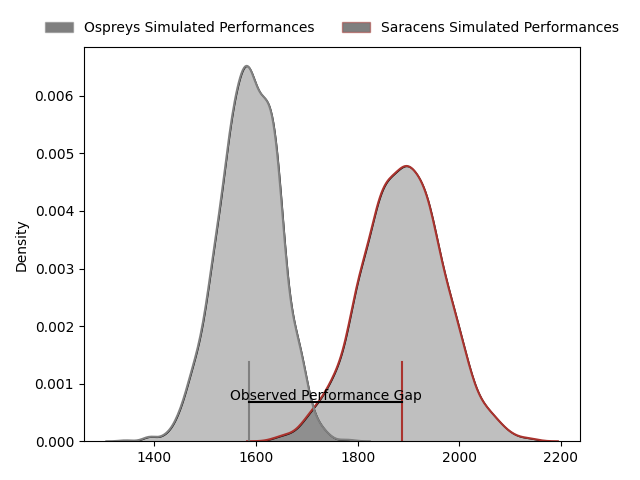
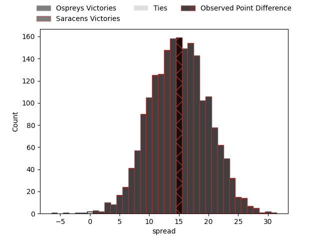
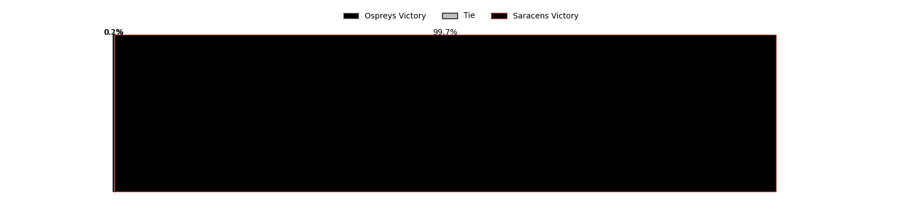

---  
layout: page  
title: Ospreys at Saracens; 20-35  
date: 2023-04-02 16:00:00 18:00:00 -0500  
categories: match review  
---
# Ospreys at Saracens; 20-35

# Club Level Predictions

The first set of predictions treats a club as the smallest object, as the club develops its members, organizes a gameplan, and deploys its players as needed for each match. This club model has a prediction of 0.844, which translates to predicting Saracens to win by 14.9.

Each club has a rating and a rating deviation (simiar to a Glicko system), and expected performances can be generated. This allows for simulated matches and spreads like the ones below.
## Projected Performances

## Projected Spreads

## Projected Results

# Player Level Predictions

Treating teams instead as an entity made up of the currently active players, I have ratings for each player in an altogether different system. These can be combined to form team ratings once teamsheets are announced, weighting starters a bit higher than the reserves. After the match is played, players can be weighted by their minutes on the field, allowing for an accurate measure of the team's composition. With these compiled team ratings, we can make predictions, measure inaccuracy, and update the individual player ratings.
## Prediction with Player Minutes: Saracens by 21.0

Saracens by 17.0 on a neutral field

There were 10 large changes in win probability in this match
## Prediction without Player Minutes: Saracens by 19.2

Saracens by 15.2 on a neutral pitch

|   Away Minutes | Away Player     |   Away elo |   Away Percentile |   Number |   Home Percentile |   Home elo | Home Player       |   Home Minutes |
|---------------:|:----------------|-----------:|------------------:|---------:|------------------:|-----------:|:------------------|---------------:|
|             53 | Nicky Smith     |      95.93 |                53 |        1 |                97 |     124.77 | Mako Vunipola     |             68 |
|             53 | Sam Parry       |      91.32 |                36 |        2 |               100 |     161.81 | Jamie George      |             76 |
|             53 | Tomas Francis   |     138.73 |                99 |        3 |                78 |     104.12 | Marco Riccioni    |             61 |
|             80 | Adam Beard      |     109.29 |                83 |        4 |                81 |     107.91 | Maro Itoje        |             80 |
|             61 | Alun Wyn Jones  |     111.39 |                85 |        5 |                41 |      92.79 | Hugh Tizard       |             53 |
|             80 | Ethan Roots     |      84.3  |                16 |        6 |                27 |      88.42 | Andy Christie     |             59 |
|             39 | Justin Tipuric  |     137.01 |                97 |        7 |                93 |     121.34 | Ben Earl          |             80 |
|             80 | Morgan Morris   |      96.8  |                48 |        8 |                85 |     111.54 | Billy Vunipola    |             80 |
|             80 | Rhys Webb       |     120.56 |                94 |        9 |                90 |     114.47 | Ivan van Zyl      |             53 |
|             80 | Owen Williams   |     121.85 |                91 |       10 |                95 |     129.86 | Owen Farrell      |             80 |
|             80 | Luke Morgan     |      91.73 |                38 |       11 |                88 |     116.05 | Sean Maitland     |             76 |
|             80 | Kieran Williams |      91.98 |                39 |       12 |                99 |     156.9  | Nick Tompkins     |             80 |
|             61 | Owen Watkin     |      86.22 |                23 |       13 |                47 |      95.21 | Alex Lozowski     |             68 |
|             42 | Keelan Giles    |      93.48 |                43 |       14 |                13 |      80.93 | Max Malins        |             80 |
|             80 | Michael Collins |     104.48 |                71 |       15 |                66 |     102.37 | Alex Goode        |             80 |
|             27 | Gareth Thomas   |      85.83 |                 8 |       16 |                16 |      84.6  | Eroni Mawi        |             12 |
|             27 | Dewi Lake       |      98.2  |                53 |       17 |               nan |      93.54 | Tom Woolstencroft |              4 |
|             27 | Tom Botha       |     100.23 |                67 |       18 |                36 |      90.71 | Alec Clarey       |             19 |
|             19 | Rhys Davies     |      94.72 |                45 |       19 |                34 |      91.88 | Nick Isiekwe      |             27 |
|             41 | Daniel Lydiate  |      95.46 |                48 |       20 |                99 |     141.75 | Jackson Wray      |             21 |
|             19 | Gareth Anscombe |      95    |               nan |       21 |                67 |     101.13 | Aled Davies       |             27 |
|             38 | Iestyn Hopkins  |      89.25 |                32 |       22 |                59 |      97.32 | Alex Lewington    |              4 |
|            nan | nan             |     nan    |               nan |       23 |                80 |     108.82 | Duncan Taylor     |             12 |

