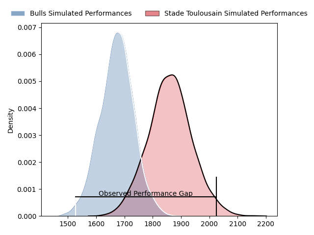
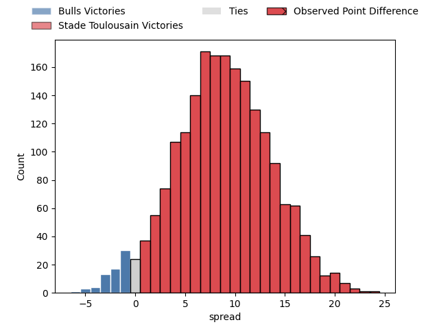
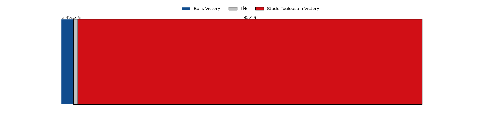

---  
layout: page  
title: Bulls at Stade Toulousain; 9-33  
date: 2023-04-02 16:00:00 18:00:00 -0500  
categories: match review  
---
# Bulls at Stade Toulousain; 9-33

# Club Level Predictions

The first set of predictions treats a club as the smallest object, as the club develops its members, organizes a gameplan, and deploys its players as needed for each match. This club model has a prediction of 0.742, which translates to predicting Stade Toulousain to win by 9.3.

Each club has a rating and a rating deviation (simiar to a Glicko system), and expected performances can be generated. This allows for simulated matches and spreads like the ones below.
## Projected Performances

## Projected Spreads

## Projected Results

# Player Level Predictions

Treating teams instead as an entity made up of the currently active players, I have ratings for each player in an altogether different system. These can be combined to form team ratings once teamsheets are announced, weighting starters a bit higher than the reserves. After the match is played, players can be weighted by their minutes on the field, allowing for an accurate measure of the team's composition. With these compiled team ratings, we can make predictions, measure inaccuracy, and update the individual player ratings.
## Prediction with Player Minutes: Stade Toulousain by 22.8

Stade Toulousain by 18.8 on a neutral field

There were 3 large changes in win probability in this match
## Prediction without Player Minutes: Stade Toulousain by 21.4

Stade Toulousain by 17.4 on a neutral pitch

|   Away Minutes | Away Player                  |   Away elo |   Away Percentile |   Number |   Home Percentile |   Home elo | Home Player         |   Home Minutes |
|---------------:|:-----------------------------|-----------:|------------------:|---------:|------------------:|-----------:|:--------------------|---------------:|
|             58 | Gerhardus Cornelis Steenkamp |      95.57 |                51 |        1 |                74 |     102.58 | Cyril Baille        |             56 |
|             64 | Cornelis Johannes Grobbelaar |      98.82 |                64 |        2 |                77 |     103.9  | Julien Marchand     |             33 |
|             58 | Mornay Jan Jakobus Smith     |      93.89 |                45 |        3 |                67 |      99.98 | Dorian Aldegheri    |             56 |
|             66 | Ruan Stefan Vermaak          |      99.72 |                63 |        4 |                37 |      91.75 | Richie Arnold       |             58 |
|             80 | Ruan Nortje                  |      96.21 |                52 |        5 |                65 |      97.12 | Emmanuel Meafou     |             66 |
|             80 | Marco Gerhardt van Staden    |      91.27 |                36 |        6 |                94 |     124.4  | Jack Willis         |             80 |
|             66 | Cyle Justin Brink            |      87.08 |                23 |        7 |                99 |     165.44 | Francois Cros       |             80 |
|             80 | Elrigh Louw                  |      97.06 |                48 |        8 |                39 |      93.57 | Alexandre Roumat    |             48 |
|             52 | Izak Jacobus Burger          |     103.52 |                72 |        9 |                97 |     127.32 | Antoine Dupont      |             66 |
|             70 | Chris Smith                  |      96.93 |                52 |       10 |                94 |     127.7  | Romain Ntamack      |             80 |
|             80 | David Kriel                  |      85.91 |                21 |       11 |                50 |      96    | Matthis Lebel       |             80 |
|             80 | Harold William Vorster       |     104.81 |                73 |       12 |                49 |      95.78 | Pita Ahki           |             80 |
|             70 | Cornal Hendricks             |      84.36 |                18 |       13 |                34 |      84.97 | Santiago Chocobares |             50 |
|             80 | Canan Moodie                 |     106.23 |                76 |       14 |                54 |      97.65 | Juan Cruz Mallia    |             80 |
|             80 | Kurt-Lee Arendse             |     107.37 |                75 |       15 |                93 |     120.71 | Thomas Ramos        |             80 |
|             22 | Dylan Thomas Smith           |      93.7  |                44 |       16 |                35 |      91.32 | Rodrigue Neti       |             24 |
|             16 | Bismarck du Plessis          |      92.02 |                38 |       17 |                61 |      98.04 | Peato Mauvaka       |             47 |
|             22 | Francois Klopper             |      85.43 |                16 |       18 |                27 |      89.05 | David Ainu'u        |             24 |
|             14 | Janko Swanepoel              |      91.04 |                38 |       19 |                49 |      93.5  | Alban Placines      |             22 |
|             14 | WJ Steenkamp                 |      98.86 |                57 |       20 |                66 |     101.63 | Joshua Brennan      |             14 |
|             28 | Embrose Cheldon Papier       |      85.05 |                15 |       21 |                86 |     112.09 | Thibaud Flament     |             32 |
|             10 | Morne Steyn                  |      85.08 |                20 |       22 |                97 |     126.84 | Paul Graou          |             14 |
|             10 | Stedman-Gee Rivett Gans      |      97.08 |                53 |       23 |                18 |      84.21 | Dimitri Delibes     |             30 |

