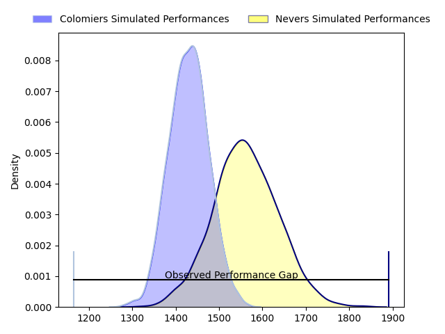
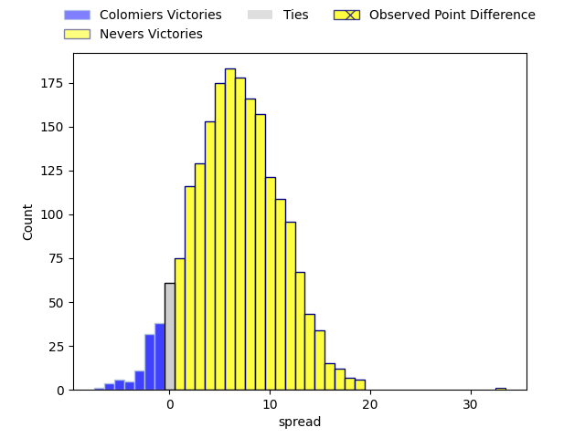
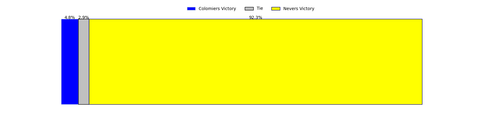

---  
layout: page  
title: Colomiers at Nevers; 10-43  
date: 2023-04-06 21:00:00 18:00:00 -0500  
categories: match review  
---
# Colomiers at Nevers; 10-43

# Club Level Predictions

The first set of predictions treats a club as the smallest object, as the club develops its members, organizes a gameplan, and deploys its players as needed for each match. This club model has a prediction of 0.681, which translates to predicting Nevers to win by 6.7.

Each club has a rating and a rating deviation (simiar to a Glicko system), and expected performances can be generated. This allows for simulated matches and spreads like the ones below.
## Projected Performances

## Projected Spreads

## Projected Results

# Player Level Predictions

Treating teams instead as an entity made up of the currently active players, I have ratings for each player in an altogether different system. These can be combined to form team ratings once teamsheets are announced, weighting starters a bit higher than the reserves. After the match is played, players can be weighted by their minutes on the field, allowing for an accurate measure of the team's composition. With these compiled team ratings, we can make predictions, measure inaccuracy, and update the individual player ratings.
## Prediction with Player Minutes: Nevers by 6.1

Nevers by 2.1 on a neutral field

There were 2 large changes in win probability in this match
## Prediction without Player Minutes: Nevers by 3.0

Colomiers by 1.0 on a neutral pitch

|   Away Minutes | Away Player           |   Away elo |   Away Percentile |   Number |   Home Percentile |   Home elo | Home Player         |   Home Minutes |
|---------------:|:----------------------|-----------:|------------------:|---------:|------------------:|-----------:|:--------------------|---------------:|
|             46 | Thomas Dubois         |      91.51 |                36 |        1 |                53 |      96.14 | Kamaliele Tufele    |             80 |
|             46 | Hikawera Elliot       |      95.31 |                52 |        2 |                51 |      94.89 | Issam Hamel         |             46 |
|             46 | Marco Fepulea'i       |      89.08 |                33 |        3 |                72 |     101.82 | Ilia Kaikatsishvili |             44 |
|             80 | Jean Thomas           |     103.77 |                75 |        4 |                90 |     116    | Maxence Barjaud     |             80 |
|             46 | Maxime Granouillet    |     109.02 |                82 |        5 |                75 |     103.83 | Senio Toleafoa      |             80 |
|             80 | Pierre-Samuel Pacheco |      85.01 |                18 |        6 |                 8 |      77.08 | Luka Plataret       |             56 |
|             80 | Aldric Lescure        |     111.04 |                85 |        7 |                98 |     137.89 | Hugues Bastide      |             52 |
|             46 | Yann Peysson          |      76.48 |                 8 |        8 |                56 |      99.09 | Jason-Collin Fraser |             80 |
|             60 | Ugo Seguela           |      87.25 |                24 |        9 |                48 |      94.8  | Yoan Cottin         |             55 |
|             80 | Thomas Girard         |      98.14 |                54 |       10 |                51 |      92.79 | Yohan Le Bourhis    |             80 |
|             52 | Alexis Palisson       |      86.66 |                22 |       11 |                22 |      86.7  | Lucas Blanc         |             80 |
|             80 | Johan Deysel          |      94.07 |                48 |       12 |                37 |      91.4  | Rudy Derrieux       |             80 |
|             64 | Paul Pimienta         |     130.57 |                97 |       13 |                14 |      81.87 | Alifereti Loaloa    |             80 |
|             80 | Simon Delas           |      76.22 |               nan |       14 |                66 |     101.58 | Christian Ambadiang |             64 |
|             80 | Max Auriac            |     107.19 |                78 |       15 |                63 |     101.47 | Kylian Jaminet      |             80 |
|             34 | Guillaume Tartas      |     117.05 |                93 |       16 |                57 |      97.55 | Aselo Ikahehegi     |             36 |
|             34 | Jack Whetton          |      82.27 |                16 |       17 |                70 |     100.85 | Elia Elia           |             34 |
|             34 | Andrew Ready          |      93.32 |                45 |       18 |                40 |      92.41 | Julien Kazubek      |             28 |
|             34 | Romain Bezian         |     124.94 |               nan |       19 |                88 |     110.3  | Arthurs Barbier     |             25 |
|             34 | Hugo Pirlet           |      75.08 |                 6 |       20 |                85 |     108.6  | Aitor Kitutu        |             24 |
|             28 | Fabien Perrin         |     100.77 |                63 |       21 |                64 |     101.37 | Leonard Paris       |             16 |
|             16 | Maxime Javaux         |     100.94 |                64 |       22 |               nan |     nan    | nan                 |            nan |
|             20 | Arthur Diaz           |      94.94 |               nan |       23 |               nan |     nan    | nan                 |            nan |

