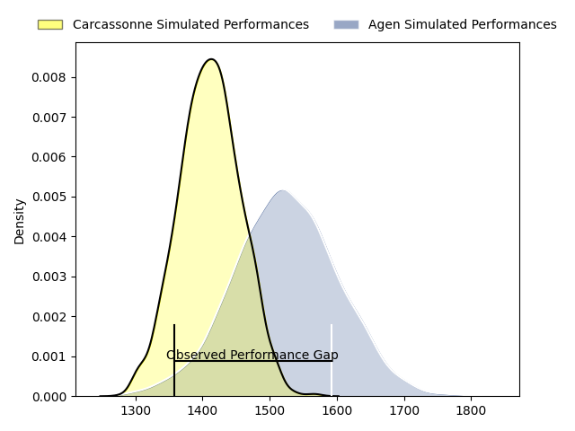
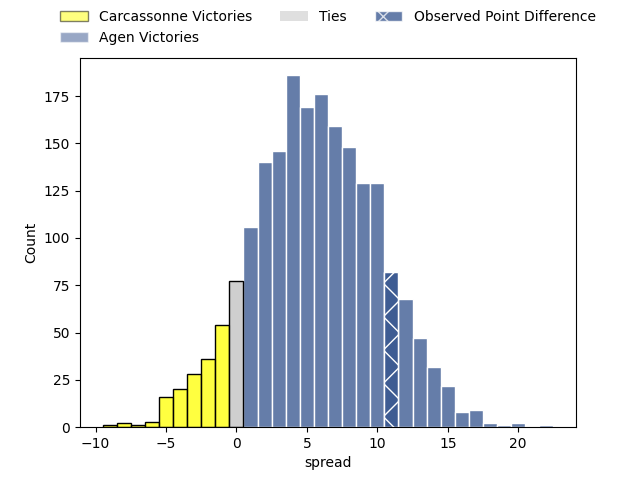
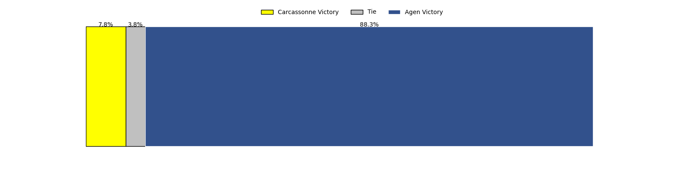

---  
layout: page  
title: Carcassonne at Agen; 19-30  
date: 2023-04-07 19:00:00 18:00:00 -0500  
categories: match review  
---
# Carcassonne at Agen; 19-30

# Club Level Predictions

The first set of predictions treats a club as the smallest object, as the club develops its members, organizes a gameplan, and deploys its players as needed for each match. This club model has a prediction of 0.656, which translates to predicting Agen to win by 5.7.

Each club has a rating and a rating deviation (simiar to a Glicko system), and expected performances can be generated. This allows for simulated matches and spreads like the ones below.
## Projected Performances

## Projected Spreads

## Projected Results

# Player Level Predictions

Treating teams instead as an entity made up of the currently active players, I have ratings for each player in an altogether different system. These can be combined to form team ratings once teamsheets are announced, weighting starters a bit higher than the reserves. After the match is played, players can be weighted by their minutes on the field, allowing for an accurate measure of the team's composition. With these compiled team ratings, we can make predictions, measure inaccuracy, and update the individual player ratings.
## Prediction with Player Minutes: Carcassonne by 0.3

Carcassonne by 4.3 on a neutral field

There were 10 large changes in win probability in this match
## Prediction without Player Minutes: Carcassonne by 1.4

Carcassonne by 5.4 on a neutral pitch

|   Away Minutes | Away Player              |   Away elo |   Away Percentile |   Number |   Home Percentile |   Home elo | Home Player           |   Home Minutes |
|---------------:|:-------------------------|-----------:|------------------:|---------:|------------------:|-----------:|:----------------------|---------------:|
|             46 | Sami Mavinga             |     104.48 |                79 |        1 |                76 |     100.08 | Hans Lombard-Buret    |             57 |
|             46 | Raphaël Carbou           |     110.24 |                86 |        2 |                34 |      91.09 | Loris Zarantonello    |             46 |
|             46 | Soso Bekoshvili          |     105.78 |                82 |        3 |                80 |     105.48 | Théo Sauzaret         |             15 |
|             80 | Romain Manchia           |      75.93 |                 8 |        4 |                62 |      99.31 | Corentin Vernet       |             80 |
|             46 | Rynard Ligtoring Landman |     105.34 |                77 |        5 |                59 |     101.18 | William Demotte       |             59 |
|             80 | Robert Harley            |     102.32 |                68 |        6 |                59 |     102.47 | Valentin Gayraud      |             80 |
|             59 | Aaron Carroll            |     108.12 |                74 |        7 |                26 |      88.1  | Vincent Farré         |             46 |
|             46 | Pierre Reynaud           |     108.01 |                80 |        8 |                40 |      93.98 | Afa Amosa             |             80 |
|             80 | Pierre Pagès             |      94.66 |                47 |        9 |                38 |      90.9  | Theo Idjellidaine     |             46 |
|             80 | Christopher Hilsenbeck   |     103.87 |                72 |       10 |                71 |     106.01 | Thomas Vincent        |             57 |
|             80 | Clément Clavières        |     103.35 |                70 |       11 |                42 |      92.96 | Iban Etcheverry       |             80 |
|             65 | Jordan Puletua           |     107.91 |                79 |       12 |                73 |     104.78 | Kolinio Ramoka        |             80 |
|             80 | Pierre Aguillon          |      99.35 |                59 |       13 |                49 |      95.77 | Théo Belan            |             80 |
|             80 | Léo Darrelatour          |     109.14 |                81 |       14 |                75 |     105.46 | Loris Tolot           |             80 |
|             49 | Baptiste Mouchous        |      94.53 |                48 |       15 |                75 |     107.32 | Jean-Marcellin Buttin |             46 |
|             34 | Luka Petriashvili        |      97.13 |                40 |       16 |                69 |     100.65 | Alex Burin            |             65 |
|             34 | Youssef Amrouni          |      82.33 |                12 |       17 |                71 |     106.48 | Matthieu Bonnet       |             34 |
|             34 | Étienne Herjean          |     108.76 |                80 |       18 |                16 |      83.12 | Timilai Rokoduru      |             34 |
|             34 | Vakhtangi Akhobadze      |     100.19 |                67 |       19 |                47 |      93.69 | Clément Martinez      |             34 |
|             34 | Simon Meka               |     105.42 |                73 |       20 |                62 |      99.89 | Sonatane Takulua      |             34 |
|             31 | Damien Añon              |      89.4  |                18 |       21 |                 0 |      57.36 | Florent Guion         |             23 |
|             21 | George Merrick           |      92.23 |                27 |       22 |                43 |      90.42 | Emile Dayral          |             23 |
|             15 | Brieuc Plessis Couillaud |     100.63 |                62 |       23 |                50 |      95.93 | Zak Farrance          |             21 |

