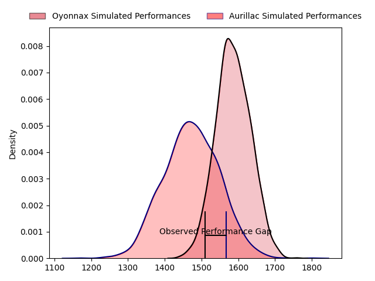
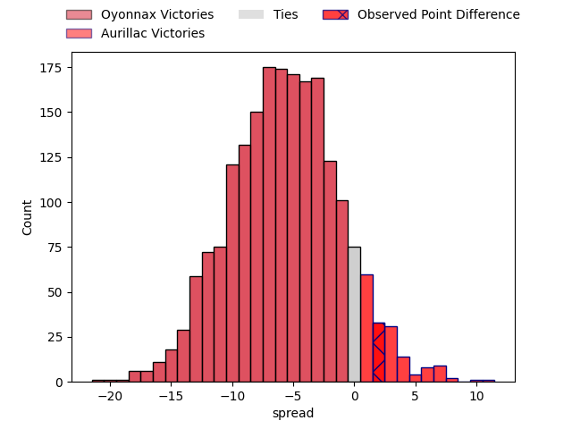

---  
layout: page  
title: Oyonnax at Aurillac; 25-27  
date: 2023-04-07 19:30:00 18:00:00 -0500  
categories: match review  
---
# Oyonnax at Aurillac; 25-27

# Club Level Predictions

The first set of predictions treats a club as the smallest object, as the club develops its members, organizes a gameplan, and deploys its players as needed for each match. This club model has a prediction of 0.346, which translates to predicting Oyonnax to win by 5.6.

Each club has a rating and a rating deviation (simiar to a Glicko system), and expected performances can be generated. This allows for simulated matches and spreads like the ones below.
## Projected Performances

## Projected Spreads

## Projected Results

# Player Level Predictions

Treating teams instead as an entity made up of the currently active players, I have ratings for each player in an altogether different system. These can be combined to form team ratings once teamsheets are announced, weighting starters a bit higher than the reserves. After the match is played, players can be weighted by their minutes on the field, allowing for an accurate measure of the team's composition. With these compiled team ratings, we can make predictions, measure inaccuracy, and update the individual player ratings.
## Prediction with Player Minutes: Aurillac by 1.6

Oyonnax by 2.4 on a neutral field

There were 16 large changes in win probability in this match
## Prediction without Player Minutes: Aurillac by 2.2

Oyonnax by 1.8 on a neutral pitch

|   Away Minutes | Away Player             |   Away elo |   Away Percentile |   Number |   Home Percentile |   Home elo | Home Player                           |   Home Minutes |
|---------------:|:------------------------|-----------:|------------------:|---------:|------------------:|-----------:|:--------------------------------------|---------------:|
|             48 | Adrien Bordenave        |      89.65 |                39 |        1 |                88 |     109.56 | Alexandre Plantier                    |             80 |
|             69 | Benjamin Geledan        |      98.37 |                61 |        2 |                63 |      98.58 | Adrian Smith                          |             80 |
|             48 | Irakli Mirtskhulava     |      95.55 |               nan |        3 |                96 |     119.68 | Giorgi Kartvelishvili                 |             80 |
|             65 | Tom Murday              |      93.63 |                46 |        4 |                31 |      90.01 | Martial Rolland                       |             80 |
|             80 | Hugo Fabregue           |      89.05 |                28 |        5 |                66 |     100.76 | Cam Dodson                            |             80 |
|             80 | Wandrille Picault       |     118.56 |                91 |        6 |                54 |      97.45 | Eoghan Masterson                      |             80 |
|             80 | Hugo Hermet             |      98.01 |                62 |        7 |                49 |      97.38 | Didier Tison                          |             80 |
|             71 | Filimo Taofifenua       |     102.86 |                68 |        8 |                22 |      81.82 | Mosa'ati Moala                        |             80 |
|             65 | Ilan El Khattabi        |      85.18 |                21 |        9 |                31 |      89.73 | Mikheil Alania                        |             80 |
|             71 | Tony Ensor              |      91.87 |                41 |       10 |                20 |      85.33 | Antoine Aucagne                       |             80 |
|             80 | Paul Gadea              |      95    |               nan |       11 |                65 |     101.41 | Adriaan Jocobus van der Berg Coertzen |             80 |
|             71 | Pedro Bettencourt Avila |      95.75 |                55 |       12 |                82 |     110.03 | Marc Palmier                          |             80 |
|             80 | Florian Vialelle        |      94.93 |                55 |       13 |                12 |      80.42 | Christa Powell                        |             80 |
|             80 | Leo Treilles            |     104.02 |                73 |       14 |                64 |     100.72 | Giorgi Gogoladze                      |             80 |
|             80 | Enzo Reybier            |     104.65 |                78 |       15 |                 7 |      72.67 | Anderson Neisen                       |             80 |
|             32 | Antoine Abraham         |      82.3  |                12 |       16 |               nan |     nan    | nan                                   |            nan |
|             32 | Victor Delmas           |      99.51 |               nan |       17 |               nan |     nan    | nan                                   |            nan |
|             15 | Yvan David              |     108.4  |                79 |       18 |               nan |     nan    | nan                                   |            nan |
|             11 | Julien Ratajczak        |      95    |               nan |       19 |               nan |     nan    | nan                                   |            nan |
|             15 | Antonin Corso           |      95    |               nan |       20 |               nan |     nan    | nan                                   |            nan |
|              9 | Gabriel Favier          |      95    |               nan |       21 |               nan |     nan    | nan                                   |            nan |
|              9 | Bruce Alvarado          |      95    |               nan |       22 |               nan |     nan    | nan                                   |            nan |
|              9 | Alexis Pisani           |      95    |               nan |       23 |               nan |     nan    | nan                                   |            nan |

