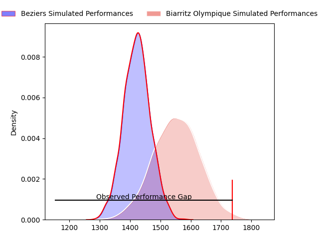
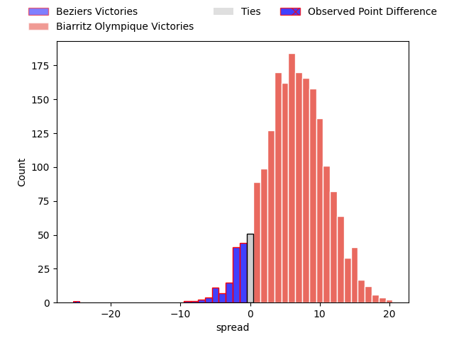
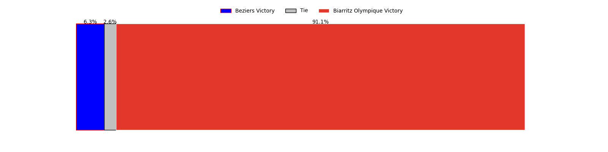

---  
layout: page  
title: Beziers at Biarritz Olympique; 42-17  
date: 2023-04-07 19:30:00 18:00:00 -0500  
categories: match review  
---
# Beziers at Biarritz Olympique; 42-17

# Club Level Predictions

The first set of predictions treats a club as the smallest object, as the club develops its members, organizes a gameplan, and deploys its players as needed for each match. This club model has a prediction of 0.681, which translates to predicting Biarritz Olympique to win by 6.6.

Each club has a rating and a rating deviation (simiar to a Glicko system), and expected performances can be generated. This allows for simulated matches and spreads like the ones below.
## Projected Performances

## Projected Spreads

## Projected Results

# Player Level Predictions

Treating teams instead as an entity made up of the currently active players, I have ratings for each player in an altogether different system. These can be combined to form team ratings once teamsheets are announced, weighting starters a bit higher than the reserves. After the match is played, players can be weighted by their minutes on the field, allowing for an accurate measure of the team's composition. With these compiled team ratings, we can make predictions, measure inaccuracy, and update the individual player ratings.
## Prediction with Player Minutes: Biarritz Olympique by 13.3

Biarritz Olympique by 9.3 on a neutral field

There were 11 large changes in win probability in this match
## Prediction without Player Minutes: Biarritz Olympique by 13.3

Biarritz Olympique by 9.3 on a neutral pitch

|   Away Minutes | Away Player         |   Away elo |   Away Percentile |   Number |   Home Percentile |   Home elo | Home Player        |   Home Minutes |
|---------------:|:--------------------|-----------:|------------------:|---------:|------------------:|-----------:|:-------------------|---------------:|
|             49 | Francisco Fernandes |      78.89 |                 8 |        1 |                44 |      93.48 | Guy Millar         |             64 |
|             62 | Yvann Lalevee       |      94.78 |                51 |        2 |                46 |      92.55 | Baptiste Erdocio   |             74 |
|             62 | Yannick Arroyo      |      83.22 |                14 |        3 |                62 |      98.66 | Zakaria El Fakir   |             44 |
|             80 | Yassine Maamry      |      82.62 |                21 |        4 |                61 |      99.09 | Johan Aliouat      |             56 |
|             80 | John Madigan        |      69.22 |                 4 |        5 |                36 |      91.99 | John Dyer          |             80 |
|             17 | William van Bost    |      93.9  |                46 |        6 |                52 |      96.96 | Josh Tyrell        |             80 |
|             80 | Éloi Massot         |      77.44 |                10 |        7 |                62 |      98.79 | Francois Vergnaud  |             80 |
|             49 | Maxence Lemardelet  |      83.03 |                21 |        8 |               nan |      95    | Ekain Imaz Agirre  |             80 |
|             65 | Mitchell Short      |      86.51 |                30 |        9 |                30 |      89.41 | Tomas Cubelli      |             56 |
|             80 | Victor Dreuille     |      83.34 |                23 |       10 |                48 |      95.74 | Baptiste Germain   |             56 |
|             80 | Nicolas Plazy       |      74.76 |                 7 |       11 |                23 |      87.03 | Yohann Artru       |             44 |
|             80 | James Tofa          |      75.71 |                 8 |       12 |                16 |      82.88 | Auguste Cadot      |             80 |
|             80 | Maxime Espeut       |     128.61 |                97 |       13 |                46 |      94.37 | Joseph Tomane      |             14 |
|             52 | Paul Reau           |      98.74 |                58 |       14 |               nan |      94.61 | Vincent Martin     |             80 |
|             58 | Mathias Duchaux     |      95    |               nan |       15 |                46 |      94.5  | Steeve Barry       |             80 |
|             63 | Sias Koen           |      90.7  |                37 |       16 |                28 |      88.63 | Ewan Bertheau      |             66 |
|             31 | Giorgi Akhaladze    |      99.86 |                72 |       17 |               nan |      95.6  | Gilles Bosch       |             36 |
|             31 | Thomas Hoarau       |      79.21 |                10 |       18 |                82 |     105.22 | Killian Taofifenua |             36 |
|             28 | Paul Recor          |     109.29 |                81 |       19 |                53 |      97.08 | Simon Augry        |             24 |
|             22 | Romain Uruty        |      93.66 |                43 |       20 |                45 |      92.77 | Barnabé Couilloud  |             24 |
|             18 | Marco Pinto Ferrer  |      81.64 |                14 |       21 |                39 |      90.32 | Darly Domvo        |             24 |
|             18 | Julien Rasamoelina  |      95    |               nan |       22 |                55 |      96.54 | Luka Azariashvili  |             16 |
|             15 | Josh Valentine      |      93.33 |                43 |       23 |                53 |     100.91 | Luka Tchelidze     |              6 |

