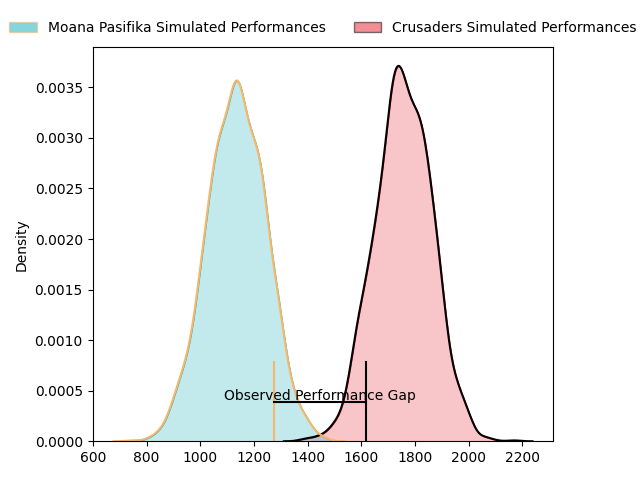
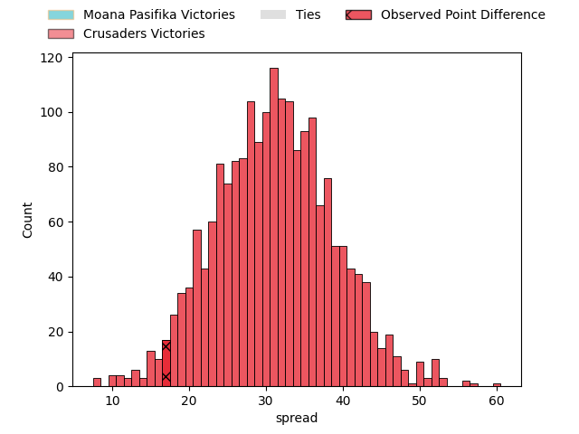

---  
layout: page  
title: Moana Pasifika at Crusaders; 21.0-38.0  
date: 2023-04-07 03:05:00 18:00:00 -0500  
categories: match review  
---
# Moana Pasifika at Crusaders; 21.0-38.0

# Club Level Predictions

The first set of predictions treats a club as the smallest object, as the club develops its members, organizes a gameplan, and deploys its players as needed for each match. This club model has a prediction of 0.967, which translates to predicting Crusaders to win by 31.2.

Each club has a rating and a rating deviation (simiar to a Glicko system), and expected performances can be generated. This allows for simulated matches and spreads like the ones below.
## Projected Performances

## Projected Spreads

## Projected Results

# Player Level Predictions

Treating teams instead as an entity made up of the currently active players, I have ratings for each player in an altogether different system. These can be combined to form team ratings once teamsheets are announced, weighting starters a bit higher than the reserves. After the match is played, players can be weighted by their minutes on the field, allowing for an accurate measure of the team's composition. With these compiled team ratings, we can make predictions, measure inaccuracy, and update the individual player ratings.
## Prediction with Player Minutes: Crusaders by 29.3

Crusaders by 25.3 on a neutral field

There were 7 large changes in win probability in this match
## Prediction without Player Minutes: Crusaders by 17.4

Crusaders by 13.4 on a neutral pitch

|   Away Minutes | Away Player          |   Away elo |   Away Percentile |   Number |   Home Percentile |   Home elo | Home Player            |   Home Minutes |
|---------------:|:---------------------|-----------:|------------------:|---------:|------------------:|-----------:|:-----------------------|---------------:|
|             59 | Ezekiel Lindenmuth   |      72.98 |                 5 |        1 |                28 |      89.4  | Joe Moody              |             53 |
|             66 | Samiuela Moli        |      76.59 |                 7 |        2 |                85 |     109.11 | Codie Taylor           |             64 |
|             20 | Joe Apikotoa         |      98.07 |                57 |        3 |                45 |      93.9  | Tamaiti Williams       |             53 |
|             80 | Michael Curry        |     107.46 |                80 |        4 |               nan |      95    | Quinten Strange        |             66 |
|             47 | Samuel Slade         |      66.42 |                 4 |        5 |                65 |     100.43 | Dom Gardiner           |             80 |
|             80 | Miracle Faiilagi     |      87.3  |                23 |        6 |                76 |     106.69 | Sione Havili           |             80 |
|             53 | Alamanda Motuga      |      84.87 |                17 |        7 |                57 |      97.74 | Corey Kellow           |             80 |
|             80 | Solomone Funaki      |      89.47 |                30 |        8 |                28 |      88.8  | Christian Lio-Willie   |             56 |
|             56 | Ere Enari            |     101.07 |                67 |        9 |                44 |      93.64 | Mitchell Drummond      |             53 |
|             80 | Lincoln McClutchie   |      93.05 |                41 |       10 |                99 |     151.32 | Richie Mo'unga         |             80 |
|             80 | Neria Fomai          |      88.78 |                28 |       11 |                52 |      97.63 | Macca Springer         |             80 |
|             80 | Danny Toala          |     112.24 |                84 |       12 |                84 |     112.28 | Dallas McLeod          |             80 |
|             60 | Levi Aumua           |     115.21 |                88 |       13 |                57 |      98.16 | Leicester Fainga'anuku |             80 |
|             80 | Timoci Tavatavanawai |      84.56 |                18 |       14 |                32 |      90.52 | Willi Gualter          |             64 |
|             68 | William Havili       |     119.85 |                92 |       15 |                49 |      94.99 | Fergus Burke           |             80 |
|             14 | Luteru Tolai         |     102.39 |                68 |       16 |                83 |     109.07 | Brodie McAlister       |             16 |
|             21 | Abraham Pole         |      99.64 |                70 |       17 |               nan |      95    | Finlay Brewis          |             27 |
|             60 | Isileli Tu'ungafasi  |      69.93 |               nan |       18 |               nan |      99.44 | Seb Calder             |             27 |
|             33 | Mike McKee           |      73.87 |                 8 |       19 |               nan |      96.79 | Jamie Hannah           |             14 |
|             27 | Jonah Mau'u          |     101.72 |                64 |       20 |                85 |     112.88 | Tom Christie           |             24 |
|             24 | Manu Paea            |      92.09 |                40 |       21 |                43 |      94.78 | Willi Heinz            |             27 |
|             12 | D'Angelo Leuila      |     100.63 |                59 |       22 |                96 |     127.18 | David Havili           |             64 |
|             20 | Fine Inisi           |      73.47 |                 7 |       23 |               nan |      95    | Melani Nanai           |             16 |

