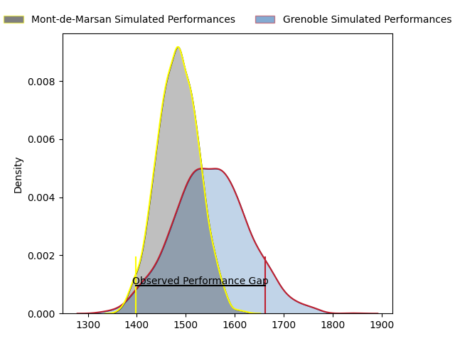
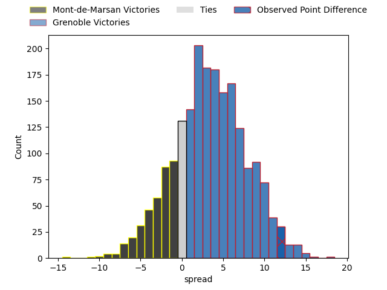
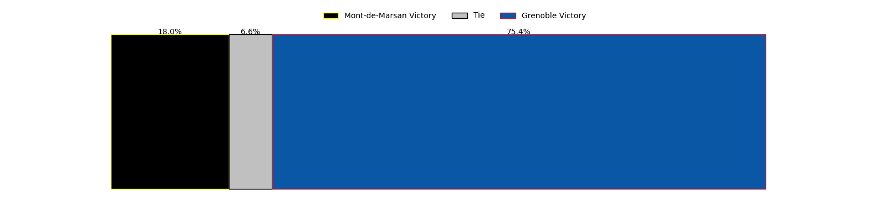

---  
layout: page  
title: Mont-de-Marsan at Grenoble; 21-33  
date: 2023-04-07 21:00:00 18:00:00 -0500  
categories: match review  
---
# Mont-de-Marsan at Grenoble; 21-33

# Club Level Predictions

The first set of predictions treats a club as the smallest object, as the club develops its members, organizes a gameplan, and deploys its players as needed for each match. This club model has a prediction of 0.592, which translates to predicting Grenoble to win by 3.3.

Each club has a rating and a rating deviation (simiar to a Glicko system), and expected performances can be generated. This allows for simulated matches and spreads like the ones below.
## Projected Performances

## Projected Spreads

## Projected Results

# Player Level Predictions

Treating teams instead as an entity made up of the currently active players, I have ratings for each player in an altogether different system. These can be combined to form team ratings once teamsheets are announced, weighting starters a bit higher than the reserves. After the match is played, players can be weighted by their minutes on the field, allowing for an accurate measure of the team's composition. With these compiled team ratings, we can make predictions, measure inaccuracy, and update the individual player ratings.
## Prediction with Player Minutes: Grenoble by 3.8

Mont-de-Marsan by 0.2 on a neutral field

There were 7 large changes in win probability in this match
## Prediction without Player Minutes: Grenoble by 6.1

Grenoble by 2.1 on a neutral pitch

|   Away Minutes | Away Player          |   Away elo |   Away Percentile |   Number |   Home Percentile |   Home elo | Home Player         |   Home Minutes |
|---------------:|:---------------------|-----------:|------------------:|---------:|------------------:|-----------:|:--------------------|---------------:|
|             56 | Thomas Bultel        |     111.92 |                89 |        1 |                28 |      89.22 | Luka Goginava       |             53 |
|             56 | Jose Luis Gonzalez   |     122.46 |                96 |        2 |                38 |      95.14 | Jean-Charles Orioli |             60 |
|             63 | Gheorge Gajion       |     109.68 |                88 |        3 |                63 |      99.09 | Irakli Aptsiauri    |             53 |
|             47 | Nicolas Garrault     |      84.53 |                19 |        4 |                86 |     111.76 | Thomas Lainault     |             47 |
|             80 | Romain Durand        |     118.64 |                91 |        5 |                86 |     111.58 | Tanginoa Halaifonua |             80 |
|             56 | Aurélien Lisena      |     119.41 |                91 |        6 |                75 |     105.91 | Antonin Berruyer    |             80 |
|             80 | Léo Banos            |      94.4  |                46 |        7 |                67 |     101.9  | Steeve Blanc-Mappaz |             80 |
|             80 | Michael Faleafa      |      99.1  |                56 |        8 |                57 |      99.49 | Marko Gazzotti      |             47 |
|             80 | Christophe Loustalot |      94.06 |                46 |        9 |                84 |     109.93 | Éric Escande        |             60 |
|             80 | Willie du Plessis    |      99.76 |                60 |       10 |                85 |     114.07 | Thomas Fortunel     |             53 |
|             72 | Kaminieli Rasaku     |      94.18 |                45 |       11 |                74 |     104.96 | Lucas Dupont        |             80 |
|             75 | Jules Even           |      92.51 |                38 |       12 |                89 |     118.42 | Romain Barthélémy   |             80 |
|             80 | Nacani Wakaya        |     126.89 |                96 |       13 |                18 |      84.31 | Romain Trouilloud   |             80 |
|             80 | Ambrose Curtis       |     105.55 |                75 |       14 |                61 |      99.6  | Karim Qadiri        |             80 |
|             80 | Alexandre de Nardi   |     109.8  |                82 |       15 |                93 |     122.45 | Julien Farnoux      |             60 |
|             33 | Baptiste Hézard      |      95    |               nan |       16 |                79 |     106.93 | José Duarte Madeira |             33 |
|             24 | Jean-Luc Innocente   |      60.26 |                 3 |       17 |                30 |      89.29 | Talalelei Gray      |             33 |
|             24 | William Wavrin       |     121.48 |                95 |       18 |                67 |     102.62 | Terence Hepetema    |             27 |
|             24 | Romain Laterrade     |      88.36 |                39 |       19 |                94 |     119.82 | Zack Gauthier       |             27 |
|             17 | Anthony Alves        |      86.02 |                18 |       20 |                77 |     103.67 | Regis Montagne      |             27 |
|              8 | Simon Renda          |     106.52 |                73 |       21 |                46 |      94.8  | Mathis Sarragallet  |             20 |
|              5 | Lucas Mensa          |      90.67 |                36 |       22 |                41 |      95.89 | Felipe Ezcurra      |             20 |
|            nan | nan                  |     nan    |               nan |       23 |                11 |      82.11 | Hugo Trouilloud     |             20 |

