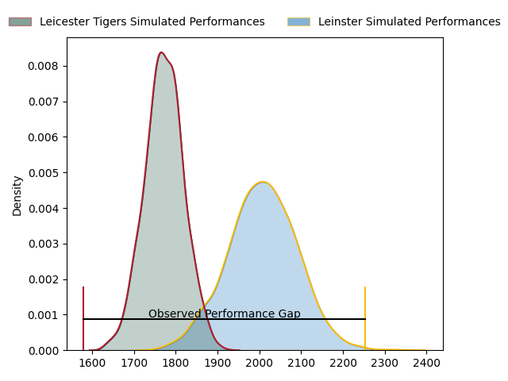
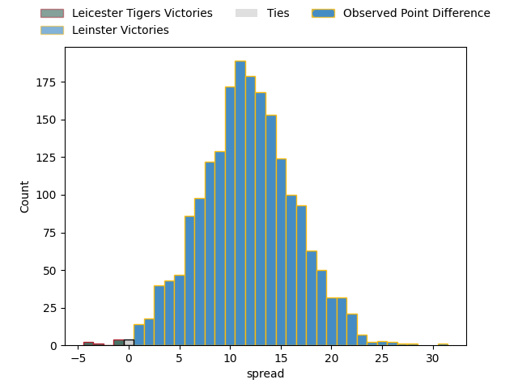

---  
layout: page  
title: Leicester Tigers at Leinster; 24-55  
date: 2023-04-07 21:00:00 18:00:00 -0500  
categories: match review  
---
# Leicester Tigers at Leinster; 24-55

# Club Level Predictions

The first set of predictions treats a club as the smallest object, as the club develops its members, organizes a gameplan, and deploys its players as needed for each match. This club model has a prediction of 0.794, which translates to predicting Leinster to win by 11.9.

Each club has a rating and a rating deviation (simiar to a Glicko system), and expected performances can be generated. This allows for simulated matches and spreads like the ones below.
## Projected Performances

## Projected Spreads

## Projected Results

# Player Level Predictions

Treating teams instead as an entity made up of the currently active players, I have ratings for each player in an altogether different system. These can be combined to form team ratings once teamsheets are announced, weighting starters a bit higher than the reserves. After the match is played, players can be weighted by their minutes on the field, allowing for an accurate measure of the team's composition. With these compiled team ratings, we can make predictions, measure inaccuracy, and update the individual player ratings.
## Prediction with Player Minutes: Leinster by 11.9

Leinster by 7.9 on a neutral field

There were 8 large changes in win probability in this match
## Prediction without Player Minutes: Leinster by 12.9

Leinster by 8.9 on a neutral pitch

|   Away Minutes | Away Player         |   Away elo |   Away Percentile |   Number |   Home Percentile |   Home elo | Home Player          |   Home Minutes |
|---------------:|:--------------------|-----------:|------------------:|---------:|------------------:|-----------:|:---------------------|---------------:|
|             52 | James Cronin        |      92.68 |                40 |        1 |                49 |      94.92 | Andrew Porter        |             62 |
|             33 | Julian Montoya      |      87.56 |                24 |        2 |                73 |     102.1  | Dan Sheehan          |             62 |
|             52 | Joe Heyes           |     106.13 |                84 |        3 |                76 |     103.37 | Tadhg Furlong        |             59 |
|             72 | George Martin       |     102.02 |                70 |        4 |                71 |     102.39 | Ross Molony          |             58 |
|             80 | Cameron Henderson   |     123.64 |                95 |        5 |                78 |     106.56 | James Ryan           |             80 |
|             80 | Hanro Liebenberg    |     131.74 |                97 |        6 |                79 |     108.27 | Ryan Baird           |             62 |
|             80 | Tommy Reffell       |     113.42 |                86 |        7 |                91 |     118.81 | Caelan Doris         |             80 |
|             62 | Jasper Wiese        |     107.41 |                80 |        8 |                94 |     123.8  | Jack Conan           |             80 |
|             74 | Jack van Poortvliet |      92.33 |                39 |        9 |                78 |     106.2  | Jamison Gibson-Park  |             70 |
|             68 | Handre Pollard      |     129.53 |                95 |       10 |                83 |     112.9  | Ross Byrne           |             80 |
|             80 | Freddie Steward     |     100.39 |                61 |       11 |                98 |     138.86 | James Lowe           |             54 |
|             74 | Dan Kelly           |      88.68 |                34 |       12 |                97 |     130.17 | Robbie Henshaw       |             66 |
|             80 | Harry Potter        |     104.96 |                74 |       13 |                22 |      86.11 | Garry Ringrose       |             80 |
|             80 | Anthony Watson      |      87.62 |                25 |       14 |                69 |     103.2  | Jimmy O'Brien        |             80 |
|             80 | Mike Brown          |     109.91 |                81 |       15 |                98 |     142.99 | Hugo Keenan          |             80 |
|             28 | Tom West            |     110.27 |                91 |       16 |               nan |      97.31 | Cian Healy           |             18 |
|             47 | Charles Clare       |      92.46 |                43 |       17 |                66 |      98.26 | John McKee           |             18 |
|             28 | Daniel Cole         |      85.61 |                18 |       18 |                84 |     105.14 | Michael Ala'alatoa   |             21 |
|              8 | Eli Snyman          |      92.68 |                40 |       19 |                41 |      91.81 | Jason Howell Jenkins |             22 |
|             18 | Olly Cracknell      |     105.7  |                76 |       20 |                61 |      97.49 | Scott Penny          |             18 |
|              6 | Sam Wolstenholme    |      95    |               nan |       21 |                61 |      98.28 | Luke McGrath         |             10 |
|             12 | Charlie Atkinson    |      96.43 |                55 |       22 |                37 |      90.67 | Ciaran Frawley       |             26 |
|              6 | Jimmy Gopperth      |     107.33 |                78 |       23 |                73 |     104.31 | Harry Byrne          |             14 |

