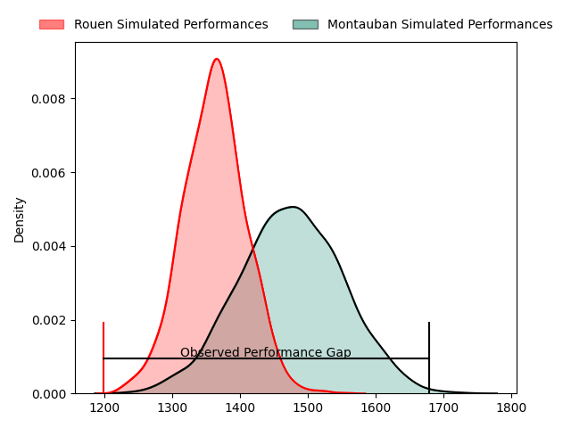
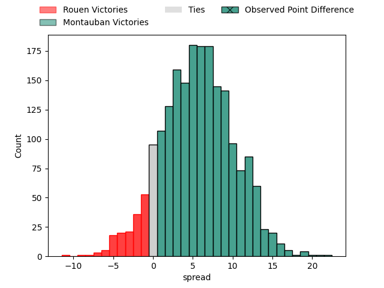
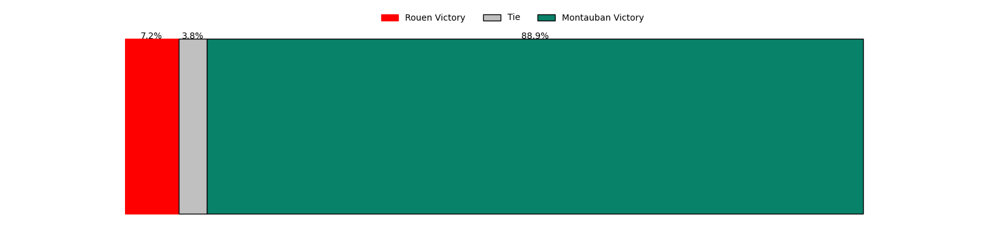

---  
layout: page  
title: Rouen at Montauban; 16-38  
date: 2023-04-07 19:30:00 18:00:00 -0500  
categories: match review  
---
# Rouen at Montauban; 16-38

# Club Level Predictions

The first set of predictions treats a club as the smallest object, as the club develops its members, organizes a gameplan, and deploys its players as needed for each match. This club model has a prediction of 0.657, which translates to predicting Montauban to win by 5.7.

Each club has a rating and a rating deviation (simiar to a Glicko system), and expected performances can be generated. This allows for simulated matches and spreads like the ones below.
## Projected Performances

## Projected Spreads

## Projected Results

# Player Level Predictions

Treating teams instead as an entity made up of the currently active players, I have ratings for each player in an altogether different system. These can be combined to form team ratings once teamsheets are announced, weighting starters a bit higher than the reserves. After the match is played, players can be weighted by their minutes on the field, allowing for an accurate measure of the team's composition. With these compiled team ratings, we can make predictions, measure inaccuracy, and update the individual player ratings.
## Prediction with Player Minutes: Montauban by 13.6

Montauban by 9.6 on a neutral field

There were 4 large changes in win probability in this match
## Prediction without Player Minutes: Montauban by 12.1

Montauban by 8.1 on a neutral pitch

|   Away Minutes | Away Player                    |   Away elo |   Away Percentile |   Number |   Home Percentile |   Home elo | Home Player       |   Home Minutes |
|---------------:|:-------------------------------|-----------:|------------------:|---------:|------------------:|-----------:|:------------------|---------------:|
|             49 | Antoine Fournier               |      77.52 |                 7 |        1 |                40 |      92.53 | Lucas Seyrolle    |             56 |
|             67 | Efitusi Ma'afu                 |      95.79 |                54 |        2 |                16 |      88.66 | Kevin Firmin      |             60 |
|             54 | Cody Thomas                    |      88.79 |                24 |        3 |                39 |      97.42 | Mirian Burduli    |             60 |
|             62 | Jean Leleu                     |      87.18 |                16 |        4 |                48 |      95.97 | Tjiuee Uanivi     |             60 |
|              8 | Toby Salmon                    |      96.6  |                53 |        5 |                72 |     103.01 | Dimitri Vaotoa    |             51 |
|             74 | Samuel Maximin                 |      94.84 |                47 |        6 |                 1 |      57.66 | Frédéric Quercy   |             80 |
|             80 | Martinus Abraham Tienie Burger |      83.62 |                17 |        7 |                75 |     105.78 | Otar Giorgadze    |             47 |
|             80 | Hugo Ndiaye                    |      97.38 |                57 |        8 |                50 |      97.45 | Quentin Witt      |             80 |
|             67 | Florent Campeggia              |      77.57 |                10 |        9 |                80 |     107.72 | Alexis Bernadet   |             80 |
|             80 | Franck Pourteau                |      90.12 |                32 |       10 |                86 |     115.95 | Jérôme Bosviel    |             80 |
|             80 | Benito Masilevu                |      90.19 |                33 |       11 |                56 |      98.06 | Bastien Guillemin |             80 |
|             30 | Taylor Gontineac               |     100.08 |                60 |       12 |                88 |     115.3  | Sevenaia Galala   |             49 |
|             80 | John Thomas Jackson            |      80.85 |                12 |       13 |                78 |     107.44 | Josua Vici        |             80 |
|             80 | Paul Surano                    |      89.14 |                30 |       14 |                48 |      95.42 | Semesa Rokoduguni |             80 |
|             80 | Peter Lydon                    |     122.06 |                93 |       15 |                71 |     105.54 | Segundo Tuculet   |             80 |
|             72 | Jimi Maximin                   |      93.03 |                42 |       16 |                40 |      92.64 | Dan Malafosse     |             29 |
|             50 | Alex Luatua                    |      93.69 |                44 |       17 |               nan |      94.29 | Tomas Lezana      |             33 |
|             26 | Willy N'Diaye                  |     101.63 |                66 |       18 |                74 |     108.29 | Maxime Mathy      |             31 |
|             31 | Soulemane Camara               |     110.89 |                89 |       19 |                97 |     126.28 | Nicolas Agnesi    |             24 |
|             18 | Fabien Vincent                 |      95.19 |                49 |       20 |                 8 |      78.26 | Arnaud Feltrin    |             20 |
|             13 | Théo Nanette                   |      83.08 |                13 |       21 |               nan |      96.14 | Maselino Paulino  |             20 |
|             13 | Jean-Étienne Lesueur           |      86.86 |                33 |       22 |                40 |      90.79 | Victor Laval      |             20 |
|              6 | Octave Leleu                   |      95    |               nan |       23 |               nan |     nan    | nan               |            nan |

