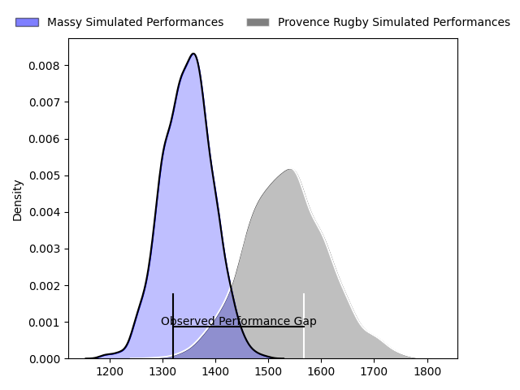
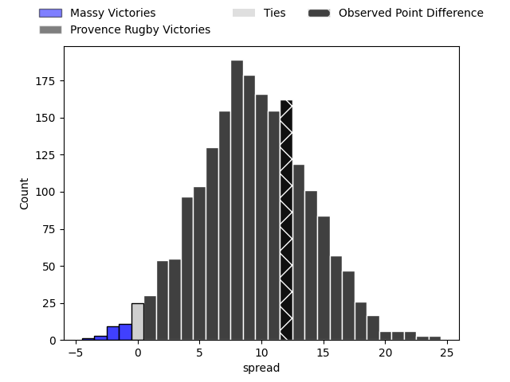

---  
layout: page  
title: Massy at Provence Rugby; 28-40  
date: 2023-04-07 19:30:00 18:00:00 -0500  
categories: match review  
---
# Massy at Provence Rugby; 28-40

# Club Level Predictions

The first set of predictions treats a club as the smallest object, as the club develops its members, organizes a gameplan, and deploys its players as needed for each match. This club model has a prediction of 0.742, which translates to predicting Provence Rugby to win by 9.3.

Each club has a rating and a rating deviation (simiar to a Glicko system), and expected performances can be generated. This allows for simulated matches and spreads like the ones below.
## Projected Performances

## Projected Spreads

## Projected Results

# Player Level Predictions

Treating teams instead as an entity made up of the currently active players, I have ratings for each player in an altogether different system. These can be combined to form team ratings once teamsheets are announced, weighting starters a bit higher than the reserves. After the match is played, players can be weighted by their minutes on the field, allowing for an accurate measure of the team's composition. With these compiled team ratings, we can make predictions, measure inaccuracy, and update the individual player ratings.
## Prediction with Player Minutes: Provence Rugby by 21.7

Provence Rugby by 17.7 on a neutral field

There were 5 large changes in win probability in this match
## Prediction without Player Minutes: Provence Rugby by 21.0

Provence Rugby by 17.0 on a neutral pitch

|   Away Minutes | Away Player              |   Away elo |   Away Percentile |   Number |   Home Percentile |   Home elo | Home Player         |   Home Minutes |
|---------------:|:-------------------------|-----------:|------------------:|---------:|------------------:|-----------:|:--------------------|---------------:|
|             46 | Alexandre Candel         |      89.9  |                38 |        1 |                67 |      99.33 | Federico Wegrzyn    |             50 |
|             46 | Pierre-Alexandre Duclieu |      87.3  |                23 |        2 |                44 |      92.99 | Loïck Jammes        |             50 |
|             46 | Tijde Visser             |      88.09 |                24 |        3 |                 6 |      74.02 | David Lolohea       |             30 |
|             80 | Ewan Coetzee             |      66.16 |                 2 |        4 |                75 |     104.31 | Jérôme Dufour       |             80 |
|             40 | Evrard Dion Oulai        |      91.95 |                38 |        5 |                74 |     103.46 | Alexandre Flanquart |             48 |
|             80 | Tony Tissot              |      90.66 |                37 |        6 |                70 |     105.59 | Guillaume Piazzoli  |             80 |
|             80 | Clément Lanen            |      89.09 |                30 |        7 |                 2 |      65.93 | Nicolas Mousties    |             80 |
|             48 | Samuel Nollet            |      79.4  |                10 |        8 |                57 |      96.97 | Malohi Suta         |             48 |
|             46 | Benjamin Prier           |     108.91 |                86 |        9 |                16 |      81.88 | Joris Cazenave      |             75 |
|             80 | Tom Deleuze              |      85.1  |                22 |       10 |                57 |      98.7  | Enzo Selponi        |             75 |
|             80 | Yanis Dit Robaglia       |      61.97 |                 3 |       11 |                34 |      90.29 | Nadir Bouhedjeur    |             80 |
|             80 | Mathieu Guillomot        |      51.9  |                 1 |       12 |                46 |      94.47 | Kaveinga Finau      |             48 |
|             50 | Victorien Jacomme        |      67.41 |                 4 |       13 |                65 |     101.69 | Peter Betham        |             80 |
|             80 | Thomas Rozière           |      82.4  |                15 |       14 |                90 |     118.15 | Kevin Bly           |             80 |
|             53 | Romain Clouté            |      90.31 |                35 |       15 |                74 |     104.91 | Adrien Lapègue      |             80 |
|             40 | Marco Fuser              |      84.55 |                19 |       16 |                38 |      92.02 | Thomas Vernet       |             50 |
|             34 | Samuel Boissinot         |      80.58 |                21 |       17 |                35 |      91.08 | Hans Nkinsi         |             32 |
|             34 | Nicolas Ferrer           |     105.38 |                81 |       18 |                18 |      84.57 | Charles Malet       |             32 |
|             34 | Pierre Trassoudaine      |     131.27 |                98 |       19 |                33 |      90.1  | Louis Marrou        |             32 |
|             34 | Ushangi Tcheishvili      |      93.52 |               nan |       20 |               nan |      93.89 | Nicolas Toth        |             30 |
|             32 | Mehdi Tlili              |      88.48 |                31 |       21 |                83 |     106.77 | Leonel Oviedo       |             30 |
|             30 | Martin Carré             |      94.73 |                52 |       22 |                33 |      92.15 | Simon Tarel         |              5 |
|             27 | Tom Cusson               |      98.86 |                58 |       23 |               nan |      96.57 | Jules Solinas       |              5 |

