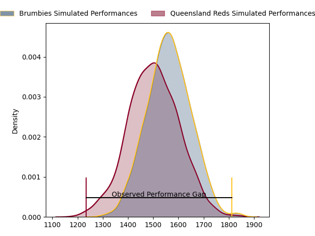
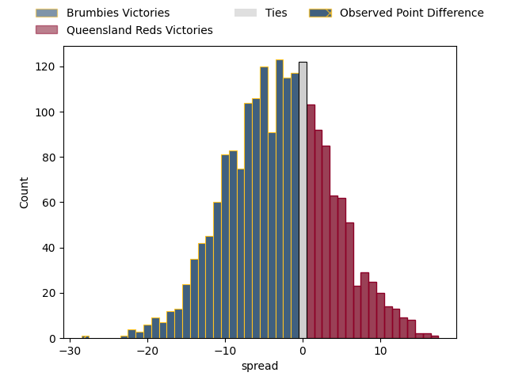

---  
layout: page  
title: Brumbies at Queensland Reds; 52.0-24.0  
date: 2023-04-07 05:35:00 18:00:00 -0500  
categories: match review  
---
# Brumbies at Queensland Reds; 52.0-24.0

# Club Level Predictions

The first set of predictions treats a club as the smallest object, as the club develops its members, organizes a gameplan, and deploys its players as needed for each match. This club model has a prediction of 0.408, which translates to predicting Brumbies to win by 3.3.

Each club has a rating and a rating deviation (simiar to a Glicko system), and expected performances can be generated. This allows for simulated matches and spreads like the ones below.
## Projected Performances

## Projected Spreads

## Projected Results

# Player Level Predictions

Treating teams instead as an entity made up of the currently active players, I have ratings for each player in an altogether different system. These can be combined to form team ratings once teamsheets are announced, weighting starters a bit higher than the reserves. After the match is played, players can be weighted by their minutes on the field, allowing for an accurate measure of the team's composition. With these compiled team ratings, we can make predictions, measure inaccuracy, and update the individual player ratings.
## Prediction with Player Minutes: Brumbies by 3.9

Brumbies by 7.9 on a neutral field

There were 8 large changes in win probability in this match
## Prediction without Player Minutes: Brumbies by 4.9

Brumbies by 8.9 on a neutral pitch

|   Away Minutes | Away Player      |   Away elo |   Away Percentile |   Number |   Home Percentile |   Home elo | Home Player           |   Home Minutes |
|---------------:|:-----------------|-----------:|------------------:|---------:|------------------:|-----------:|:----------------------|---------------:|
|             49 | James Slipper    |     125.44 |                97 |        1 |                35 |      91.46 | Peni Ravai            |             23 |
|             60 | Lachlan Lonergan |      80.26 |                10 |        2 |                44 |      93.17 | Matt Faessler         |             60 |
|             49 | Allan Alaalatoa  |     136.77 |                99 |        3 |               nan |      91.83 | Phransis Sula- Siaosi |             49 |
|             82 | Nick Frost       |      84.11 |                18 |        4 |                97 |     128.28 | Angus Blyth           |             30 |
|             65 | Cadeyrn Neville  |     125.98 |                96 |        5 |                39 |      92.38 | Seru Uru              |             82 |
|             82 | Rob Valetini     |     118.1  |                91 |        6 |                95 |     125.92 | Liam Wright           |             82 |
|             65 | Rory Scott       |      91.31 |                36 |        7 |                80 |     108.68 | Fraser McReight       |             82 |
|             82 | Pete Samu        |      96.12 |                46 |        8 |                73 |     104.99 | Harry Wilson          |             82 |
|             52 | Nic White        |     118.04 |                93 |        9 |                65 |     100.66 | Tate McDermott        |             59 |
|             77 | Noah Lolesio     |      98.56 |                57 |       10 |                56 |      98.07 | Lawson Creighton      |             82 |
|             10 | Corey Toole      |      89.35 |                30 |       11 |                91 |     120.25 | Filipo Daugunu        |             82 |
|             82 | Tamati Tua       |     112    |                84 |       12 |                37 |      91.24 | Isaac Henry           |             52 |
|             82 | Len Ikitau       |     114.22 |                86 |       13 |                24 |      87.06 | Josh Flook            |             82 |
|             82 | Andy Muirhead    |     123.33 |                93 |       14 |                44 |      93.71 | Jordan Petaia         |             68 |
|             82 | Tom Wright       |     109.34 |                81 |       15 |                58 |      99.33 | Jock Campbell         |             82 |
|             22 | Billy Pollard    |      95    |               nan |       16 |                89 |     114.15 | Richie Asiata         |             22 |
|             33 | Blake Schoupp    |      92.18 |                38 |       17 |                78 |     102.53 | Dane Zander           |             59 |
|             33 | Rhys Van Nek     |     105.27 |                81 |       18 |                35 |      91.44 | Zane Nonggorr         |             33 |
|             17 | Darcy Swain      |      95.44 |                43 |       19 |                29 |      89.37 | Ryan Smith            |             52 |
|             17 | Luke Reimer      |     109.95 |                82 |       20 |               nan |      95.78 | Jake Upfield          |              0 |
|             30 | Ryan Lonergan    |     125.6  |                97 |       21 |                50 |      94.68 | Kalani Thomas         |             23 |
|              5 | Jack Debreczeni  |      87.86 |                31 |       22 |                35 |      91.21 | James O'Connor        |             14 |
|             72 | Ben O'Donnell    |      78.96 |                14 |       23 |                31 |      88.39 | Taj Annan             |             30 |

