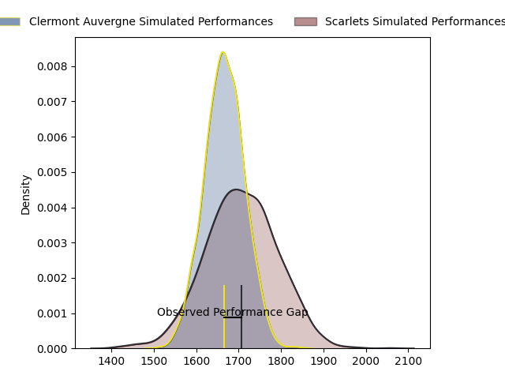
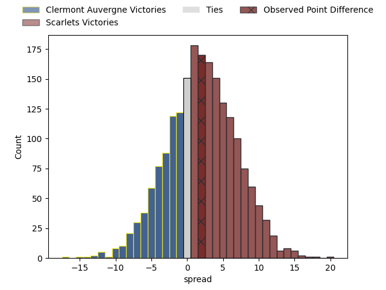

---  
layout: page  
title: Clermont Auvergne at Scarlets; 30-32  
date: 2023-04-07 21:00:00 18:00:00 -0500  
categories: match review  
---
# Clermont Auvergne at Scarlets; 30-32

# Club Level Predictions

The first set of predictions treats a club as the smallest object, as the club develops its members, organizes a gameplan, and deploys its players as needed for each match. This club model has a prediction of 0.556, which translates to predicting Scarlets to win by 2.0.

Each club has a rating and a rating deviation (simiar to a Glicko system), and expected performances can be generated. This allows for simulated matches and spreads like the ones below.
## Projected Performances

## Projected Spreads

## Projected Results

# Player Level Predictions

Treating teams instead as an entity made up of the currently active players, I have ratings for each player in an altogether different system. These can be combined to form team ratings once teamsheets are announced, weighting starters a bit higher than the reserves. After the match is played, players can be weighted by their minutes on the field, allowing for an accurate measure of the team's composition. With these compiled team ratings, we can make predictions, measure inaccuracy, and update the individual player ratings.
## Prediction with Player Minutes: Clermont Auvergne by 3.2

Clermont Auvergne by 7.2 on a neutral field

There were 13 large changes in win probability in this match
## Prediction without Player Minutes: Clermont Auvergne by 5.7

Clermont Auvergne by 9.7 on a neutral pitch

|   Away Minutes | Away Player                |   Away elo |   Away Percentile |   Number |   Home Percentile |   Home elo | Home Player      |   Home Minutes |
|---------------:|:---------------------------|-----------:|------------------:|---------:|------------------:|-----------:|:-----------------|---------------:|
|             60 | Etienne Falgoux            |     108.5  |                86 |        1 |                66 |      99.91 | Kemsley Mathias  |             53 |
|             68 | Étienne Fourcade           |     101.54 |                71 |        2 |                84 |     107.43 | Ken Owens        |             67 |
|             61 | Cristian Ojovan            |     102.85 |                75 |        3 |                38 |      92.1  | Javan Sebastian  |             43 |
|             80 | Thibault Lanen             |     109.79 |                83 |        4 |                66 |     100.85 | Vaea Fifita      |             80 |
|             67 | Paul Jedrasiak             |      92.55 |                40 |        5 |                68 |     101.39 | Sam Lousi        |             80 |
|             80 | Killian Tixeront           |     107.69 |                78 |        6 |                46 |      94.56 | Aaron Shingler   |             71 |
|             57 | Lucas Dessaigne            |     109.51 |                81 |        7 |                26 |      88.18 | Joshua McLeod    |             80 |
|             80 | Fritz Lee                  |     108.63 |                81 |        8 |                68 |     103.12 | Sione Kalamafoni |             62 |
|             56 | Baptiste Jauneau           |     100.27 |                50 |        9 |                55 |      97.48 | Gareth Davies    |             53 |
|             61 | Anthony Belleau            |     104.75 |                73 |       10 |                76 |     105.94 | Sam Costelow     |             80 |
|             80 | Alivereti Raka             |      95.27 |                46 |       11 |                38 |      91.91 | Ryan Conbeer     |             80 |
|             80 | George Moala               |     106.07 |                75 |       12 |                27 |      88.18 | Johnny Williams  |             80 |
|             80 | Irae Simone                |     100.08 |                61 |       13 |                71 |     103.98 | Joe Roberts      |             80 |
|             80 | Damian Penaud              |     117.11 |                89 |       14 |                66 |     101.91 | Steffan Evans    |             80 |
|             75 | Alex Newsome               |     108.06 |                76 |       15 |                64 |     102.61 | Leigh Halfpenny  |             24 |
|             20 | Giorgi Beria               |      94.13 |                43 |       16 |                98 |     131.64 | Wyn Jones        |             27 |
|             12 | Jean-Maxence Jules-Rosette |      95.42 |               nan |       17 |                75 |     100.22 | Shaun Evans      |             13 |
|             19 | Rabah Slimani              |     101.22 |                60 |       18 |                33 |      90.3  | Sam Wainwright   |             37 |
|             13 | Edward Annandale           |      95.24 |               nan |       19 |                57 |      98.39 | Morgan Jones     |              9 |
|             23 | Jacobus van Tonder         |      95    |               nan |       20 |                42 |      96.58 | Carwyn Tuipulotu |             18 |
|             24 | Sebastien Bézy             |     106.97 |                79 |       21 |               nan |      95.76 | Kieran Hardy     |             27 |
|             19 | Jules Plisson              |      96.92 |                50 |       22 |                85 |     110.02 | Ioan Nicholas    |             56 |
|              5 | Bautista Delguy            |     106.08 |                76 |       23 |               nan |     nan    | nan              |            nan |

