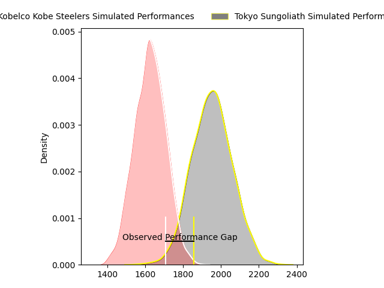
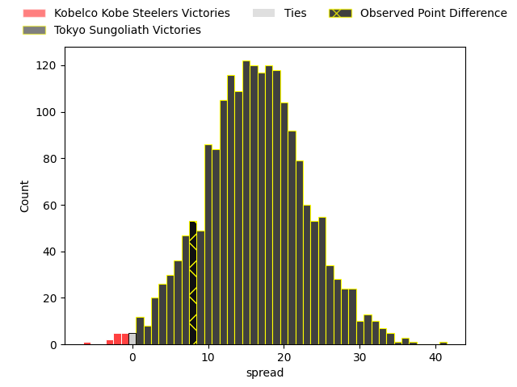
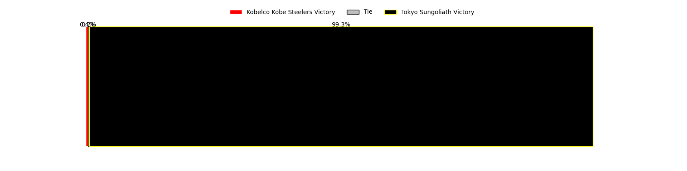

---  
layout: page  
title: Kobelco Kobe Steelers at Tokyo Sungoliath; 17-25  
date: 2023-04-07 12:00:00 18:00:00 -0500  
categories: match review  
---
# Kobelco Kobe Steelers at Tokyo Sungoliath; 17-25

# Club Level Predictions

The first set of predictions treats a club as the smallest object, as the club develops its members, organizes a gameplan, and deploys its players as needed for each match. This club model has a prediction of 0.857, which translates to predicting Tokyo Sungoliath to win by 16.1.

Each club has a rating and a rating deviation (simiar to a Glicko system), and expected performances can be generated. This allows for simulated matches and spreads like the ones below.
## Projected Performances

## Projected Spreads

## Projected Results

# Player Level Predictions

Treating teams instead as an entity made up of the currently active players, I have ratings for each player in an altogether different system. These can be combined to form team ratings once teamsheets are announced, weighting starters a bit higher than the reserves. After the match is played, players can be weighted by their minutes on the field, allowing for an accurate measure of the team's composition. With these compiled team ratings, we can make predictions, measure inaccuracy, and update the individual player ratings.
## Prediction with Player Minutes: Tokyo Sungoliath by 4.0

Tokyo Sungoliath by 0.0 on a neutral field
## Prediction without Player Minutes: Tokyo Sungoliath by 1.0

Kobelco Kobe Steelers by 3.0 on a neutral pitch

|   Away Minutes | Away Player              |   Away elo |   Away Percentile |   Number |   Home Percentile |   Home elo | Home Player         |   Home Minutes |
|---------------:|:-------------------------|-----------:|------------------:|---------:|------------------:|-----------:|:--------------------|---------------:|
|             40 | Isileli Nakajima Vakauta |     112.48 |                91 |        1 |                98 |     129.81 | Yukio Morikawa      |             57 |
|             53 | Kenta Matsuoka           |     104.74 |                79 |        2 |                33 |      90.14 | Kosuke Horikoshi    |             54 |
|             13 | Hiroshi Yamashita        |      91.94 |                37 |        3 |                84 |     106.78 | Shinnosuke Kakinaga |             54 |
|             47 | Seokhwan Jang            |     138.5  |                98 |        4 |                96 |     125.78 | Wataru Kobayashi    |             40 |
|             80 | Gerard Cowley-Tuioti     |      94.44 |                46 |        5 |                74 |     103.4  | Harrison Hockings   |             80 |
|             65 | Takara Imamura           |     103.62 |                71 |        6 |               nan |      95    | Tom Sanders         |             63 |
|             80 | Hikaru Hashimoto         |     147.03 |                99 |        7 |                21 |      86.36 | Ryuga Hashimoto     |             80 |
|             80 | Amanaki Saumaki          |      91.87 |                36 |        8 |                82 |     109.1  | Tevita Tatafu       |             80 |
|             57 | Daiki Nakajima           |     114.57 |                90 |        9 |                59 |      98.82 | Naoto Saito         |             80 |
|             80 | Lee Seung Sin            |      83.96 |                18 |       10 |                56 |      98.3  | Aaron Cruden        |             65 |
|             75 | Rakuhei Yamashita        |     139.14 |                98 |       11 |                45 |      94.29 | Tevita Li           |             69 |
|             80 | Timothy Lafaele          |      87.93 |                26 |       12 |                83 |     111.64 | Ryoto Nakamura      |             80 |
|             65 | Richard Buckman          |      91.23 |                37 |       13 |                66 |     102.28 | Shogo Nakano        |             80 |
|             80 | Ataata Moeakiola         |      93.29 |                43 |       14 |                75 |     105.7  | Seiya Ozaki         |             80 |
|             80 | Ryohei Yamanaka          |      88.26 |                27 |       15 |                51 |      96.47 | Kotaro Matsushima   |             80 |
|             67 | Sho Maeda                |     102.93 |                75 |       16 |                68 |     101.26 | Hendrik Tui         |             40 |
|             40 | Koki Yamamoto            |      93.44 |               nan |       17 |                99 |     133.83 | Shunta Nakamura     |             26 |
|             33 | Naohiro Kotaki           |      87.44 |                25 |       18 |                64 |      98.24 | Ryosuke Iwaihara    |             26 |
|             27 | Kyungmun Wang            |      89.4  |               nan |       19 |                88 |     109.61 | Shintaro Ishihara   |             23 |
|             23 | Kenta Tokuda             |     102.26 |                60 |       20 |                74 |     105.4  | Koji Iino           |             17 |
|             15 | Tiennan Costley          |      96.09 |                46 |       21 |                54 |      95.13 | Hikaru Tamura       |             15 |
|             15 | Beaudein Waaka           |      91.77 |               nan |       22 |                43 |      91.75 | Taiga Ozaki         |             11 |
|              5 | Kanta Matsunaga          |      89.63 |               nan |       23 |               nan |     nan    | nan                 |            nan |

