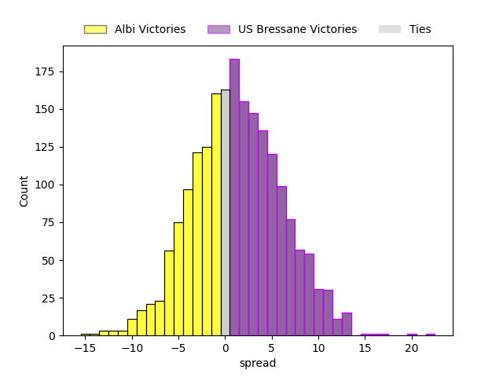
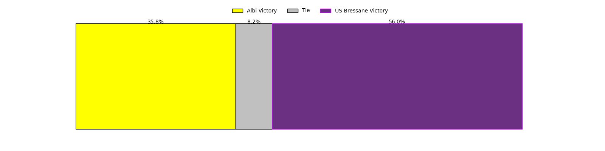

---  
layout: page  
title: Albi at US Bressane; 32-32  
date: 2023-04-07 19:30:00 18:00:00 -0500  
categories: match review  
---
# Albi at US Bressane; 32-32

# Club Level Predictions

The first set of predictions treats a club as the smallest object, as the club develops its members, organizes a gameplan, and deploys its players as needed for each match. This club model has a prediction of 0.53, which translates to predicting US Bressane to win by 1.1.

Each club has a rating and a rating deviation (simiar to a Glicko system), and expected performances can be generated. This allows for simulated matches and spreads like the ones below.
## Projected Performances

## Projected Spreads

## Projected Results

# Player Level Predictions

Treating teams instead as an entity made up of the currently active players, I have ratings for each player in an altogether different system. These can be combined to form team ratings once teamsheets are announced, weighting starters a bit higher than the reserves. After the match is played, players can be weighted by their minutes on the field, allowing for an accurate measure of the team's composition. With these compiled team ratings, we can make predictions, measure inaccuracy, and update the individual player ratings.
## Prediction with Player Minutes: US Bressane by 1.7

Albi by 2.3 on a neutral field

There were 16 large changes in win probability in this match
## Prediction without Player Minutes: Albi by 1.3

Albi by 5.3 on a neutral pitch

|   Away Minutes | Away Player                 |   Away elo |   Away Percentile |   Number |   Home Percentile |   Home elo | Home Player                 |   Home Minutes |
|---------------:|:----------------------------|-----------:|------------------:|---------:|------------------:|-----------:|:----------------------------|---------------:|
|             47 | Maxime Escur                |      75.68 |                10 |        1 |                14 |      83.32 | Vazha Kapanadze             |             70 |
|             64 | Arthur Castant              |      99.25 |                66 |        2 |                22 |      86.83 | Clément Jullien             |             64 |
|             64 | Dimitri Tchapnga            |      90.98 |                33 |        3 |                28 |      89.34 | Willem Johannes Harmse      |             70 |
|             54 | John Henry Heath Backhouse  |      88.96 |                28 |        4 |                55 |      97.1  | Koen Bloemen                |             32 |
|             80 | Jacques Jacobus Engelbrecht |      95.21 |                56 |        5 |                36 |      91.48 | Marius Constantin Antonescu |             80 |
|             80 | Vincent Calas               |      81.13 |                12 |        6 |                17 |      84.51 | Nicolas Tachat              |             64 |
|             58 | Lucas Guillaume             |     115.24 |                89 |        7 |                36 |      91.43 | Loïc Baradel                |             80 |
|             80 | Camille Jarreau             |      95.89 |                45 |        8 |                71 |     105.84 | TJ Ioane                    |             41 |
|             17 | Titouan Pouzoullic          |      82.72 |                20 |        9 |                56 |     100.08 | Jérémy Valençot             |             80 |
|             80 | Benjamin Pehau              |     110.97 |                82 |       10 |                14 |      83.04 | Christian Lacombe           |             80 |
|             80 | Avenisi Vasuinubu           |      89.25 |                30 |       11 |                47 |      94.75 | Kavekini Tabu               |             80 |
|             45 | François Fontaine           |      87.64 |                26 |       12 |                97 |     130.52 | Parataiso Silafai-Lea'ana   |             80 |
|             32 | Wandile Gabada  Mjekevu     |      79.3  |                11 |       13 |                 9 |      76.68 | Maile Mamao                 |             80 |
|             80 | Charly Vicenzo Trussardi    |     100.18 |                63 |       14 |                36 |      91.19 | Élie De Fleurian            |             80 |
|             80 | Paul Clergue                |     107    |                83 |       15 |                36 |      90.59 | Audric Sanlaville           |             80 |
|             33 | Antoine Soave               |     113.93 |                92 |       16 |               nan |     112.17 | Quentin Drancourt           |             10 |
|             16 | Romain Maurice              |      92.94 |                54 |       17 |                54 |      97.17 | Sione Anga'aelangi          |             16 |
|             16 | Kevin Brou                  |      87.24 |                23 |       18 |                 0 |      39.27 | Erich de Jager              |             10 |
|             26 | Pierre Roussel              |      94.02 |                45 |       19 |                29 |      89.31 | Monty Leverstein            |             48 |
|             22 | Luke Joseph Stringer        |      97.52 |                63 |       20 |                 6 |      76.14 | Dimitri Jean Etienne        |             16 |
|             63 | Gilen Queheille             |      81.13 |                12 |       21 |                93 |     121.38 | Lucas Lyons                 |             39 |
|             48 | Enzo Marzocca               |     104.87 |                70 |       22 |               nan |     nan    | nan                         |            nan |
|             35 | James Haydn Tedder          |      80.22 |               nan |       23 |               nan |     nan    | nan                         |            nan |

