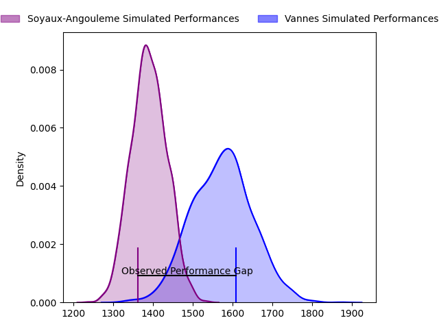
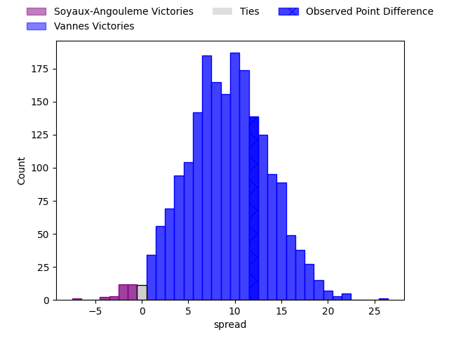
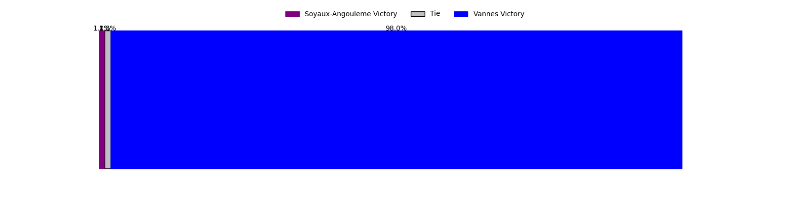

---  
layout: page  
title: Soyaux-Angouleme at Vannes; 21-33  
date: 2023-04-07 19:30:00 18:00:00 -0500  
categories: match review  
---
# Soyaux-Angouleme at Vannes; 21-33

# Club Level Predictions

The first set of predictions treats a club as the smallest object, as the club develops its members, organizes a gameplan, and deploys its players as needed for each match. This club model has a prediction of 0.74, which translates to predicting Vannes to win by 9.2.

Each club has a rating and a rating deviation (simiar to a Glicko system), and expected performances can be generated. This allows for simulated matches and spreads like the ones below.
## Projected Performances

## Projected Spreads

## Projected Results

# Player Level Predictions

Treating teams instead as an entity made up of the currently active players, I have ratings for each player in an altogether different system. These can be combined to form team ratings once teamsheets are announced, weighting starters a bit higher than the reserves. After the match is played, players can be weighted by their minutes on the field, allowing for an accurate measure of the team's composition. With these compiled team ratings, we can make predictions, measure inaccuracy, and update the individual player ratings.
## Prediction with Player Minutes: Vannes by 12.2

Vannes by 8.2 on a neutral field

There were 5 large changes in win probability in this match
## Prediction without Player Minutes: Vannes by 16.5

Vannes by 12.5 on a neutral pitch

|   Away Minutes | Away Player            |   Away elo |   Away Percentile |   Number |   Home Percentile |   Home elo | Home Player             |   Home Minutes |
|---------------:|:-----------------------|-----------:|------------------:|---------:|------------------:|-----------:|:------------------------|---------------:|
|             26 | Omar Odishvili         |      95.55 |                51 |        1 |                98 |     133.91 | Andy Bordelai           |             66 |
|             51 | Rayne Barka            |      93.98 |                48 |        2 |                81 |     106.18 | Cyril Blanchard         |             58 |
|             26 | Omar Dahir             |      86.27 |                16 |        3 |                61 |      98.42 | John Afoa               |             57 |
|             80 | Matt Va'ai             |     103.54 |                70 |        4 |                 3 |      61.77 | Myles Edwards           |             80 |
|             80 | Janse Roux             |      96.95 |                54 |        5 |                46 |      95.01 | Mattéo Desjeux          |             50 |
|             80 | Germain Burgaud        |     116.57 |                89 |        6 |                46 |      94.34 | Juan Bautista Pedemonte |             80 |
|             80 | Nicolas Martins        |      97.33 |                53 |        7 |                88 |     114.75 | Francisco Gorrisen      |             80 |
|             65 | Hubert Texier          |     114.34 |                87 |        8 |                70 |     103.69 | Karl Chateau            |             26 |
|             67 | Adrien Bau             |      61.34 |                 1 |        9 |                88 |     112.2  | Michael Ruru            |             72 |
|             80 | Jacob Botica           |      93.69 |                41 |       10 |                79 |     109.08 | Maxime Lafage           |             76 |
|             80 | Maxime Laforgue        |     105.39 |                75 |       11 |                79 |     107.17 | Romaric Camou           |             80 |
|             61 | Mathis Lafon           |      89.22 |                30 |       12 |                39 |      91.68 | Youenn Floch            |             41 |
|             80 | Inaki Ayarza Saporta   |      88.77 |                27 |       13 |                62 |     100.35 | Sacha Valleau           |             80 |
|             63 | Junior Ratuva          |      97.38 |                54 |       14 |                87 |     115.36 | Nathanael Hulleu        |             80 |
|             80 | Rémi Brosset           |     115.83 |                86 |       15 |                88 |     115.61 | Gwenaël Duplenne        |             80 |
|             54 | Shota Gogisvanidze     |     105.52 |                76 |       16 |                 4 |      69.87 | Gregoire Bazin          |             54 |
|             54 | Yassin Boutemani       |      89.51 |                29 |       17 |                91 |     118.23 | Andres Vilaseca         |             39 |
|             29 | Patxi Bidart           |      88.69 |                20 |       18 |                90 |     116.58 | Ewan Thomas Johnson     |             30 |
|             19 | Nasoni Naqiri Kunavore |     125.04 |                95 |       19 |                65 |     101.12 | Phil Kite               |             23 |
|             17 | Hugo Le Gall           |      76.38 |                 8 |       20 |                79 |     104.75 | Pat Leafa               |             22 |
|             15 | Yassine Jarmouni       |      97.96 |                51 |       21 |                63 |      97.87 | Enzo Baggiani           |             14 |
|             13 | Lucas Rubio            |      96.91 |               nan |       22 |                91 |     116.32 | Erwan Nicolas           |              8 |
|            nan | nan                    |     nan    |               nan |       23 |                61 |     100.89 | Jean Chezeau            |              4 |

