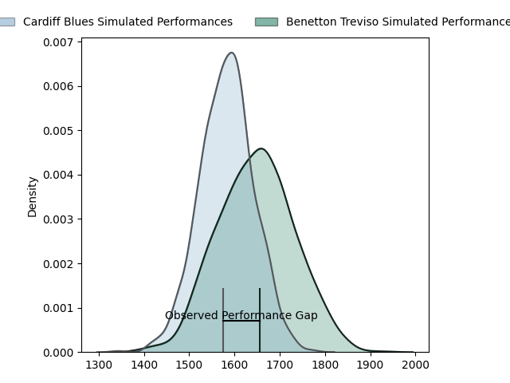
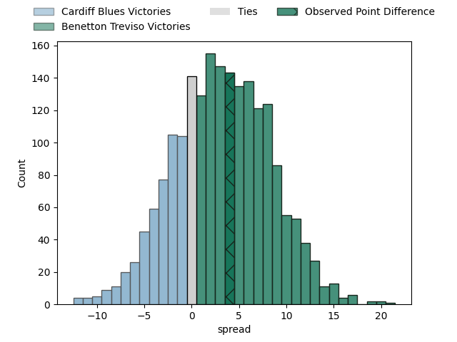

---  
layout: page  
title: Cardiff Blues at Benetton Treviso; 23-27  
date: 2023-04-08 16:00:00 18:00:00 -0500  
categories: match review  
---
# Cardiff Blues at Benetton Treviso; 23-27

# Club Level Predictions

The first set of predictions treats a club as the smallest object, as the club develops its members, organizes a gameplan, and deploys its players as needed for each match. This club model has a prediction of 0.586, which translates to predicting Benetton Treviso to win by 3.1.

Each club has a rating and a rating deviation (simiar to a Glicko system), and expected performances can be generated. This allows for simulated matches and spreads like the ones below.
## Projected Performances

## Projected Spreads

## Projected Results

# Player Level Predictions

Treating teams instead as an entity made up of the currently active players, I have ratings for each player in an altogether different system. These can be combined to form team ratings once teamsheets are announced, weighting starters a bit higher than the reserves. After the match is played, players can be weighted by their minutes on the field, allowing for an accurate measure of the team's composition. With these compiled team ratings, we can make predictions, measure inaccuracy, and update the individual player ratings.
## Prediction with Player Minutes: Benetton Treviso by 12.1

Benetton Treviso by 8.1 on a neutral field

There were 11 large changes in win probability in this match
## Prediction without Player Minutes: Benetton Treviso by 10.1

Benetton Treviso by 6.1 on a neutral pitch

|   Away Minutes | Away Player       |   Away elo |   Away Percentile |   Number |   Home Percentile |   Home elo | Home Player                     |   Home Minutes |
|---------------:|:------------------|-----------:|------------------:|---------:|------------------:|-----------:|:--------------------------------|---------------:|
|             68 | Corey Domachowski |      99.05 |                63 |        1 |                71 |     101.54 | Francisco Nahuel Tetaz Chaparro |             80 |
|             59 | Liam Belcher      |      92.48 |                42 |        2 |                97 |     127.8  | Giacomo Nicotera                |             43 |
|             80 | Kieran Assirati   |      90.27 |                31 |        3 |                64 |      99.43 | Tiziano Pasquali                |             74 |
|             60 | Joshua Turnbull   |      96.44 |                51 |        4 |                 2 |      60.75 | Niccolo Cannone                 |             80 |
|             72 | Teddy Williams    |     100.27 |                65 |        5 |                85 |     110.97 | Federico Ruzza                  |             80 |
|             72 | James Botham      |      81.05 |                11 |        6 |                30 |      89.19 | Sebastian Negri                 |             43 |
|             80 | Thomas Young      |      91.98 |               nan |        7 |                88 |     115.16 | Michele Lamaro                  |             80 |
|             80 | Taulupe Faletau   |     111.23 |                85 |        8 |                39 |      93.62 | Henry Stowers                   |             52 |
|             72 | Tomos Williams    |     119.85 |                94 |        9 |                67 |     101.09 | Dewald Otto Duvenage            |             80 |
|             80 | Rhys Priestland   |      91.61 |                39 |       10 |                79 |     109.06 | Jacob Umaga                     |             62 |
|             80 | Josh Adams        |     107.93 |                80 |       11 |                83 |     110.85 | Marcus Watson                   |             80 |
|             80 | Max Llewellyn     |      94.44 |                46 |       12 |                94 |     124.45 | Tommaso Menoncello              |             80 |
|             80 | Mason Grady       |      96.67 |                51 |       13 |                78 |     107.7  | Juan Ignacio Brex               |             80 |
|             80 | Owen Lane         |      96.46 |                51 |       14 |                74 |     105.3  | Edoardo Padovani                |             80 |
|             80 | Ben Thomas        |      91.03 |                41 |       15 |                44 |      92.83 | Rhyno Christo Smith             |             80 |
|             21 | Kristian Dacey    |      92.66 |                43 |       16 |                47 |      95.98 | Siua Maile                      |             37 |
|             12 | Rhys Carre        |      86.72 |                22 |       17 |               nan |      95.52 | Filipo Alongi                   |              6 |
|             20 | Lopeti Timani     |      81.69 |                14 |       18 |                35 |      93.47 | Manuel Zuliani                  |             37 |
|              8 | Seb Davies        |      96.53 |                53 |       19 |                56 |      99.41 | Lorenzo Cannone                 |             28 |
|              8 | James Ratti       |      84.65 |                20 |       20 |                22 |      87.95 | Tomas Albornoz                  |             18 |
|              8 | Lloyd Williams    |     102.05 |                68 |       21 |               nan |     nan    | nan                             |            nan |

