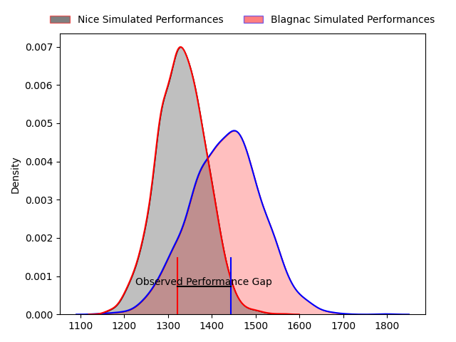
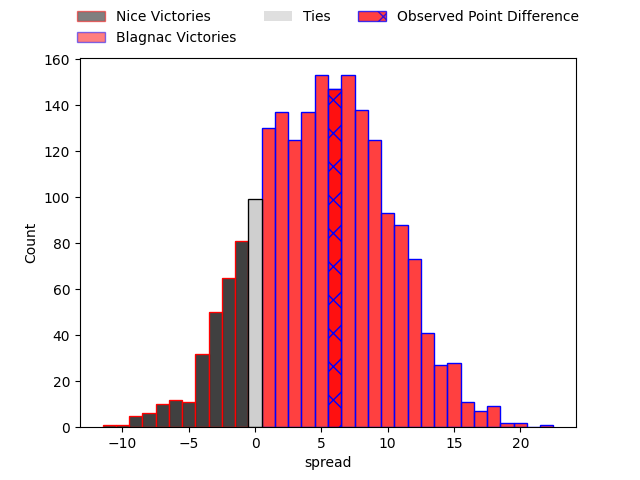
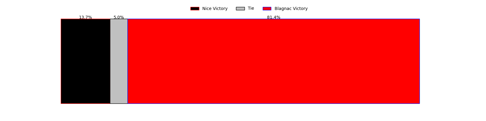

---  
layout: page  
title: Nice at Blagnac; 12-18  
date: 2023-04-08 16:00:00 18:00:00 -0500  
categories: match review  
---
# Nice at Blagnac; 12-18

# Club Level Predictions

The first set of predictions treats a club as the smallest object, as the club develops its members, organizes a gameplan, and deploys its players as needed for each match. This club model has a prediction of 0.644, which translates to predicting Blagnac to win by 5.2.

Each club has a rating and a rating deviation (simiar to a Glicko system), and expected performances can be generated. This allows for simulated matches and spreads like the ones below.
## Projected Performances

## Projected Spreads

## Projected Results

# Player Level Predictions

Treating teams instead as an entity made up of the currently active players, I have ratings for each player in an altogether different system. These can be combined to form team ratings once teamsheets are announced, weighting starters a bit higher than the reserves. After the match is played, players can be weighted by their minutes on the field, allowing for an accurate measure of the team's composition. With these compiled team ratings, we can make predictions, measure inaccuracy, and update the individual player ratings.
## Prediction with Player Minutes: Blagnac by 4.9

Blagnac by 0.9 on a neutral field

There were 10 large changes in win probability in this match
## Prediction without Player Minutes: Blagnac by 9.2

Blagnac by 5.2 on a neutral pitch

|   Away Minutes | Away Player          |   Away elo |   Away Percentile |   Number |   Home Percentile |   Home elo | Home Player         |   Home Minutes |
|---------------:|:---------------------|-----------:|------------------:|---------:|------------------:|-----------:|:--------------------|---------------:|
|             51 | Sunia Vola           |     101.46 |                71 |        1 |                78 |     100.87 | Alexis Decaux       |             59 |
|             80 | Kurt Stanley Haupt   |      87.9  |                33 |        2 |                38 |      91.57 | Florian Bertrand    |             59 |
|             80 | Jeronimo Negrotto    |      85.58 |                18 |        3 |                66 |      99.73 | Fabien Lorenzon     |             60 |
|             80 | Thibaud Rey          |     101.68 |                69 |        4 |                83 |     109.79 | Vincent Mutel       |             80 |
|             62 | Marvin Woki          |      99.32 |                68 |        5 |                79 |     103.89 | Lilian Rousset      |             80 |
|             80 | Louis Suaud          |     104.55 |                73 |        6 |                52 |      93.61 | Benjamin Collet     |             51 |
|             67 | Arthur Vignolles     |      91.65 |                38 |        7 |                62 |      99.97 | Ianis Ponsole       |             80 |
|             62 | Steffon Armitage     |     103.15 |                70 |        8 |                 3 |      61.52 | Lucas Tolofua       |             51 |
|             18 | Mathieu Lorée        |      84.56 |                18 |        9 |                69 |     102.28 | Paul Ravier         |             69 |
|             80 | Mathis Viard         |     101.92 |                68 |       10 |                65 |      97.71 | Valentin Delpy      |             80 |
|             80 | David Odiete         |      95.06 |                52 |       11 |                14 |      81.71 | Lukas Doyhenard     |             80 |
|             80 | Luca Cutayar         |     110.66 |                83 |       12 |                50 |      93.5  | Aurelien Labau      |             80 |
|             69 | Baptiste Delage      |      90.14 |                33 |       13 |                57 |      98.61 | Clément Vareilles   |             55 |
|             80 | Clement Egiziano     |      91.93 |                39 |       14 |                39 |      89.86 | Lucas Martins       |             80 |
|             80 | Loic Le Gal          |      87    |                25 |       15 |                89 |     116.14 | Jean-Andre Vernetti |             80 |
|             29 | Nicolas Lemaire      |      91.04 |               nan |       16 |                73 |     102.32 | Cesar Biscioni      |             21 |
|             18 | Laijiasa Bolenaivalu |     116.17 |                89 |       17 |                77 |     103.87 | Gabin Villerouge    |             21 |
|             18 | Martin Freytes       |      70.77 |                 6 |       18 |                77 |     105.3  | Baptiste Collet     |             20 |
|             13 | Louis Vincent        |      87.95 |                34 |       19 |                64 |     101.54 | Mathieu Vachon      |             29 |
|             62 | Agustin Ormaechea    |      99.29 |                67 |       20 |                67 |     101.2  | Corentin Penc'hoat  |             11 |
|             11 | Hugo Martin          |      83.54 |                17 |       21 |                 4 |      70.21 | Antoine Renaud      |             25 |
|            nan | nan                  |     nan    |               nan |       22 |                23 |      87.01 | Nekolo Tolofua      |             12 |
|            nan | nan                  |     nan    |               nan |       23 |                13 |      82.4  | Loïc Verdy          |             17 |

