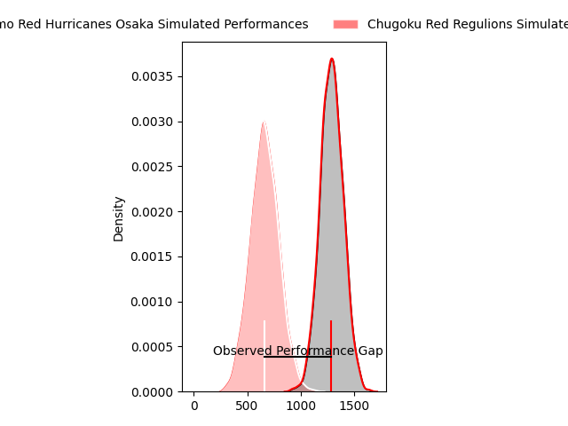
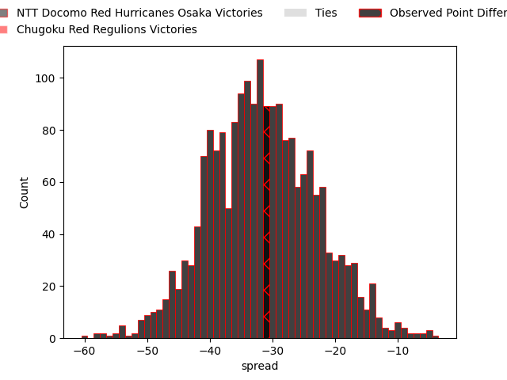

---  
layout: page  
title: NTT Docomo Red Hurricanes Osaka at Chugoku Red Regulions; 31-0  
date: 2023-04-08 00:00:00 18:00:00 -0500  
categories: match review  
---
# NTT Docomo Red Hurricanes Osaka at Chugoku Red Regulions; 31-0

# Club Level Predictions

The first set of predictions treats a club as the smallest object, as the club develops its members, organizes a gameplan, and deploys its players as needed for each match. This club model has a prediction of 0.032, which translates to predicting NTT Docomo Red Hurricanes Osaka to win by 31.4.

Each club has a rating and a rating deviation (simiar to a Glicko system), and expected performances can be generated. This allows for simulated matches and spreads like the ones below.
## Projected Performances

## Projected Spreads

## Projected Results

# Player Level Predictions

Treating teams instead as an entity made up of the currently active players, I have ratings for each player in an altogether different system. These can be combined to form team ratings once teamsheets are announced, weighting starters a bit higher than the reserves. After the match is played, players can be weighted by their minutes on the field, allowing for an accurate measure of the team's composition. With these compiled team ratings, we can make predictions, measure inaccuracy, and update the individual player ratings.
## Prediction with Player Minutes: NTT Docomo Red Hurricanes Osaka by 24.3

NTT Docomo Red Hurricanes Osaka by 28.3 on a neutral field

There were 2 large changes in win probability in this match
## Prediction without Player Minutes: NTT Docomo Red Hurricanes Osaka by 25.4

NTT Docomo Red Hurricanes Osaka by 29.4 on a neutral pitch

|   Away Minutes | Away Player          |   Away elo |   Away Percentile |   Number |   Home Percentile |   Home elo | Home Player          |   Home Minutes |
|---------------:|:---------------------|-----------:|------------------:|---------:|------------------:|-----------:|:---------------------|---------------:|
|             57 | Yosuke Nishiura      |      81.67 |                11 |        1 |                 5 |      73.6  | Kojiro Arito         |             52 |
|             71 | Hisamitsu Shimada    |      99.35 |                66 |        2 |                 9 |      77.96 | Kentaro Iwanaga      |             66 |
|             57 | Yuichiro Hosono      |      98.29 |                60 |        3 |                 3 |      69.64 | Saiya Kitajima       |             40 |
|             80 | Tatsunari Fujita     |      71.4  |                 6 |        4 |                 0 |      36.94 | Taro Nishikawa       |             80 |
|             38 | Tom Jeffries         |     107.17 |                79 |        5 |                40 |      92.64 | Tomonari Aoki        |             66 |
|             80 | Toru Sugishita       |      72.54 |                 5 |        6 |                15 |      83.65 | Shintaro Matsuda     |             80 |
|             80 | Willie Britz         |      99.25 |                62 |        7 |                 1 |      55.84 | Kouta Moriyama       |             80 |
|             71 | Colin Bourke         |     100.38 |                61 |        8 |                 3 |      66.18 | Shun Kawaguchi       |             40 |
|             52 | Toshihiro Yamamouchi |     108.43 |                83 |        9 |                 1 |      61.63 | Shohei Tsukamoto     |             40 |
|             80 | Oh Ryong Tee         |     107.43 |                73 |       10 |                16 |      83.25 | Ippei Yamada         |             80 |
|             71 | Kanta Yamamoto       |      57.55 |                 1 |       11 |                18 |      84.13 | Hirofumi Higashikawa |             66 |
|             52 | Mifiposeti Paea      |     105.47 |                74 |       12 |                23 |      85.55 | Shinya Hirayama      |             57 |
|             80 | Daisuke Iba          |      91.63 |                39 |       13 |                 3 |      64.47 | Masaaki Morita       |             80 |
|             80 | Amanaki Lisala       |      94.21 |               nan |       14 |                17 |      83.79 | Kentaro Fujii        |             80 |
|             80 | Taichi Yoshizawa     |      68.31 |                 5 |       15 |                 4 |      70.31 | Hashizo Yoshida      |             80 |
|             42 | Josh Fenner          |      87.28 |                23 |       16 |                 3 |      68.51 | Kohei Matsunaga      |             40 |
|             28 | Benjamin Saunders    |     131.18 |                98 |       17 |                 7 |      74.86 | Rintaro Kawashima    |             40 |
|             28 | Ryo Tsuruda          |     133.52 |                98 |       18 |                18 |      84.8  | Kento Miyata         |             40 |
|              9 | Shosuke Fukasawa     |      94.01 |                21 |       19 |                 4 |      69.37 | Toshiyuki Ooki       |             28 |
|              9 | Tsukasa Yasuda       |      89.17 |               nan |       20 |                 2 |      61.02 | Makoto Torikai       |             23 |
|              9 | Kenta Komura         |      96.68 |                57 |       21 |                11 |      81.05 | Hidetatsu Tsuboi     |             14 |
|             23 | Munekata Sashida     |      90.02 |                39 |       22 |               nan |      64.43 | Kennta Fujisaki      |             14 |
|             23 | Takai Shota          |      93.12 |               nan |       23 |                 9 |      77.57 | Riki Yamaguchi       |             14 |

