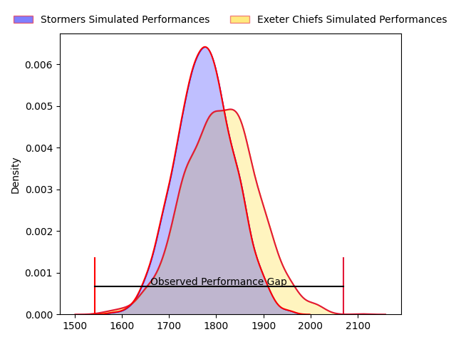
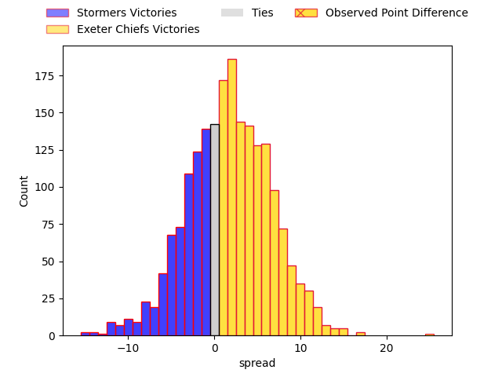

---  
layout: page  
title: Stormers at Exeter Chiefs; 17-42  
date: 2023-04-08 18:30:00 18:00:00 -0500  
categories: match review  
---
# Stormers at Exeter Chiefs; 17-42

# Club Level Predictions

The first set of predictions treats a club as the smallest object, as the club develops its members, organizes a gameplan, and deploys its players as needed for each match. This club model has a prediction of 0.548, which translates to predicting Exeter Chiefs to win by 1.7.

Each club has a rating and a rating deviation (simiar to a Glicko system), and expected performances can be generated. This allows for simulated matches and spreads like the ones below.
## Projected Performances

## Projected Spreads

## Projected Results

# Player Level Predictions

Treating teams instead as an entity made up of the currently active players, I have ratings for each player in an altogether different system. These can be combined to form team ratings once teamsheets are announced, weighting starters a bit higher than the reserves. After the match is played, players can be weighted by their minutes on the field, allowing for an accurate measure of the team's composition. With these compiled team ratings, we can make predictions, measure inaccuracy, and update the individual player ratings.
## Prediction with Player Minutes: Stormers by 5.8

Stormers by 9.8 on a neutral field

There were 6 large changes in win probability in this match
## Prediction without Player Minutes: Stormers by 4.9

Stormers by 8.9 on a neutral pitch

|   Away Minutes | Away Player                  |   Away elo |   Away Percentile |   Number |   Home Percentile |   Home elo | Home Player       |   Home Minutes |
|---------------:|:-----------------------------|-----------:|------------------:|---------:|------------------:|-----------:|:------------------|---------------:|
|             69 | Steven Kitshoff              |     106.18 |                83 |        1 |                57 |      97.41 | Scott Sio         |             53 |
|             50 | Joseph Dweba                 |     105.83 |                81 |        2 |                97 |     128.7  | Dan Frost         |             53 |
|             57 | Jozua Francois Malherbe      |     103.6  |                77 |        3 |                 4 |      72.39 | Marcus Street     |             53 |
|             66 | Ernst van Rhyn               |     100.29 |                65 |        4 |                48 |      95.13 | Jonny Gray        |             80 |
|             80 | Marvin Orie                  |     103.87 |                74 |        5 |                92 |     119.97 | Dafydd Jenkins    |             80 |
|             41 | Junior Sipato Pokomela       |     100.65 |                64 |        6 |                86 |     113.51 | Jannes Kirsten    |             57 |
|             80 | Ben-Jason Dixon              |     114.9  |                88 |        7 |                20 |      86.38 | Christ Tshiunza   |             53 |
|             41 | Marcel Theunissen            |      93.6  |                38 |        8 |                92 |     119.78 | Sam Simmonds      |             62 |
|             62 | Herschel Jerome Jantjies     |      98.21 |                57 |        9 |                26 |      87.79 | Will Becconsall   |             80 |
|             80 | Immanuel Libbok              |     109.9  |                81 |       10 |                18 |      84.39 | Joe Simmonds      |             80 |
|             80 | Seabelo Senatla              |     107.42 |                79 |       11 |                95 |     126.15 | Olly Woodburn     |             80 |
|             80 | Daniel Michael du Plessis    |     109.29 |                80 |       12 |                18 |      84.52 | Sean O'Brien      |             65 |
|             58 | Adriaan Ruhan Nel            |      96.93 |                51 |       13 |                58 |      98.88 | Henry Slade       |             80 |
|             80 | Suleiman  Hartzenberg        |     118.89 |                90 |       14 |                10 |      77.3  | Jack Nowell       |             62 |
|             80 | Damian Willemse              |     109.84 |                81 |       15 |                17 |      81.32 | Tom Wyatt         |             80 |
|             11 | Alistair Fernando Vermaak    |      83.51 |                14 |       16 |                91 |     112.83 | Nika Abuladze     |             27 |
|             30 | JJ Kotze                     |      94.54 |                44 |       17 |               nan |      86.41 | Jack Yeandle      |             27 |
|             23 | Johan Neethling Fouche       |     100.36 |                55 |       18 |                51 |      89.44 | Josh Iosefa-Scott |             27 |
|             14 | Gary Porter                  |      86.33 |                22 |       19 |                97 |     128.4  | Dave Ewers        |             23 |
|             39 | Willem Gerhardus Engelbrecht |      90.79 |                29 |       20 |               nan |      90.29 | Aidon Davis       |             27 |
|             39 | Hacjivah Dayimani            |     105.05 |                73 |       21 |                16 |      83.1  | Harvey Skinner    |             15 |
|             18 | Albertus Paul de Wet         |     107.32 |                79 |       22 |               nan |      89.89 | Tom Cairns        |             18 |
|             22 | Clayton Blommetjies          |     102.5  |                64 |       23 |                71 |     105.34 | Stuart Hogg       |             18 |

