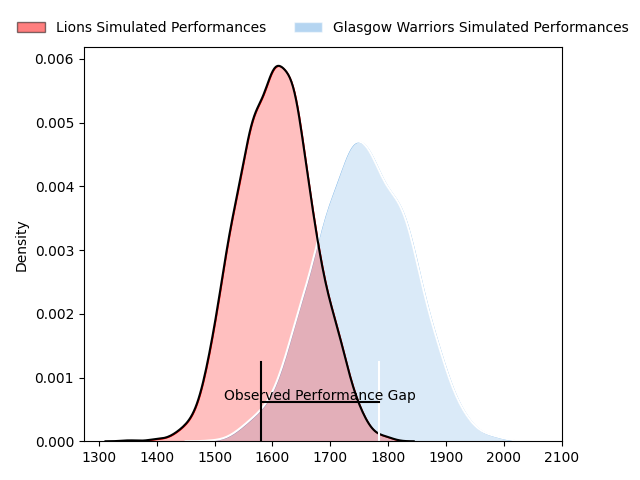
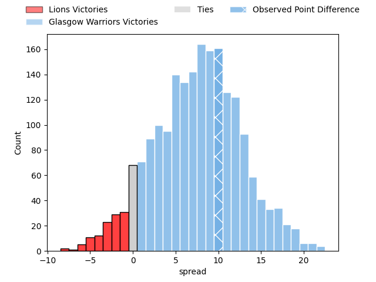

---  
layout: page  
title: Lions at Glasgow Warriors; 21-31  
date: 2023-04-08 21:00:00 18:00:00 -0500  
categories: match review  
---
# Lions at Glasgow Warriors; 21-31

# Club Level Predictions

The first set of predictions treats a club as the smallest object, as the club develops its members, organizes a gameplan, and deploys its players as needed for each match. This club model has a prediction of 0.705, which translates to predicting Glasgow Warriors to win by 7.7.

Each club has a rating and a rating deviation (simiar to a Glicko system), and expected performances can be generated. This allows for simulated matches and spreads like the ones below.
## Projected Performances

## Projected Spreads

## Projected Results

# Player Level Predictions

Treating teams instead as an entity made up of the currently active players, I have ratings for each player in an altogether different system. These can be combined to form team ratings once teamsheets are announced, weighting starters a bit higher than the reserves. After the match is played, players can be weighted by their minutes on the field, allowing for an accurate measure of the team's composition. With these compiled team ratings, we can make predictions, measure inaccuracy, and update the individual player ratings.
## Prediction with Player Minutes: Glasgow Warriors by 2.9

Lions by 1.1 on a neutral field

There were 9 large changes in win probability in this match
## Prediction without Player Minutes: Glasgow Warriors by 7.9

Glasgow Warriors by 3.9 on a neutral pitch

|   Away Minutes | Away Player                 |   Away elo |   Away Percentile |   Number |   Home Percentile |   Home elo | Home Player          |   Home Minutes |
|---------------:|:----------------------------|-----------:|------------------:|---------:|------------------:|-----------:|:---------------------|---------------:|
|             49 | Jean-Pierre Smith           |     101.95 |                73 |        1 |                55 |     100.16 | Jamie Bhatti         |             61 |
|             66 | PJ Botha                    |     102.24 |                73 |        2 |                93 |     117.34 | George Turner        |             61 |
|             66 | Asenathi Ntlabakanye        |      82.21 |                12 |        3 |                88 |     110.04 | Zander Fagerson      |             61 |
|             80 | Willem Alberts              |      94.15 |                45 |        4 |                81 |     108.35 | Scott Cummings       |             61 |
|             80 | Ruben (Hobo) Schoeman       |     109.95 |                83 |        5 |                95 |     124.6  | Richie Gray          |             61 |
|             75 | Jacobus Albertus Kriel      |      97.37 |                53 |        6 |                61 |      99.45 | Matt Fagerson        |             80 |
|             80 | Ruan Venter                 |     100.79 |                64 |        7 |                78 |     107.46 | Rory Darge           |             75 |
|             80 | Francke Horn                |     111.78 |                85 |        8 |                13 |      81.38 | Jack Dempsey         |             80 |
|             59 | Sanele Nohamba              |     106.96 |                79 |        9 |                76 |     105.68 | George Horne         |             80 |
|             80 | Gianni Dean Lombard         |     104.93 |                73 |       10 |                80 |     109.11 | Domingo Miotti       |             61 |
|             80 | Edwill Charl van der Merwe  |     106.41 |                77 |       11 |                81 |     110.32 | Jamie Dobie          |             80 |
|             80 | Marius Louw                 |     105.28 |                74 |       12 |                12 |      80.41 | Sione Tuipulotu      |             74 |
|             75 | Manuel Johern (Mannie) Rass |      97.51 |                54 |       13 |                 4 |      69.57 | Huw Jones            |             80 |
|              7 | Sibahle Ndiphiwe Maxwane    |     102.82 |                69 |       14 |                63 |     100.08 | Kyle Steyn           |             80 |
|             80 | Quan Horn                   |     105.16 |                70 |       15 |                81 |     109.71 | Ollie Smith          |             80 |
|             31 | Rhynardt Rijnsburger        |     106.84 |                82 |       16 |                78 |     106.35 | Nathan McBeth        |             19 |
|             14 | Morné Brandon               |      84.24 |                13 |       17 |                80 |     105.28 | Johnny Matthews      |             19 |
|             14 | Ruan Martin Dreyer          |      96.04 |               nan |       18 |                68 |     103.03 | Simon Berghan        |             19 |
|              5 | Travis Gordon               |      83.17 |                16 |       19 |                69 |     104.94 | Lewis Bean           |             19 |
|             21 | Morne Van den Berg          |      78.33 |                10 |       20 |                87 |     113.27 | Jean-Pierre du Preez |             19 |
|              5 | Rynardt Jonker              |     112.83 |                84 |       21 |                78 |     108.07 | Thomas Gordon        |              5 |
|             73 | Andries Coetzee             |     114.31 |                87 |       22 |                68 |     101.74 | Ali Price            |              6 |
|            nan | nan                         |     nan    |               nan |       23 |                15 |      82.62 | Tom Jordan           |             19 |

