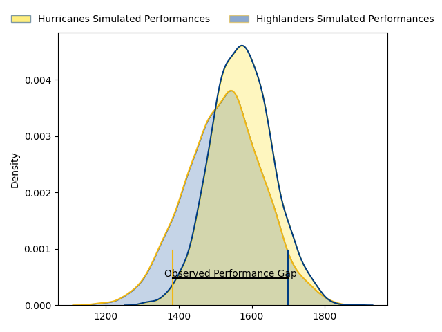
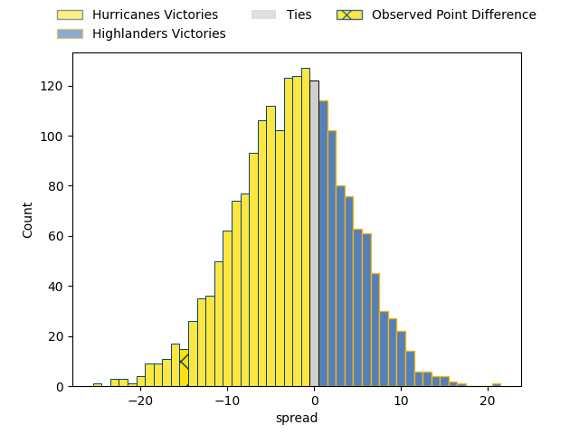

---  
layout: page  
title: Hurricanes at Highlanders; 29.0-14.0  
date: 2023-04-08 03:05:00 18:00:00 -0500  
categories: match review  
---
# Hurricanes at Highlanders; 29.0-14.0

# Club Level Predictions

The first set of predictions treats a club as the smallest object, as the club develops its members, organizes a gameplan, and deploys its players as needed for each match. This club model has a prediction of 0.425, which translates to predicting Hurricanes to win by 2.7.

Each club has a rating and a rating deviation (simiar to a Glicko system), and expected performances can be generated. This allows for simulated matches and spreads like the ones below.
## Projected Performances

## Projected Spreads

## Projected Results

# Player Level Predictions

Treating teams instead as an entity made up of the currently active players, I have ratings for each player in an altogether different system. These can be combined to form team ratings once teamsheets are announced, weighting starters a bit higher than the reserves. After the match is played, players can be weighted by their minutes on the field, allowing for an accurate measure of the team's composition. With these compiled team ratings, we can make predictions, measure inaccuracy, and update the individual player ratings.
## Prediction with Player Minutes: Hurricanes by 0.6

Hurricanes by 4.6 on a neutral field

There were 8 large changes in win probability in this match
## Prediction without Player Minutes: Hurricanes by 2.2

Hurricanes by 6.2 on a neutral pitch

|   Away Minutes | Away Player         |   Away elo |   Away Percentile |   Number |   Home Percentile |   Home elo | Home Player         |   Home Minutes |
|---------------:|:--------------------|-----------:|------------------:|---------:|------------------:|-----------:|:--------------------|---------------:|
|             59 | Xavier Numia        |     121.27 |                96 |        1 |                90 |     112.24 | Ethan de Groot      |             60 |
|             50 | Dane Coles          |     128.48 |                97 |        2 |                76 |     103.51 | Andrew Makalio      |             53 |
|             59 | Tyrel Lomax         |     142.45 |                99 |        3 |                85 |     107.47 | Jermaine Ainsley    |             60 |
|             80 | James Blackwell     |      95.91 |                50 |        4 |                99 |     155.06 | Pari Pari Parkinson |             71 |
|             54 | Dominic Bird        |     120.46 |                93 |        5 |                70 |     101.95 | Josh Dickson        |             80 |
|             80 | Brayden Iose        |      52.68 |                 0 |        6 |                90 |     118.16 | Shannon Frizell     |             53 |
|             80 | Du'Plessis Kirifi   |     113.68 |                86 |        7 |                90 |     118.07 | Billy Harmon        |             80 |
|             68 | Ardie Savea         |     124.14 |                94 |        8 |                 2 |      65.19 | Hugh Renton         |             60 |
|             59 | Cam Roigard         |      94.22 |                52 |        9 |                15 |      82.98 | Folau Fakatava      |             80 |
|             70 | Aidan Morgan        |     104.1  |                73 |       10 |                69 |     104.09 | Cameron Millar      |             76 |
|             80 | Salesi Rayasi       |      92.61 |                41 |       11 |                78 |     106.94 | Jonah Lowe          |             80 |
|             80 | Jordie Barrett      |     130.69 |                97 |       12 |                41 |      92.63 | Thomas Umaga-Jensen |             80 |
|             59 | Billy Proctor       |     120.18 |                92 |       13 |                92 |     119.7  | Fetuli Paea         |             80 |
|             80 | Julian Savea        |     136.66 |                98 |       14 |                90 |     118.3  | Mosese Dawai        |             67 |
|             80 | Joshua Moorby       |      93.91 |                46 |       15 |                32 |      89.79 | Sam Gilbert         |             80 |
|             30 | Asafo Aumua         |     123.56 |                96 |       16 |                15 |      83.6  | Leni Apisai         |             27 |
|             21 | Pouri Rakete-Stones |      92.16 |                38 |       17 |                70 |     100.5  | Dan Lienert-Brown   |             20 |
|             21 | Owen Franks         |      93.86 |                46 |       18 |                79 |     101.34 | Saula Mau           |             20 |
|             26 | TK Howden           |      88.31 |                26 |       19 |                42 |      92.11 | Max Hicks           |              9 |
|             12 | Peter Lakai         |     103.19 |                75 |       20 |                33 |      90.23 | Sean Withy          |             27 |
|             21 | Jamie Booth         |      64.44 |                 2 |       21 |               nan |      95    | James Arscott       |              4 |
|             10 | Harry Godfrey       |      80.96 |                15 |       22 |               nan |      95    | Scott Gregory       |             13 |
|             21 | Peter Umaga-Jensen  |      95    |               nan |       23 |                55 |      99.65 | Marino Mikaele-Tu'u |             20 |

