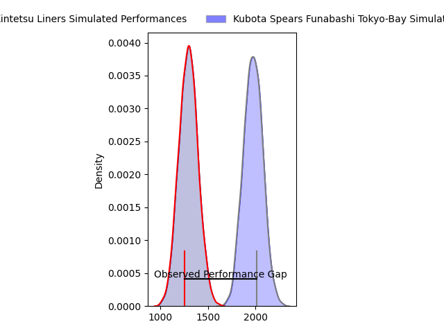
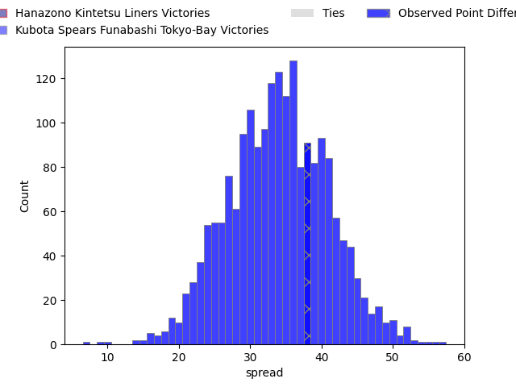

---  
layout: page  
title: Hanazono Kintetsu Liners at Kubota Spears Funabashi Tokyo-Bay; 17-55  
date: 2023-04-08 05:00:00 18:00:00 -0500  
categories: match review  
---
# Hanazono Kintetsu Liners at Kubota Spears Funabashi Tokyo-Bay; 17-55

# Club Level Predictions

The first set of predictions treats a club as the smallest object, as the club develops its members, organizes a gameplan, and deploys its players as needed for each match. This club model has a prediction of 0.977, which translates to predicting Kubota Spears Funabashi Tokyo-Bay to win by 34.0.

Each club has a rating and a rating deviation (simiar to a Glicko system), and expected performances can be generated. This allows for simulated matches and spreads like the ones below.
## Projected Performances

## Projected Spreads

## Projected Results

# Player Level Predictions

Treating teams instead as an entity made up of the currently active players, I have ratings for each player in an altogether different system. These can be combined to form team ratings once teamsheets are announced, weighting starters a bit higher than the reserves. After the match is played, players can be weighted by their minutes on the field, allowing for an accurate measure of the team's composition. With these compiled team ratings, we can make predictions, measure inaccuracy, and update the individual player ratings.
## Prediction with Player Minutes: Kubota Spears Funabashi Tokyo-Bay by 43.2

Kubota Spears Funabashi Tokyo-Bay by 39.2 on a neutral field

There were 2 large changes in win probability in this match
## Prediction without Player Minutes: Kubota Spears Funabashi Tokyo-Bay by 44.1

Kubota Spears Funabashi Tokyo-Bay by 40.1 on a neutral pitch

|   Away Minutes | Away Player           |   Away elo |   Away Percentile |   Number |   Home Percentile |   Home elo | Home Player          |   Home Minutes |
|---------------:|:----------------------|-----------:|------------------:|---------:|------------------:|-----------:|:---------------------|---------------:|
|             68 | Kenta Tanaka          |      77.11 |                 7 |        1 |                93 |     116.01 | Kota Kaishi          |             51 |
|             62 | Atsushi Kashimoto     |     100.7  |                69 |        2 |                85 |     111.88 | Hiraoki Sugimoto     |             51 |
|             80 | Kota Mitake           |      75.95 |                 7 |        3 |                90 |     112.34 | Opeti Helu           |             51 |
|             54 | Ben Toolis            |      58.83 |                 2 |        4 |                59 |      98.48 | Uwe Helu             |             51 |
|             66 | Sanaila Junior Waqa   |      95    |               nan |        5 |                81 |     106.73 | David James Bulbring |             80 |
|             40 | Takahito Sugahara     |      75.45 |                 6 |        6 |                98 |     138.26 | Finau Tupa           |             80 |
|             80 | Shohei Nonaka         |     102.02 |                65 |        7 |                72 |     103.86 | Yuki Aoki            |             64 |
|             80 | Waimana Kapa          |      76.31 |                 8 |        8 |                91 |     118.23 | Takeo Suenaga        |             80 |
|             62 | William Genia         |      47.65 |                 0 |        9 |                67 |     100.98 | Shinobu Fujiwara     |             57 |
|             80 | Jackson Garden-Bachop |      53.46 |                 1 |       10 |                70 |     102.94 | Bernard Foley        |             51 |
|             62 | Tatsuma Nanto         |     100.91 |                64 |       11 |                79 |     107.66 | Haruto Kida          |             80 |
|             80 | Haruki Kanazawa       |      89.65 |               nan |       12 |                80 |     108.43 | Rikus Pretorius      |             80 |
|             80 | Koji Okamura          |      73.66 |                 7 |       13 |                80 |     109.16 | Halatoa Vailea       |             57 |
|             64 | Ren Takano            |      87.35 |                24 |       14 |                31 |      89.58 | Koga Nezuka          |             80 |
|             80 | Yoshizumi Takeda      |      66.75 |                 4 |       15 |                24 |      86.44 | Yuhei Shimada        |             80 |
|             40 | Tsuyoshi Murata       |     100.68 |                66 |       16 |                60 |      97.02 | Yota Kaminori        |             29 |
|             26 | Patrick Tafa          |      90.93 |               nan |       17 |                80 |     106.03 | Schalk Erasmus       |             29 |
|             18 | Tomoya Nakamura       |      87.36 |                24 |       18 |                95 |     119.56 | Kengo Kitagawa       |             29 |
|             18 | Shota Hirono          |      93.95 |                55 |       19 |                43 |      93.66 | Ruan Botha           |             29 |
|             18 | Joshua Nohra          |      82.23 |                15 |       20 |                57 |     100.48 | Atsushi Oshikawa     |             29 |
|             16 | Kensyo Kawamura       |      92.92 |               nan |       21 |               nan |      99.48 | Ippei Okada          |             23 |
|             14 | Lata Tangimana        |      66.69 |                 2 |       22 |                51 |      96.52 | Sione Teaupa         |             23 |
|             12 | Yushi Inoue           |      89.43 |                31 |       23 |               nan |      97.63 | Masaya Tamaki        |             16 |

