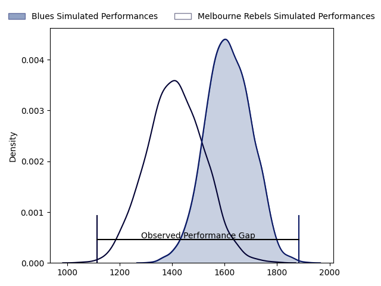
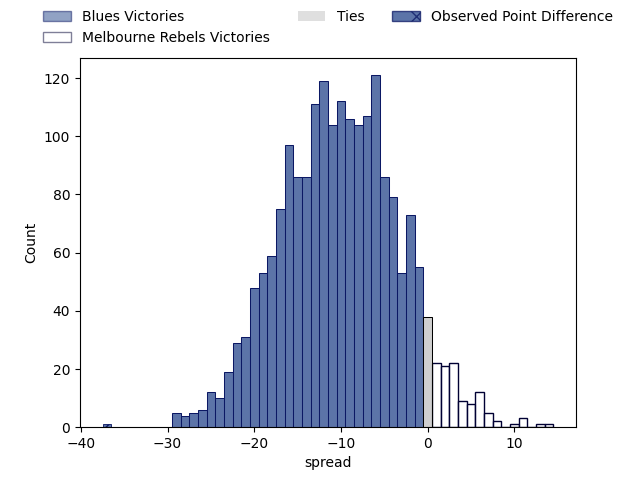

---  
layout: page  
title: Blues at Melbourne Rebels; 54.0-17.0  
date: 2023-04-08 05:35:00 18:00:00 -0500  
categories: match review  
---
# Blues at Melbourne Rebels; 54.0-17.0

# Club Level Predictions

The first set of predictions treats a club as the smallest object, as the club develops its members, organizes a gameplan, and deploys its players as needed for each match. This club model has a prediction of 0.241, which translates to predicting Blues to win by 10.3.

Each club has a rating and a rating deviation (simiar to a Glicko system), and expected performances can be generated. This allows for simulated matches and spreads like the ones below.
## Projected Performances

## Projected Spreads

## Projected Results

# Player Level Predictions

Treating teams instead as an entity made up of the currently active players, I have ratings for each player in an altogether different system. These can be combined to form team ratings once teamsheets are announced, weighting starters a bit higher than the reserves. After the match is played, players can be weighted by their minutes on the field, allowing for an accurate measure of the team's composition. With these compiled team ratings, we can make predictions, measure inaccuracy, and update the individual player ratings.
## Prediction with Player Minutes: Blues by 1.5

Blues by 5.5 on a neutral field

There were 10 large changes in win probability in this match
## Prediction without Player Minutes: Blues by 0.2

Blues by 4.2 on a neutral pitch

|   Away Minutes | Away Player       |   Away elo |   Away Percentile |   Number |   Home Percentile |   Home elo | Home Player         |   Home Minutes |
|---------------:|:------------------|-----------:|------------------:|---------:|------------------:|-----------:|:--------------------|---------------:|
|             56 | Jordan Lay        |      91.84 |                37 |        1 |                76 |     100.27 | Cabous Eloff        |             67 |
|             64 | Ricky Riccitelli  |      92.79 |                43 |        2 |                65 |      98.88 | Alex Mafi           |             15 |
|             64 | Nepo Laulala      |     119.91 |                95 |        3 |                72 |      97.89 | Pone Fa'amausili    |             64 |
|             81 | Patrick Tuipulotu |     129.46 |                97 |        4 |                73 |     103.19 | Josh Canham         |             81 |
|             69 | Sam Darry         |     100.35 |                65 |        5 |                48 |      95.41 | Trevor Hosea        |             37 |
|             81 | Adrian Choat      |      87.31 |                23 |        6 |                35 |      90.93 | Josh Kemeny         |             72 |
|             81 | Dalton Papali'i   |     103.21 |                70 |        7 |                63 |     100.38 | Brad Wilkin         |             81 |
|             66 | Anton Segner      |      83.33 |                15 |        8 |                31 |      89.99 | Vaiolini Ekuasi     |             67 |
|             64 | Finlay Christie   |     103.7  |                73 |        9 |                98 |     130.06 | Ryan Louwrens       |             67 |
|             81 | Beauden Barrett   |     156.74 |               100 |       10 |                56 |      98.2  | Carter Gordon       |             81 |
|             66 | Caleb Clarke      |      98.96 |                59 |       11 |                94 |     124.66 | Monty Ioane         |             81 |
|             69 | Harry Plummer     |     112.18 |                84 |       12 |                75 |     105.65 | Reece Hodge         |             81 |
|             81 | Rieko Ioane       |      77.97 |                10 |       13 |                76 |     107.26 | Andrew Kellaway     |             67 |
|             81 | Mark Telea        |     112.09 |                85 |       14 |                36 |      91.11 | Lachie Anderson     |             76 |
|             81 | Zarn Sullivan     |      91.42 |                41 |       15 |                57 |      99.12 | Joe Pincus          |             81 |
|             17 | Soane Vikena      |      95    |               nan |       16 |                61 |      97.83 | Jordan Uelese       |             26 |
|             25 | Ofa Tu'ungafasi   |     110.21 |                89 |       17 |                91 |     113.88 | Matt Gibbon         |             31 |
|             17 | James Lay         |     104.12 |                78 |       18 |                40 |      92.53 | Sam Talakai         |             40 |
|             12 | Cameron Suafoa    |     104.79 |                76 |       19 |               nan |      93.05 | Angelo Smith        |             44 |
|             15 | Tom Robinson      |     113.47 |                90 |       20 |                43 |      93.41 | Tuaina Taii Tualima |             14 |
|             17 | Sam Nock          |     104.35 |                74 |       21 |                59 |      98.03 | James Tuttle        |             14 |
|             12 | Corey Evans       |     102.08 |                67 |       22 |                 7 |      72.34 | Nick Jooste         |             14 |
|             15 | Caleb Tangitau    |      95    |               nan |       23 |               nan |      92.09 | Lukas Ripley        |              5 |

