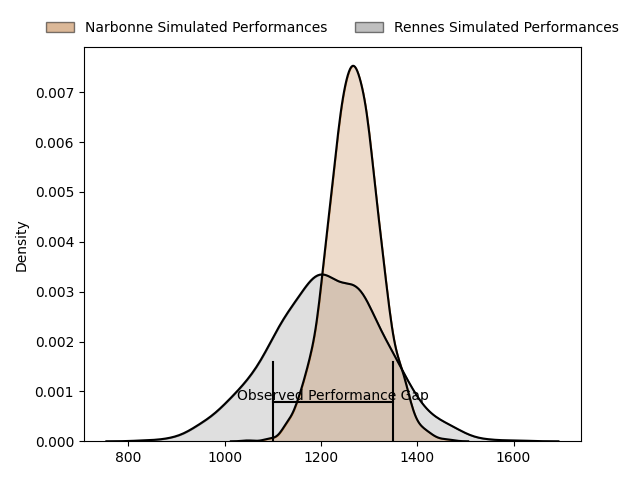
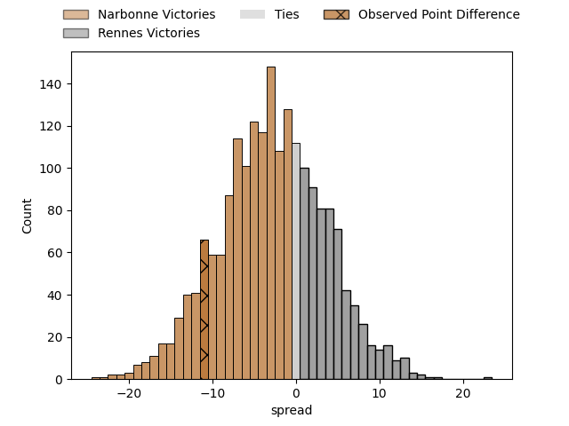
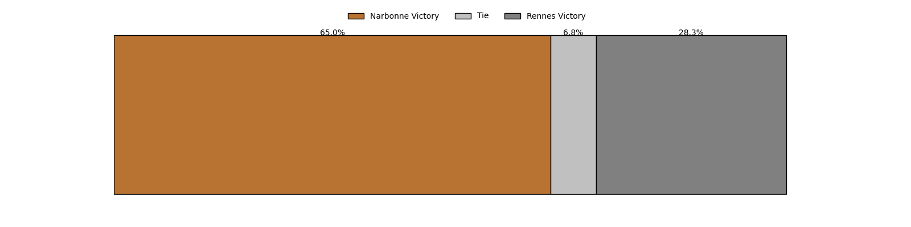

---  
layout: page  
title: Narbonne at Rennes; 40-29  
date: 2023-04-08 18:00:00 18:00:00 -0500  
categories: match review  
---
# Narbonne at Rennes; 40-29

# Club Level Predictions

The first set of predictions treats a club as the smallest object, as the club develops its members, organizes a gameplan, and deploys its players as needed for each match. This club model has a prediction of 0.416, which translates to predicting Narbonne to win by 3.0.

Each club has a rating and a rating deviation (simiar to a Glicko system), and expected performances can be generated. This allows for simulated matches and spreads like the ones below.
## Projected Performances

## Projected Spreads

## Projected Results

# Player Level Predictions

Treating teams instead as an entity made up of the currently active players, I have ratings for each player in an altogether different system. These can be combined to form team ratings once teamsheets are announced, weighting starters a bit higher than the reserves. After the match is played, players can be weighted by their minutes on the field, allowing for an accurate measure of the team's composition. With these compiled team ratings, we can make predictions, measure inaccuracy, and update the individual player ratings.
## Prediction with Player Minutes: Narbonne by 4.4

Narbonne by 8.4 on a neutral field

There were 4 large changes in win probability in this match
## Prediction without Player Minutes: Narbonne by 5.4

Narbonne by 9.4 on a neutral pitch

|   Away Minutes | Away Player        |   Away elo |   Away Percentile |   Number |   Home Percentile |   Home elo | Home Player            |   Home Minutes |
|---------------:|:-------------------|-----------:|------------------:|---------:|------------------:|-----------:|:-----------------------|---------------:|
|             58 | Sylvain Abadie     |      87.15 |                21 |        1 |                61 |      99.63 | Grégory Querin         |             30 |
|             64 | Christophe David   |      96.15 |                55 |        2 |                34 |      90.9  | Pierre Strippoli       |             44 |
|             40 | Levi Tikoipau      |      95.84 |                52 |        3 |                31 |      91.59 | Luvuyo Pupuma          |             80 |
|             40 | Morgan Maga        |      94.8  |                47 |        4 |                 8 |      78.22 | Pedro Ortega           |             40 |
|             80 | Mauro Rebussone    |     112.11 |                86 |        5 |                27 |      88.7  | Gabriel Quesmel        |             80 |
|             80 | Arthur Christienne |      90.58 |                34 |        6 |                59 |      98.96 | Baptiste Beaujouan     |             44 |
|             80 | Paul Belzons       |      98.26 |                56 |        7 |                60 |      97.25 | Victor Danielli        |             61 |
|             30 | Luke Nakobukobua   |     103.8  |                70 |        8 |                 3 |      66.31 | Gaétan Béraud          |             80 |
|             64 | Pierrick Nova      |      70.96 |                 5 |        9 |                22 |      86.76 | Lucas Ollion           |             44 |
|             40 | Tom Chauvet        |      85.01 |                19 |       10 |                90 |     120.88 | Joaquin Diaz Luzzi     |             80 |
|             80 | Pierre-Hugo Ducom  |      92.66 |                41 |       11 |                24 |      87.33 | Mathieu Brignonen      |             80 |
|             80 | José Lima          |     112.3  |                84 |       12 |                 7 |      74.45 | Gonzalo Lopez Bontempo |             80 |
|             64 | Pierre Nueno       |     102.26 |                63 |       13 |                44 |      93.5  | Ryan Dubois            |             64 |
|             80 | Sébastien Giorgis  |      93.43 |                43 |       14 |                67 |     102.39 | Enzo Salvai            |             80 |
|             80 | Paul Auradou       |      93.89 |                46 |       15 |                17 |      81.71 | Pedro Soto             |             80 |
|             22 | Geoffrey Moise     |     101.17 |                71 |       16 |                21 |      87.21 | Baptiste Le Jallé      |             50 |
|             16 | Gabriel Atlan      |      95.11 |               nan |       17 |                10 |      80.07 | Alexandre Fau          |             36 |
|             40 | Matthieu Loudet    |      87.22 |                38 |       18 |                46 |      94.65 | Clément Fontaine       |             40 |
|             40 | Bill Caffo         |      93.13 |                42 |       19 |                28 |      88.73 | Vincent Wenger         |             36 |
|             50 | Thibault Clauzade  |      95.66 |                49 |       20 |                50 |      95.61 | Matéo Jeune-Joly       |             36 |
|             16 | Pablo Barbaste     |      97.43 |                55 |       21 |                29 |      89.07 | Clément Lepresle       |             16 |
|             40 | James Kane         |     106.02 |                72 |       22 |               nan |      95    | Jules Frétigné         |             19 |
|             16 | Gauthier Wolf      |      93.22 |               nan |       23 |               nan |     nan    | nan                    |            nan |

