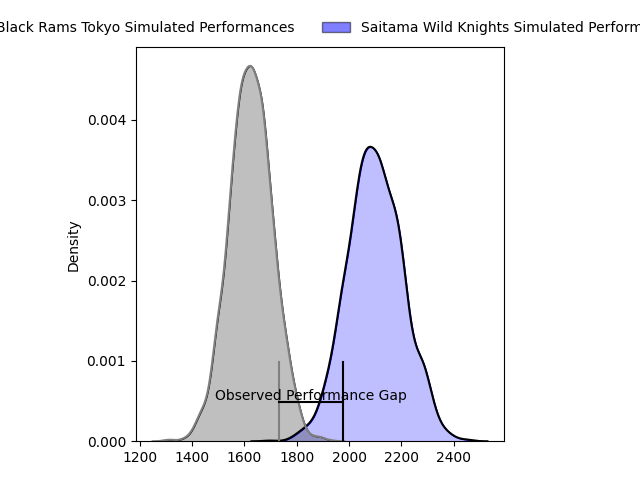
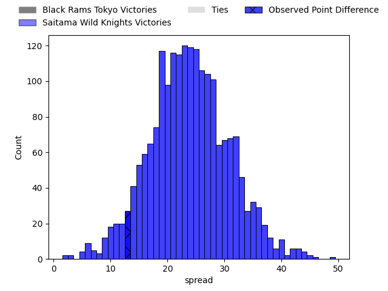

---  
layout: page  
title: Black Rams Tokyo at Saitama Wild Knights; 12-25  
date: 2023-04-08 10:00:00 18:00:00 -0500  
categories: match review  
---
# Black Rams Tokyo at Saitama Wild Knights; 12-25

# Club Level Predictions

The first set of predictions treats a club as the smallest object, as the club develops its members, organizes a gameplan, and deploys its players as needed for each match. This club model has a prediction of 0.935, which translates to predicting Saitama Wild Knights to win by 23.9.

Each club has a rating and a rating deviation (simiar to a Glicko system), and expected performances can be generated. This allows for simulated matches and spreads like the ones below.
## Projected Performances

## Projected Spreads

## Projected Results

# Player Level Predictions

Treating teams instead as an entity made up of the currently active players, I have ratings for each player in an altogether different system. These can be combined to form team ratings once teamsheets are announced, weighting starters a bit higher than the reserves. After the match is played, players can be weighted by their minutes on the field, allowing for an accurate measure of the team's composition. With these compiled team ratings, we can make predictions, measure inaccuracy, and update the individual player ratings.
## Prediction with Player Minutes: Saitama Wild Knights by 15.1

Saitama Wild Knights by 11.1 on a neutral field

There were 4 large changes in win probability in this match
## Prediction without Player Minutes: Saitama Wild Knights by 14.8

Saitama Wild Knights by 10.8 on a neutral pitch

|   Away Minutes | Away Player        |   Away elo |   Away Percentile |   Number |   Home Percentile |   Home elo | Home Player       |   Home Minutes |
|---------------:|:-------------------|-----------:|------------------:|---------:|------------------:|-----------:|:------------------|---------------:|
|             67 | Kazuma Nishi       |      92.47 |                39 |        1 |                82 |     105.83 | Keita Inagaki     |             67 |
|             59 | Ko Sato            |     100.04 |                68 |        2 |                68 |     102.67 | Shota Horie       |             56 |
|             52 | Paddy Ryan         |      99.54 |                65 |        3 |                74 |     103.14 | Taiki Fujii       |             45 |
|             80 | Michael Stolberg   |     112.86 |                88 |        4 |                66 |     100.77 | Mark Abbott       |             80 |
|             80 | Pohiva Lotoahea    |     116.43 |                90 |        5 |                86 |     112.04 | Lodewyk de Jager  |             66 |
|             80 | Brodi McCurran     |     120.95 |                92 |        6 |                68 |     108.52 | Ryota Hasegawa    |             70 |
|             52 | Junpei Yukawa      |      99.57 |                58 |        7 |                56 |      98.6  | Itsuki Onishi     |             14 |
|             75 | Talau Fakatava     |      91.11 |                35 |        8 |                84 |     110.89 | Jack Cornelsen    |             80 |
|             71 | Syota Yamamoto     |     110.29 |                84 |        9 |                85 |     110.49 | Keisuke Uchida    |             73 |
|             63 | Kohei Horigome     |      96.59 |                51 |       10 |                84 |     113.44 | Rikiya Matsuda    |             80 |
|             80 | Siope Lolo Tavo    |      86.72 |               nan |       11 |                89 |     117.41 | Marika Koroibete  |             80 |
|             63 | Hadleigh Parkes    |     113.24 |                85 |       12 |                75 |     105.54 | Damian de Allende |             73 |
|             80 | Yuta Kurihara      |      70.66 |                 5 |       13 |                88 |     116.02 | Tomoki Osada      |             80 |
|             80 | Amanaki Lotoahea   |     103.04 |                69 |       14 |                96 |     130.58 | Ryuji Noguchi     |             80 |
|             80 | Isaac Lucas        |     111.22 |                70 |       15 |                11 |      80.02 | Kyohei Yamasawa   |             80 |
|             28 | Taichi Chiba       |     108.39 |                84 |       16 |                86 |     113.52 | Lachlan Boshier   |             66 |
|             28 | Nathan Hughes      |     105.9  |                77 |       17 |                90 |     111.65 | Asaleli Valu      |             35 |
|             21 | Masaaki Onishi     |      91.04 |                17 |       18 |                90 |     114.3  | Atsushi Sakate    |             24 |
|             17 | Matt McGahan       |     120.65 |                92 |       19 |                89 |     116.28 | Liam Mitchell     |             14 |
|             17 | Daisuke Nishikawa  |     104.07 |                72 |       20 |                69 |     100.68 | Daniel Perez      |             13 |
|             13 | Yuichiro Taniguchi |     100.65 |                63 |       21 |                95 |     126.77 | Shota Fukui       |             10 |
|              9 | Toshiya Takahashi  |      88.6  |                27 |       22 |                74 |     108.27 | Vince Aso         |              7 |
|              5 | Shu Yamamoto       |      95    |               nan |       23 |                99 |     141.43 | Taiki Koyama      |              7 |

