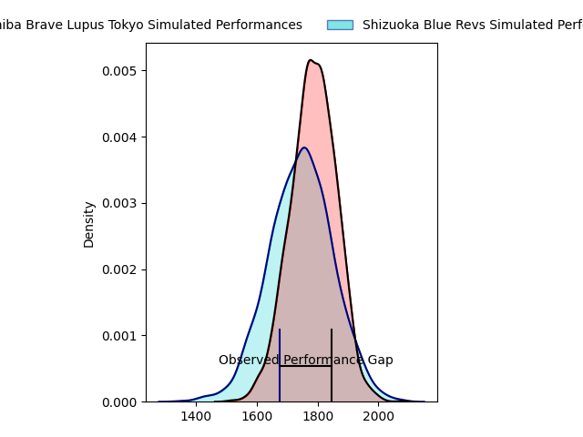
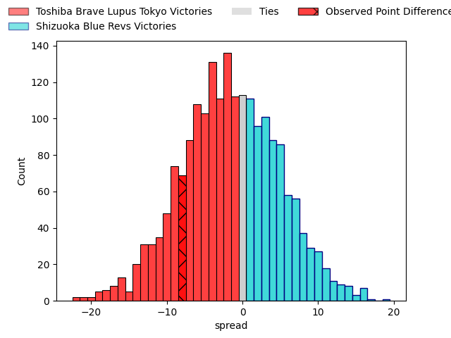

---  
layout: page  
title: Toshiba Brave Lupus Tokyo at Shizuoka Blue Revs; 37-29  
date: 2023-04-08 11:00:00 18:00:00 -0500  
categories: match review  
---
# Toshiba Brave Lupus Tokyo at Shizuoka Blue Revs; 37-29

# Club Level Predictions

The first set of predictions treats a club as the smallest object, as the club develops its members, organizes a gameplan, and deploys its players as needed for each match. This club model has a prediction of 0.449, which translates to predicting Toshiba Brave Lupus Tokyo to win by 1.8.

Each club has a rating and a rating deviation (simiar to a Glicko system), and expected performances can be generated. This allows for simulated matches and spreads like the ones below.
## Projected Performances

## Projected Spreads

## Projected Results

# Player Level Predictions

Treating teams instead as an entity made up of the currently active players, I have ratings for each player in an altogether different system. These can be combined to form team ratings once teamsheets are announced, weighting starters a bit higher than the reserves. After the match is played, players can be weighted by their minutes on the field, allowing for an accurate measure of the team's composition. With these compiled team ratings, we can make predictions, measure inaccuracy, and update the individual player ratings.
## Prediction with Player Minutes: Toshiba Brave Lupus Tokyo by 2.3

Toshiba Brave Lupus Tokyo by 6.3 on a neutral field

There were 8 large changes in win probability in this match
## Prediction without Player Minutes: Toshiba Brave Lupus Tokyo by 2.0

Toshiba Brave Lupus Tokyo by 6.0 on a neutral pitch

|   Away Minutes | Away Player        |   Away elo |   Away Percentile |   Number |   Home Percentile |   Home elo | Home Player        |   Home Minutes |
|---------------:|:-------------------|-----------:|------------------:|---------:|------------------:|-----------:|:-------------------|---------------:|
|             59 | Sena Kimura        |      97.87 |                59 |        1 |                49 |      95.03 | Kazuhiro Kawata    |             80 |
|             63 | Mamoru Harada      |      97.99 |                59 |        2 |                42 |      92.76 | Takeshi Hino       |             78 |
|             59 | Yuta Kokaji        |     120.56 |                95 |        3 |                56 |      97.1  | Heiichiro Ito      |             72 |
|             80 | Warner Dearns      |      99.13 |                61 |        4 |                95 |     124.09 | Eishin Kuwano      |             52 |
|             80 | Jacob Pierce       |     111.22 |                85 |        5 |                49 |      95.57 | Murray Douglas     |             80 |
|             80 | Shin Ito           |     107.03 |                77 |        6 |                86 |     112.88 | Yuya Odo           |             80 |
|             40 | Yoshitaka Tokunaga |      98.67 |                58 |        7 |                31 |      89.52 | Richard Goh Jones  |             80 |
|             80 | Michael Leitch     |      98.38 |                52 |        8 |                18 |      84.46 | Malgene Ilaua      |             66 |
|             63 | Takahiro Ogawa     |      94.29 |                46 |        9 |                49 |      94.95 | Bryn Hall          |             72 |
|             69 | Tom Taylor         |      90.73 |                33 |       10 |                30 |      89.55 | Kenta Iemura       |             80 |
|             80 | Shohei Toyoshima   |     107.82 |                80 |       11 |               nan |      95    | Alapati Leiua      |             80 |
|             60 | Taichi Mano        |     100.14 |                61 |       12 |                43 |      93.17 | Viliami Tahitu'a   |             80 |
|             80 | Nicholas McCurran  |      92.55 |                41 |       13 |                93 |     122.87 | Hiroto Kobayashi   |             72 |
|             55 | Jone Naikabula     |     125.08 |                94 |       14 |                57 |      98.22 | Eito Maki          |             57 |
|             80 | Takuro Matsunaga   |     108.36 |                77 |       15 |                61 |      99.72 | Keagan Faria       |             66 |
|             40 | Takeshi Sasaki     |      94.53 |                46 |       16 |                60 |      95.01 | Samuela Anise      |             28 |
|             25 | Masaki Hamada      |     118.41 |                90 |       17 |               nan |      99.32 | Yuji Ueki          |             23 |
|             21 | Masataka Mikami    |      99.79 |                72 |       18 |                30 |      89.25 | Chikara Ito        |             14 |
|             21 | Latu Taufa         |     100.8  |                69 |       19 |                37 |      87.19 | Shoji Takuma       |             14 |
|             20 | Yuto Mori          |      95    |               nan |       20 |                77 |     104.11 | Minoru Tanoue      |              8 |
|             17 | Jack Stratton      |      92.42 |                45 |       21 |               nan |      88.12 | Takayoshi Mohara   |              8 |
|             17 | Daigo Hashimoto    |      70.74 |                 3 |       22 |                32 |      89.01 | Clinton Ryno Swart |              8 |
|             11 | Kyosuke Kajikawa   |      89.84 |                42 |       23 |               nan |      95.53 | Richmond Tongatama |              2 |

