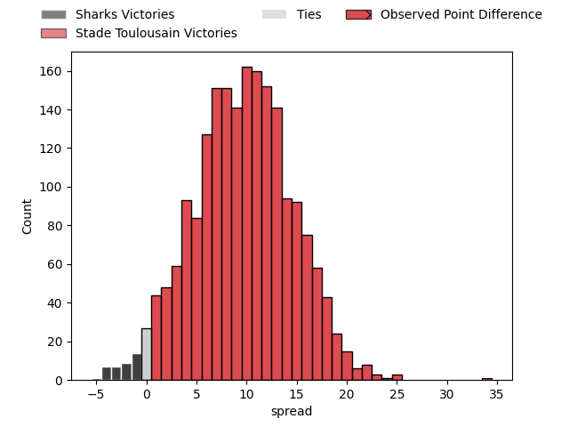
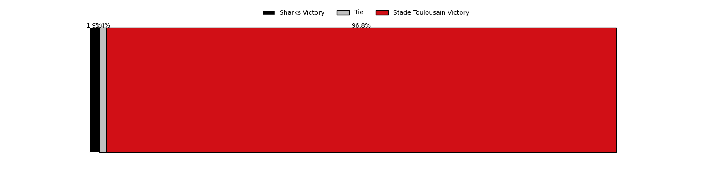

---  
layout: page  
title: Sharks at Stade Toulousain; 20-54  
date: 2023-04-08 16:00:00 18:00:00 -0500  
categories: match review  
---
# Sharks at Stade Toulousain; 20-54

# Club Level Predictions

The first set of predictions treats a club as the smallest object, as the club develops its members, organizes a gameplan, and deploys its players as needed for each match. This club model has a prediction of 0.75, which translates to predicting Stade Toulousain to win by 9.7.

Each club has a rating and a rating deviation (simiar to a Glicko system), and expected performances can be generated. This allows for simulated matches and spreads like the ones below.
## Projected Performances

## Projected Spreads

## Projected Results

# Player Level Predictions

Treating teams instead as an entity made up of the currently active players, I have ratings for each player in an altogether different system. These can be combined to form team ratings once teamsheets are announced, weighting starters a bit higher than the reserves. After the match is played, players can be weighted by their minutes on the field, allowing for an accurate measure of the team's composition. With these compiled team ratings, we can make predictions, measure inaccuracy, and update the individual player ratings.
## Prediction with Player Minutes: Stade Toulousain by 11.3

Stade Toulousain by 7.3 on a neutral field

There were 7 large changes in win probability in this match
## Prediction without Player Minutes: Stade Toulousain by 7.3

Stade Toulousain by 3.3 on a neutral pitch

|   Away Minutes | Away Player               |   Away elo |   Away Percentile |   Number |   Home Percentile |   Home elo | Home Player          |   Home Minutes |
|---------------:|:--------------------------|-----------:|------------------:|---------:|------------------:|-----------:|:---------------------|---------------:|
|             51 | Retshegofaditswe Nche     |     104.79 |                80 |        1 |                75 |     102.83 | Cyril Baille         |             63 |
|             73 | Mbongeni Mbonambi         |     101.23 |                70 |        2 |                61 |      99.21 | Peato Mauvaka        |             80 |
|             71 | Thomas Joubert du Toit    |     106.38 |                84 |        3 |                67 |     100.23 | Dorian Aldegheri     |             63 |
|             80 | Hyron Diego Andrews       |      85.5  |                18 |        4 |                42 |      93.19 | Richie Arnold        |             70 |
|             80 | Douw Gerbrandt Grobler    |      97.26 |                56 |        5 |                60 |      98.76 | Emmanuel Meafou      |             63 |
|             80 | Siya Kolisi               |     114.49 |                87 |        6 |                94 |     124.75 | Jack Willis          |             69 |
|             63 | Vincent Tshikaya Tshituka |     112.9  |                86 |        7 |                86 |     112.23 | Thibaud Flament      |             80 |
|             58 | Sikhumbuzo Notshe         |     110.85 |                84 |        8 |                99 |     165.79 | Francois Cros        |             80 |
|             73 | Grant Williams            |     107.27 |                71 |        9 |                97 |     127.61 | Antoine Dupont       |             80 |
|             80 | Curwin Dominique Bosch    |     106.45 |                76 |       10 |                94 |     128.05 | Romain Ntamack       |             80 |
|             73 | Makazole Mapimpi          |     109.29 |                81 |       11 |                56 |      97.99 | Matthis Lebel        |             70 |
|             59 | Rohan Janse van Rensburg  |     103.15 |                69 |       12 |                55 |      97.77 | Pita Ahki            |             75 |
|             80 | Lukhanyo Am               |     114.49 |                87 |       13 |                37 |      91.3  | Pierre-Louis Barassi |             80 |
|             80 | Werner Kok                |     109.99 |                82 |       14 |                61 |      99.63 | Juan Cruz Mallia     |             80 |
|             80 | Boeta Chamberlain         |     106.33 |                73 |       15 |                93 |     121.06 | Thomas Ramos         |             80 |
|             29 | Khuthuzani Kingdom Mchunu |     102.2  |                71 |       16 |                42 |      94.77 | Alexandre Roumat     |             17 |
|             21 | Ben Tapuai                |      93.32 |                38 |       17 |                35 |      91.91 | Rodrigue Neti        |             17 |
|             22 | Phendulani Buthelezi      |     102.7  |                63 |       18 |                27 |      89.64 | David Ainu'u         |             17 |
|             17 | Jeandre Labuschagne       |      97.19 |               nan |       19 |                49 |      94.05 | Alban Placines       |             11 |
|              9 | Carlu Johann Sadie        |     106.6  |                82 |       20 |                67 |     101.98 | Joshua Brennan       |             10 |
|              7 | Cameron Robin Wright      |      84.17 |                16 |       21 |                38 |      91.67 | Arthur Retière       |             10 |
|              7 | Thaakir Abrahams          |      85.55 |                21 |       22 |                18 |      84.96 | Dimitri Delibes      |              5 |
|              7 | Kerron van Vuuren         |      99.54 |                55 |       23 |               nan |     nan    | nan                  |            nan |

