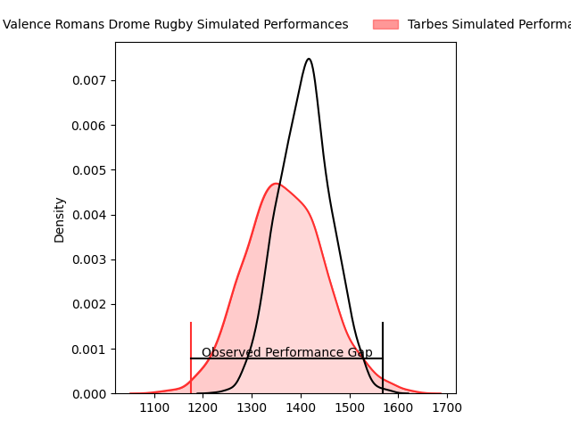
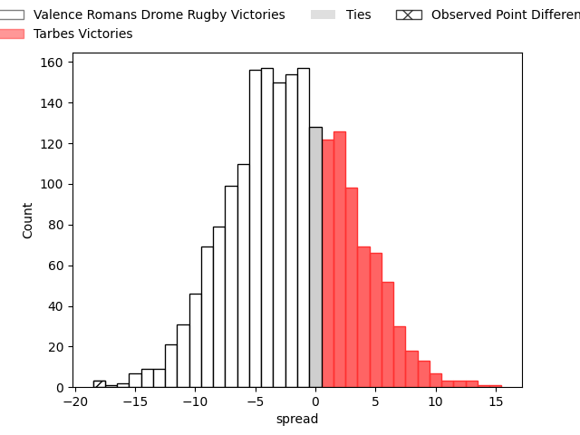
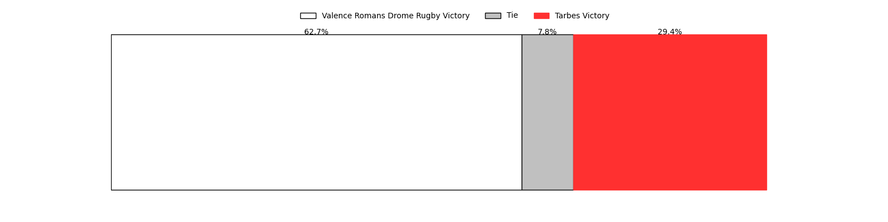

---  
layout: page  
title: Valence Romans Drome Rugby at Tarbes; 31-13  
date: 2023-04-08 19:30:00 18:00:00 -0500  
categories: match review  
---
# Valence Romans Drome Rugby at Tarbes; 31-13

# Club Level Predictions

The first set of predictions treats a club as the smallest object, as the club develops its members, organizes a gameplan, and deploys its players as needed for each match. This club model has a prediction of 0.44, which translates to predicting Valence Romans Drome Rugby to win by 2.1.

Each club has a rating and a rating deviation (simiar to a Glicko system), and expected performances can be generated. This allows for simulated matches and spreads like the ones below.
## Projected Performances

## Projected Spreads

## Projected Results

# Player Level Predictions

Treating teams instead as an entity made up of the currently active players, I have ratings for each player in an altogether different system. These can be combined to form team ratings once teamsheets are announced, weighting starters a bit higher than the reserves. After the match is played, players can be weighted by their minutes on the field, allowing for an accurate measure of the team's composition. With these compiled team ratings, we can make predictions, measure inaccuracy, and update the individual player ratings.
## Prediction with Player Minutes: Valence Romans Drome Rugby by 8.0

Valence Romans Drome Rugby by 12.0 on a neutral field

There were 5 large changes in win probability in this match
## Prediction without Player Minutes: Valence Romans Drome Rugby by 9.6

Valence Romans Drome Rugby by 13.6 on a neutral pitch

|   Away Minutes | Away Player                   |   Away elo |   Away Percentile |   Number |   Home Percentile |   Home elo | Home Player            |   Home Minutes |
|---------------:|:------------------------------|-----------:|------------------:|---------:|------------------:|-----------:|:-----------------------|---------------:|
|             45 | Sami Zouhair                  |     137.47 |                99 |        1 |                13 |      82.74 | Alexandre Combier      |             45 |
|             45 | Dorian Marco Pena             |     112.8  |                88 |        2 |                66 |      99.62 | Johan Mees Erasmus     |             41 |
|             45 | John Henry Fincham            |     101.98 |                77 |        3 |                12 |      81.96 | Alexandre Duny         |             45 |
|             80 | Darrell Dyer                  |     122.63 |                94 |        4 |                 5 |      70.32 | Paul Sajous            |             59 |
|             55 | Florian Goumat                |     107.04 |                79 |        5 |                23 |      86.59 | Antoine Bousquet       |             80 |
|             80 | Alexis Armary                 |     120.28 |                92 |        6 |                69 |     102.85 | Mattéo Coustalat       |             80 |
|             80 | Sven Bernat Girlando          |     106.13 |                75 |        7 |                55 |      97.88 | Aurelien Ricart        |             59 |
|             31 | Ioane Iashagashvili           |     103.31 |                69 |        8 |                19 |      87.56 | Willem Leon Massyn     |             80 |
|             70 | Tim Menzel                    |      78.69 |                11 |        9 |                22 |      86.66 | Thibaut Dulucq         |             45 |
|             80 | Joris Moura                   |     115.97 |                86 |       10 |                70 |     102.89 | Anthony  Fuertes       |             45 |
|             80 | Adam Vargas                   |     106.72 |                77 |       11 |                84 |     111.7  | Jonathan Duffau        |             80 |
|             80 | Ben Neiceru                   |     121.86 |                93 |       12 |                50 |      96.45 | Josaia Vakacegu        |             80 |
|             80 | Charles Bouldoire             |     102.47 |                67 |       13 |                43 |      93.34 | Alofa Alofa            |             80 |
|             80 | Bart Wierenga                 |      49.21 |                 0 |       14 |                26 |      87.9  | Johan Paulet           |             80 |
|             70 | Quentin Gobet                 |     104.67 |                69 |       15 |                67 |     103.87 | William Pees           |             56 |
|             35 | Andrea Pontanier              |      87.71 |                24 |       16 |                22 |      89.91 | Antoine Palisse        |             35 |
|             35 | Yanis Gimenez                 |     107.27 |                83 |       17 |                84 |     107.45 | Enzo Mondon            |             39 |
|             35 | Kevin Goze                    |     102.67 |                75 |       18 |                14 |      83.36 | Aleksi Tchitchiashvili |             35 |
|             25 | John Adriaan (Ian) Groenewald |      93    |               nan |       19 |               nan |      95.74 | Jason Nel              |             21 |
|             49 | Charles Brayer                |      68.66 |                 6 |       20 |               nan |      96.33 | Léo Estaque            |             21 |
|             10 | Léopold Dupas                 |      89.12 |                28 |       21 |                99 |     141.8  | Thomas Lhusero         |             35 |
|             10 | Anatole Pauvert               |      81.05 |                15 |       22 |                49 |      95.41 | Mathieu Berbizier      |             35 |
|            nan | nan                           |     nan    |               nan |       23 |                18 |      81.31 | Thibaut Trotta         |             24 |

