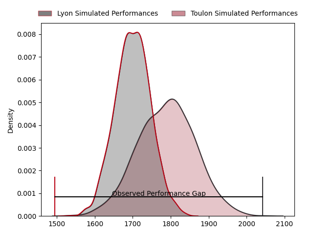
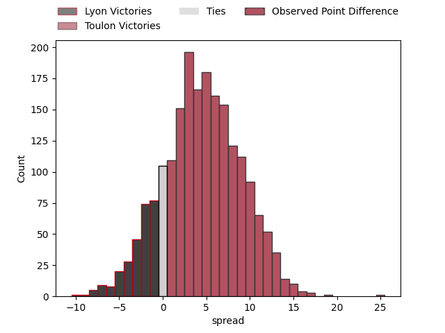

---  
layout: page  
title: Lyon at Toulon; 23-48  
date: 2023-04-08 13:30:00 18:00:00 -0500  
categories: match review  
---
# Lyon at Toulon; 23-48

# Club Level Predictions

The first set of predictions treats a club as the smallest object, as the club develops its members, organizes a gameplan, and deploys its players as needed for each match. This club model has a prediction of 0.624, which translates to predicting Toulon to win by 4.4.

Each club has a rating and a rating deviation (simiar to a Glicko system), and expected performances can be generated. This allows for simulated matches and spreads like the ones below.
## Projected Performances

## Projected Spreads

## Projected Results

# Player Level Predictions

Treating teams instead as an entity made up of the currently active players, I have ratings for each player in an altogether different system. These can be combined to form team ratings once teamsheets are announced, weighting starters a bit higher than the reserves. After the match is played, players can be weighted by their minutes on the field, allowing for an accurate measure of the team's composition. With these compiled team ratings, we can make predictions, measure inaccuracy, and update the individual player ratings.
## Prediction with Player Minutes: Toulon by 19.7

Toulon by 15.7 on a neutral field

There were 5 large changes in win probability in this match
## Prediction without Player Minutes: Toulon by 20.9

Toulon by 16.9 on a neutral pitch

|   Away Minutes | Away Player            |   Away elo |   Away Percentile |   Number |   Home Percentile |   Home elo | Home Player         |   Home Minutes |
|---------------:|:-----------------------|-----------:|------------------:|---------:|------------------:|-----------:|:--------------------|---------------:|
|             59 | Jerome Rey             |      99.93 |                66 |        1 |                73 |     103.96 | Dany Priso          |             50 |
|             51 | Liam Coltman           |     104.2  |                78 |        2 |                88 |     111.71 | Teddy Baubigny      |             51 |
|             46 | Francisco Gomez Kodela |      96.17 |                53 |        3 |                91 |     114.37 | Beka Gigashvili     |             51 |
|             80 | Killian Geraci         |      96.89 |                54 |        4 |                82 |     109.13 | Swan Rebbadj        |             80 |
|             51 | Loann Goujon           |      90.1  |                32 |        5 |                88 |     113.68 | Brian Alainu'uese   |             61 |
|             80 | Liam Allen             |     102.48 |                68 |        6 |                77 |     106.85 | Cornell du Preez    |             80 |
|             46 | Mickael Guillard       |      92.31 |                38 |        7 |                98 |     138.2  | Charles Ollivon     |             64 |
|             80 | Arno Botha             |     102.41 |                66 |        8 |                82 |     110.27 | Facundo Isa         |             80 |
|             51 | Jonathan Pelissié      |      92.3  |                38 |        9 |                84 |     110.12 | Baptiste Serin      |             61 |
|             59 | Lima Sopoaga           |      92.26 |                38 |       10 |                69 |     104.15 | Ihaia West          |             61 |
|             80 | Noa Nakaitaci          |      89.4  |                22 |       11 |                82 |     109.76 | Aymeric Luc         |             80 |
|             80 | Kyle Godwin            |     110.19 |                66 |       12 |                79 |     107.96 | Duncan Paia'aua     |             68 |
|             80 | Josiah Maraku          |     100.92 |                63 |       13 |                75 |     105.96 | Waisea Nayacavelu   |             80 |
|             64 | Tavite Veredamu        |     102.33 |                67 |       14 |                76 |     106.35 | Jiuta Wainiqolo     |             80 |
|             80 | Toby Arnold            |      95.88 |                50 |       15 |                45 |      93.33 | Marius Domon        |             80 |
|             21 | Feao Fotuaika          |      95.18 |               nan |       16 |                81 |     105.36 | Bruce Devaux        |             30 |
|             29 | Guillaume Marchand     |     100.82 |                60 |       17 |               nan |      96.87 | Christopher Tolofua |             29 |
|             34 | Demba Bamba            |     102.06 |                63 |       18 |                81 |     105.39 | Kieran Brookes      |             29 |
|             29 | Félix Lambey           |      99.66 |                61 |       19 |               nan |      95    | Mathieu Tanguy      |             19 |
|             34 | Joel Kpoku             |      92.79 |                35 |       20 |                50 |      97.77 | Sergio Parisse      |             16 |
|             29 | Baptiste Couilloud     |      90.88 |                36 |       21 |                39 |      91.94 | Benoit Paillaugue   |             19 |
|             21 | Léo Berdeu             |      98.02 |                55 |       22 |                98 |     140.24 | Dan Biggar          |             19 |
|             16 | Thibaut Regard         |      98.37 |                57 |       23 |                70 |     103.44 | Jérémy Sinzelle     |             12 |

