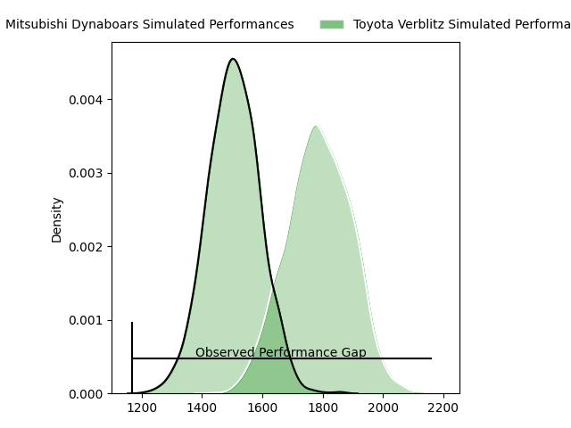
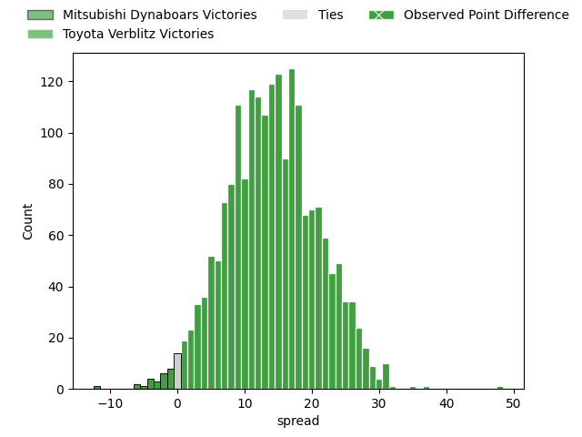

---  
layout: page  
title: Mitsubishi Dynaboars at Toyota Verblitz; 5-53  
date: 2023-04-08 07:40:00 18:00:00 -0500  
categories: match review  
---
# Mitsubishi Dynaboars at Toyota Verblitz; 5-53

# Club Level Predictions

The first set of predictions treats a club as the smallest object, as the club develops its members, organizes a gameplan, and deploys its players as needed for each match. This club model has a prediction of 0.827, which translates to predicting Toyota Verblitz to win by 14.1.

Each club has a rating and a rating deviation (simiar to a Glicko system), and expected performances can be generated. This allows for simulated matches and spreads like the ones below.
## Projected Performances

## Projected Spreads

## Projected Results

# Player Level Predictions

Treating teams instead as an entity made up of the currently active players, I have ratings for each player in an altogether different system. These can be combined to form team ratings once teamsheets are announced, weighting starters a bit higher than the reserves. After the match is played, players can be weighted by their minutes on the field, allowing for an accurate measure of the team's composition. With these compiled team ratings, we can make predictions, measure inaccuracy, and update the individual player ratings.
## Prediction with Player Minutes: Toyota Verblitz by 13.4

Toyota Verblitz by 9.4 on a neutral field

There were 4 large changes in win probability in this match
## Prediction without Player Minutes: Toyota Verblitz by 11.6

Toyota Verblitz by 7.6 on a neutral pitch

|   Away Minutes | Away Player            |   Away elo |   Away Percentile |   Number |   Home Percentile |   Home elo | Home Player              |   Home Minutes |
|---------------:|:-----------------------|-----------:|------------------:|---------:|------------------:|-----------:|:-------------------------|---------------:|
|             56 | Hayato Hosoda          |      78.47 |                 8 |        1 |                61 |      98.37 | Shogo Miura              |             68 |
|             56 | Yuki Miyazato          |      82.68 |                14 |        2 |                96 |     123.22 | Yoshikatsu Hikosaka      |             65 |
|             56 | Tomoaki Ishii          |     134.85 |                99 |        3 |                59 |      97.86 | Runya Choi               |             65 |
|             80 | Daniel Linde           |      89.86 |                31 |        4 |                49 |      95.53 | Daichi Akiyama           |             80 |
|             80 | Walt Steenkamp         |      86.87 |                23 |        5 |                16 |      82.66 | Michael Allardice        |             54 |
|             40 | Masataka Tsuruya       |     117.04 |                90 |        6 |                15 |      85.45 | Kyo Yoshida              |             80 |
|             65 | Yusuke Sakamoto        |      95.78 |                49 |        7 |                72 |     104.07 | Kazuki Himeno            |             80 |
|             80 | Epineri Uluviti        |      93.28 |                38 |        8 |                59 |      98.99 | Pieter Stephanus du Toit |             68 |
|             70 | Kota Iwamura           |     101.45 |                67 |        9 |                67 |     101.66 | Kenta Fukuda             |             54 |
|             80 | Matt To'omua           |      81.16 |                14 |       10 |                25 |      87.35 | Willem Jacobus Le Roux   |             65 |
|             70 | Honeti Taumoha'apai    |     110.37 |                83 |       11 |                42 |      92.92 | Vatiliai Tuidraki        |             80 |
|             80 | Brackin Karauria-Henry |      86.38 |                23 |       12 |                87 |     114.72 | Charlie Lawrence         |             80 |
|             65 | Curtis Rona            |      92.12 |                40 |       13 |                96 |     127.04 | Yuki Okada               |             68 |
|             80 | Nozomi Nara            |      99.3  |                60 |       14 |                64 |     100.78 | Taichi Takahashi         |             80 |
|             80 | Kazuki Ishida          |      93.33 |                43 |       15 |                57 |      99.15 | Tiaan Falcon             |             80 |
|             40 | Timote Tavalea         |      92.98 |               nan |       16 |                81 |     109.96 | Isaiah Mapusua           |             26 |
|             24 | Shunsuke Sakamoto      |      78.57 |                10 |       17 |                71 |     102.49 | Kaito Shigeno            |             26 |
|             24 | Yoshimitsu Yasue       |      90.11 |                51 |       18 |                39 |      94.01 | Ryusei Kato              |             15 |
|             24 | Mototsugu Hachiya      |      94.34 |                52 |       19 |                11 |      80.36 | Yusuke Kizu              |             15 |
|             15 | Koki Sato              |      73.95 |                 5 |       20 |                 7 |      78.83 | Rob Thompson             |             15 |
|             15 | Matt Vaega             |      75.07 |                 8 |       21 |                67 |      99.28 | Shunsuke Asaoka          |             12 |
|             10 | Keita Sekimoto         |      84.42 |                18 |       22 |                44 |      96.89 | Will Tupou               |             12 |
|             10 | Ryoto Shibata          |      89.61 |                31 |       23 |                36 |      93.04 | Shuhei Yamaguchi         |             12 |

