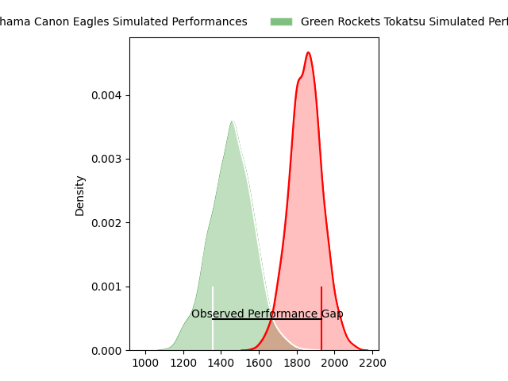
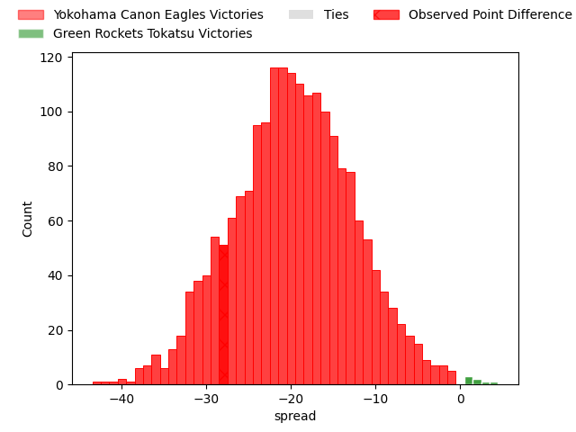
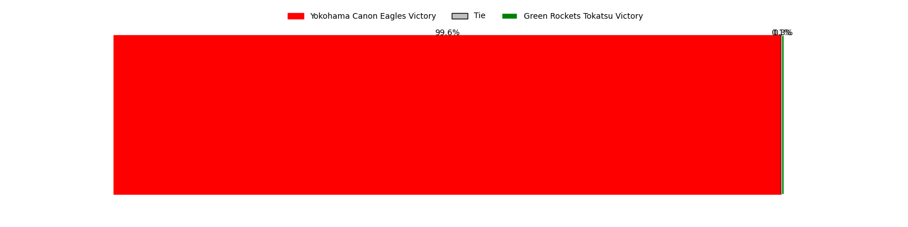

---  
layout: page  
title: Yokohama Canon Eagles at Green Rockets Tokatsu; 45-17  
date: 2023-04-09 07:30:00 18:00:00 -0500  
categories: match review  
---
# Yokohama Canon Eagles at Green Rockets Tokatsu; 45-17

# Club Level Predictions

The first set of predictions treats a club as the smallest object, as the club develops its members, organizes a gameplan, and deploys its players as needed for each match. This club model has a prediction of 0.1, which translates to predicting Yokohama Canon Eagles to win by 19.8.

Each club has a rating and a rating deviation (simiar to a Glicko system), and expected performances can be generated. This allows for simulated matches and spreads like the ones below.
## Projected Performances

## Projected Spreads

## Projected Results

# Player Level Predictions

Treating teams instead as an entity made up of the currently active players, I have ratings for each player in an altogether different system. These can be combined to form team ratings once teamsheets are announced, weighting starters a bit higher than the reserves. After the match is played, players can be weighted by their minutes on the field, allowing for an accurate measure of the team's composition. With these compiled team ratings, we can make predictions, measure inaccuracy, and update the individual player ratings.
## Prediction with Player Minutes: Yokohama Canon Eagles by 27.3

Yokohama Canon Eagles by 31.3 on a neutral field

There were 2 large changes in win probability in this match
## Prediction without Player Minutes: Yokohama Canon Eagles by 28.3

Yokohama Canon Eagles by 32.3 on a neutral pitch

|   Away Minutes | Away Player              |   Away elo |   Away Percentile |   Number |   Home Percentile |   Home elo | Home Player        |   Home Minutes |
|---------------:|:-------------------------|-----------:|------------------:|---------:|------------------:|-----------:|:-------------------|---------------:|
|             56 | Takato Okabe             |     133    |                98 |        1 |                52 |      95.7  | Kosei Yamamoto     |             51 |
|             56 | Yusuke Niwai             |     100.71 |                69 |        2 |                35 |      90.62 | Ash Dixon          |             57 |
|             56 | Tatsuro Sugimoto         |      70.82 |                 3 |        3 |                28 |      86.37 | Taku Toma          |             35 |
|             77 | Cory Hill                |     108.23 |                81 |        4 |                 9 |      76.51 | Daiki Yamagiwa     |             80 |
|             80 | Liaki Moli               |     122.42 |                94 |        5 |                45 |      94.06 | Jake Ball          |             80 |
|             80 | Jacobus Johannes van Dyk |     107.92 |                78 |        6 |                15 |      86.44 | Kavaia Tagivetaua  |             73 |
|             63 | Ryota Suginaga           |     134.58 |                97 |        7 |                 0 |      52.48 | Ryoi Kamei         |             57 |
|             80 | Sione Halasili           |     115.49 |                88 |        8 |                58 |      98.82 | Aseri Masivou      |             80 |
|             66 | Kafazumi Yamasuga        |      89    |                28 |        9 |                28 |      88.87 | Nicholas Phipps    |             57 |
|             80 | Yu Tamura                |     115.32 |                85 |       10 |                17 |      83.52 | Doga Maeda         |             80 |
|             80 | Masayoshi Takezawa       |      78.24 |                11 |       11 |                10 |      75.59 | Kentaro Kodama     |             57 |
|             69 | Naoya Minamihashi        |     112.64 |                80 |       12 |                27 |      88.28 | Christian Laui     |             80 |
|             80 | Jesse Andre Kriel        |     123.52 |                94 |       13 |                64 |     101.43 | Maritino Nemani    |             80 |
|             80 | Inoke Burua              |     127.12 |                95 |       14 |                87 |     115.05 | Yuma Sugimoto      |             74 |
|             66 | Sarel Petrus Marais      |     118.52 |                90 |       15 |                16 |      81.11 | Lomano Lemeki      |             80 |
|             24 | Chang Ho Ahn             |     106.54 |                84 |       16 |                88 |     112.52 | Satoshi Ueda       |             45 |
|             24 | Shin Kawamura            |      79.17 |                 9 |       17 |                17 |      88.55 | Sunao Takizawa     |             29 |
|             24 | Rento Tsukayama          |     126.52 |                97 |       18 |                24 |      87.46 | Myuu Arai          |             23 |
|             17 | Sioeli Vakalahi          |     110.63 |                82 |       19 |                17 |      83.6  | Wheetu Douglas     |             23 |
|             14 | Francois (Faf) de Klerk  |     115.91 |                91 |       20 |               nan |     102.41 | Tatsuya Fujii      |             23 |
|             14 | Junpei Ogura             |     108.46 |                76 |       21 |               nan |      93.56 | Taqele Naiyaravoro |             23 |
|             11 | Ryo Tabata               |      95    |               nan |       22 |                34 |      90.69 | Yoshida Hosoda     |              7 |
|              3 | Max Douglas              |     101    |                67 |       23 |                24 |      87.21 | Tim Bennetts       |              6 |

