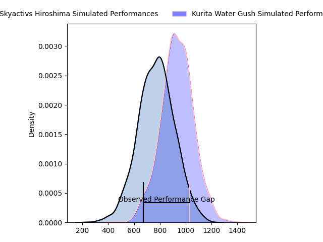
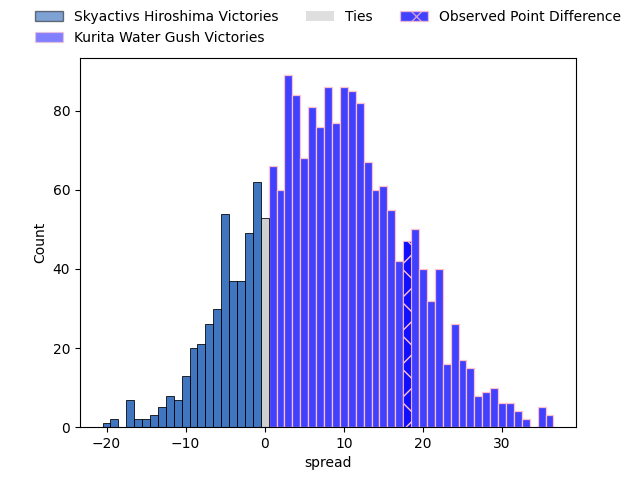
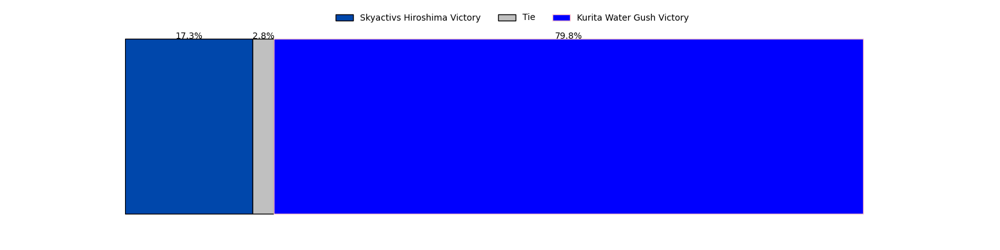

---  
layout: page  
title: Skyactivs Hiroshima at Kurita Water Gush; 12-30  
date: 2023-04-09 00:00:00 18:00:00 -0500  
categories: match review  
---
# Skyactivs Hiroshima at Kurita Water Gush; 12-30

# Club Level Predictions

The first set of predictions treats a club as the smallest object, as the club develops its members, organizes a gameplan, and deploys its players as needed for each match. This club model has a prediction of 0.691, which translates to predicting Kurita Water Gush to win by 7.7.

Each club has a rating and a rating deviation (simiar to a Glicko system), and expected performances can be generated. This allows for simulated matches and spreads like the ones below.
## Projected Performances

## Projected Spreads

## Projected Results

# Player Level Predictions

Treating teams instead as an entity made up of the currently active players, I have ratings for each player in an altogether different system. These can be combined to form team ratings once teamsheets are announced, weighting starters a bit higher than the reserves. After the match is played, players can be weighted by their minutes on the field, allowing for an accurate measure of the team's composition. With these compiled team ratings, we can make predictions, measure inaccuracy, and update the individual player ratings.
## Prediction with Player Minutes: Kurita Water Gush by 38.2

Kurita Water Gush by 34.2 on a neutral field

There were 4 large changes in win probability in this match
## Prediction without Player Minutes: Kurita Water Gush by 37.9

Kurita Water Gush by 33.9 on a neutral pitch

|   Away Minutes | Away Player        |   Away elo |   Away Percentile |   Number |   Home Percentile |   Home elo | Home Player          |   Home Minutes |
|---------------:|:-------------------|-----------:|------------------:|---------:|------------------:|-----------:|:---------------------|---------------:|
|             31 | Tomonori Koyanagi  |      87.11 |                21 |        1 |                59 |      97.89 | Kei Shibuya          |             69 |
|             52 | Yusuke Kitobayashi |      66.12 |                 3 |        2 |                11 |      80.68 | Ryota Kuribara       |             75 |
|             77 | Tomoya Otake       |      78.35 |                 8 |        3 |                19 |      86.39 | Masachi Debuchi      |             50 |
|             74 | Rame Sato          |      72.55 |                 6 |        4 |                 8 |      75.54 | Kota Nakamura        |             53 |
|             80 | Lachlan Osborne    |      69.24 |                 4 |        5 |                94 |     122.3  | Gideon Koegelenberg  |             80 |
|             52 | Isi Manu           |      86.88 |                22 |        6 |                49 |      95.51 | Yosuke Ishii         |             80 |
|             80 | Tomoki Ashida      |      58.34 |                 1 |        7 |                80 |     109.06 | Taisei Nakao         |             53 |
|             80 | Iori Suzuki        |      81.45 |                13 |        8 |                88 |     115.04 | Tebita Oto           |             80 |
|             56 | Dai Goto           |      53.4  |               nan |        9 |                41 |      92.89 | Sho Nakamura         |             72 |
|             80 | Ginjiro Sakiguchi  |      39.41 |                 0 |       10 |                46 |      94.76 | Andrew Deegan        |             80 |
|             80 | Kouhei Kamei       |      54.43 |               nan |       11 |                32 |      89.94 | Keigo Hamazoe        |             80 |
|             80 | Jacob Abel         |      84.42 |                18 |       12 |                79 |     108.4  | Antonio Mikaele-Tu'u |             80 |
|             63 | Shuhei Lee         |      48.58 |                 0 |       13 |                61 |      99.64 | Tom English          |             53 |
|             77 | Ren Ouchi          |      88.89 |                29 |       14 |                 1 |      59.13 | Kentaro Sugimori     |             69 |
|             80 | Yuto Nakamura      |      77.61 |                13 |       15 |                88 |     115.27 | Koshi Emoto          |             80 |
|             49 | Koshiro Shigenobu  |      89.97 |                38 |       16 |                15 |      84.04 | Kuriyama Rui         |             30 |
|             28 | Tomohiro Takeda    |      75.29 |                 6 |       17 |                18 |      85.7  | Takuro Hayashida     |             27 |
|             28 | Tevin Ferris       |     106.26 |                80 |       18 |                 2 |      59.31 | Mitsuo Nakao         |             27 |
|             24 | Tsubasa Kono       |     100.23 |                65 |       19 |                 5 |      71.71 | Kengo Nakamura       |             27 |
|             17 | Hayato Kanamuru    |      86.92 |               nan |       20 |               nan |      94.34 | Daiki Yokota         |             11 |
|              6 | Yoshinobu Nishino  |      53.71 |               nan |       21 |                40 |      97.39 | Kota Hojo            |              5 |
|              3 | Yuji Takahashi     |      93.88 |               nan |       22 |                 7 |      80.14 | Shoya Koyama         |             11 |
|              3 | Sora Ohchi         |      92.87 |                42 |       23 |               nan |      95    | Ren Shinwada         |              8 |

