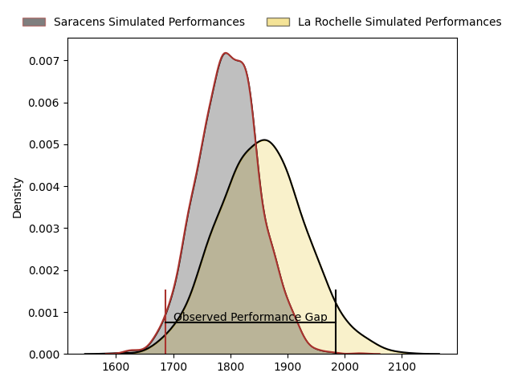
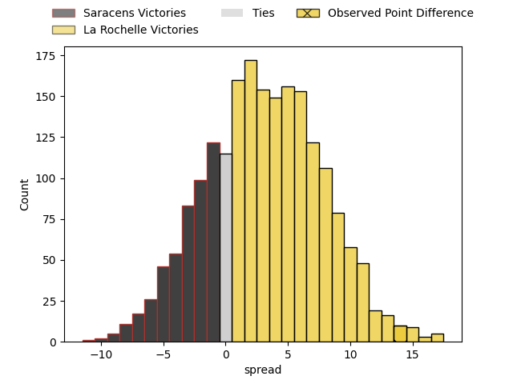
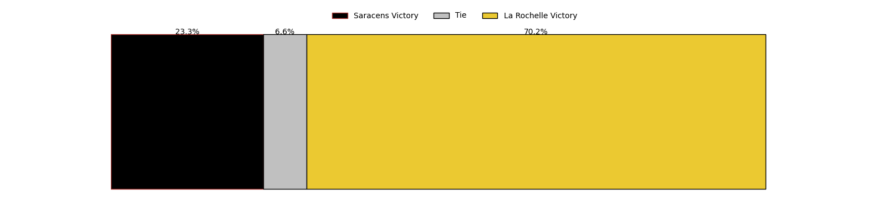

---  
layout: page  
title: Saracens at La Rochelle; 10-24  
date: 2023-04-09 16:00:00 18:00:00 -0500  
categories: match review  
---
# Saracens at La Rochelle; 10-24

# Club Level Predictions

The first set of predictions treats a club as the smallest object, as the club develops its members, organizes a gameplan, and deploys its players as needed for each match. This club model has a prediction of 0.582, which translates to predicting La Rochelle to win by 2.9.

Each club has a rating and a rating deviation (simiar to a Glicko system), and expected performances can be generated. This allows for simulated matches and spreads like the ones below.
## Projected Performances

## Projected Spreads

## Projected Results

# Player Level Predictions

Treating teams instead as an entity made up of the currently active players, I have ratings for each player in an altogether different system. These can be combined to form team ratings once teamsheets are announced, weighting starters a bit higher than the reserves. After the match is played, players can be weighted by their minutes on the field, allowing for an accurate measure of the team's composition. With these compiled team ratings, we can make predictions, measure inaccuracy, and update the individual player ratings.
## Prediction with Player Minutes: Saracens by 11.8

Saracens by 15.8 on a neutral field

There were 4 large changes in win probability in this match
## Prediction without Player Minutes: Saracens by 11.5

Saracens by 15.5 on a neutral pitch

|   Away Minutes | Away Player        |   Away elo |   Away Percentile |   Number |   Home Percentile |   Home elo | Home Player               |   Home Minutes |
|---------------:|:-------------------|-----------:|------------------:|---------:|------------------:|-----------:|:--------------------------|---------------:|
|             62 | Mako Vunipola      |     123.15 |                96 |        1 |                64 |      94.57 | Reda Wardi                |             58 |
|             62 | Jamie George       |     160.39 |               100 |        2 |                31 |      89.34 | Pierre Bourgarit          |             44 |
|             62 | Marco Riccioni     |     103.01 |                75 |        3 |                97 |     124    | Uini Atonio               |             58 |
|             80 | Maro Itoje         |     107.1  |                79 |        4 |                50 |      95.85 | Thomas Lavault            |             66 |
|             68 | Hugh Tizard        |      85.61 |                21 |        5 |                39 |      92.14 | William Skelton           |             80 |
|             80 | Nick Isiekwe       |      91.58 |                34 |        6 |                56 |      98.19 | Ultan Dillane             |             66 |
|             80 | Ben Earl           |     119.34 |                91 |        7 |                55 |      97.75 | Levani Botia              |             60 |
|             22 | Billy Vunipola     |     110.1  |                83 |        8 |                86 |     112.15 | Gregory Alldritt          |             80 |
|             76 | Ivan van Zyl       |     113.75 |                89 |        9 |                80 |     107.38 | Tawera Kerr-Barlow        |             70 |
|             80 | Owen Farrell       |     127.95 |                94 |       10 |                29 |      89.28 | Antoine Hastoy            |             80 |
|             80 | Sean Maitland      |     116.3  |                88 |       11 |                76 |     106.76 | Raymond Rhule             |             80 |
|             60 | Nick Tompkins      |     157.35 |                99 |       12 |                68 |     103.01 | Jonathan Danty            |             69 |
|             80 | Alex Lozowski      |      93.76 |                45 |       13 |                77 |     107.1  | UJ Seuteni                |             80 |
|             80 | Max Malins         |      80.12 |                13 |       14 |                55 |      97.86 | Jules Favre               |             80 |
|             65 | Alex Goode         |     100.86 |                62 |       15 |                53 |      97.38 | Brice Dulin               |             80 |
|             58 | Jackson Wray       |     140.15 |                99 |       16 |                64 |     103.28 | Quentin Lespiaucq-Brettes |             36 |
|             20 | Duncan Taylor      |      88.82 |                31 |       17 |                50 |      95.12 | Joel Sclavi               |             22 |
|             18 | Eroni Mawi         |      84.12 |                15 |       18 |                52 |      95.7  | Hayden Thompson-Stringer  |             22 |
|             18 | Christian Judge    |      93.19 |                42 |       19 |                58 |      97.75 | Yoan Tanga Mangene        |             20 |
|             18 | Tom Woolstencroft  |      92.89 |               nan |       20 |                66 |     101.63 | Romain Sazy               |             14 |
|             12 | Callum Hunter-Hill |      95    |               nan |       21 |                53 |      97.06 | Rémi Bourdeau             |             14 |
|             15 | Alex Lewington     |      92.38 |                44 |       22 |                69 |     102.72 | Teddy Thomas              |             11 |
|              4 | Ruben de Haas      |      95    |               nan |       23 |                27 |      90.38 | Thomas Berjon             |             10 |

