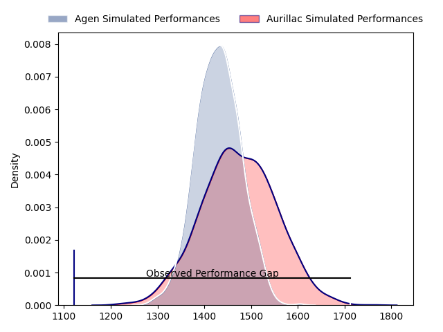
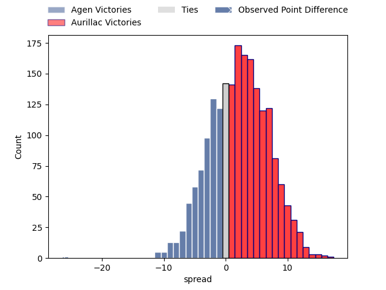

---  
layout: page  
title: Agen at Aurillac; 38-12  
date: 2023-04-13 21:00:00 18:00:00 -0500  
categories: match review  
---
# Agen at Aurillac; 38-12

# Club Level Predictions

The first set of predictions treats a club as the smallest object, as the club develops its members, organizes a gameplan, and deploys its players as needed for each match. This club model has a prediction of 0.566, which translates to predicting Aurillac to win by 2.3.

Each club has a rating and a rating deviation (simiar to a Glicko system), and expected performances can be generated. This allows for simulated matches and spreads like the ones below.
## Projected Performances

## Projected Spreads

## Projected Results

# Player Level Predictions

Treating teams instead as an entity made up of the currently active players, I have ratings for each player in an altogether different system. These can be combined to form team ratings once teamsheets are announced, weighting starters a bit higher than the reserves. After the match is played, players can be weighted by their minutes on the field, allowing for an accurate measure of the team's composition. With these compiled team ratings, we can make predictions, measure inaccuracy, and update the individual player ratings.
## Prediction with Player Minutes: Agen by 3.5

Agen by 7.5 on a neutral field

There were 8 large changes in win probability in this match
## Prediction without Player Minutes: Agen by 2.7

Agen by 6.7 on a neutral pitch

|   Away Minutes | Away Player        |   Away elo |   Away Percentile |   Number |   Home Percentile |   Home elo | Home Player           |   Home Minutes |
|---------------:|:-------------------|-----------:|------------------:|---------:|------------------:|-----------:|:----------------------|---------------:|
|             64 | Hans Lombard-Buret |     102.32 |                74 |        1 |                92 |     115.46 | Alexandre Plantier    |             58 |
|             64 | Loris Zarantonello |      95.4  |                53 |        2 |                93 |     117.08 | Luka Nioradze         |             65 |
|             65 | Alex Burin         |     102.48 |                59 |        3 |                94 |     117.84 | Giorgi Kartvelishvili |             65 |
|             80 | Corentin Vernet    |     105.75 |                78 |        4 |                77 |     105.5  | Cam Dodson            |             80 |
|             64 | William Demotte    |     103.08 |                72 |        5 |                36 |      90.28 | Jean-Baptiste Singer  |             46 |
|             64 | Arnaud Duputs      |      95    |               nan |        6 |                63 |     100.43 | Eoghan Masterson      |             65 |
|             80 | Antoine Erbani     |      96.93 |                52 |        7 |                61 |      99.5  | Didier Tison          |             80 |
|             80 | Matthieu Bonnet    |     115.3  |                82 |        8 |                10 |      78.68 | Latuka Maituku        |             46 |
|             52 | Dorian Bellot      |      98.33 |                57 |        9 |                37 |      91.52 | Mikheil Alania        |             58 |
|             53 | Thomas Vincent     |     110.41 |                82 |       10 |                89 |     116.33 | Marc Palmier          |             80 |
|             80 | Iban Etcheverry    |      98.35 |                57 |       11 |                11 |      78.3  | Simeli Yabaki         |             80 |
|             80 | Clément Garrigues  |     103.24 |                69 |       12 |                 8 |      76.45 | Christa Powell        |             80 |
|             80 | Théo Belan         |     106.12 |                75 |       13 |                38 |      91.46 | Jimmy Yobo            |             80 |
|             80 | Loris Tolot        |     107.18 |                79 |       14 |                55 |      97.81 | Albert Valentin       |             80 |
|             52 | Mathieu Lamoulie   |      85.59 |                22 |       15 |                83 |     109.92 | Giorgi Gogoladze      |             58 |
|             28 | Sonatane Takulua   |      97.91 |                49 |       16 |                56 |      97.36 | Georgi Javakhia       |             34 |
|             28 | Emile Dayral       |      92.09 |                42 |       17 |                21 |      85.87 | Mosa'ati Moala        |             34 |
|             27 | Kolinio Ramoka     |     104.83 |                73 |       18 |                 4 |      64.4  | Hugo Bouyssou         |             22 |
|             16 | Afa Amosa          |     102.26 |                65 |       19 |                10 |      76    | Anderson Neisen       |             22 |
|             16 | Evan Olmstead      |      90.71 |                34 |       20 |                29 |      88.8  | Robert Rodgers        |             22 |
|             16 | Mike Sosene-Feagai |     107.44 |                84 |       21 |                14 |      82.04 | Theo Lachaud          |             15 |
|             16 | Richard Barrington |     103.39 |                77 |       22 |                 8 |      78.59 | Henzo Kiteau          |             15 |
|             15 | Maino Pakihivatau  |      95    |               nan |       23 |                12 |      81.5  | Steve Moukete         |             15 |

