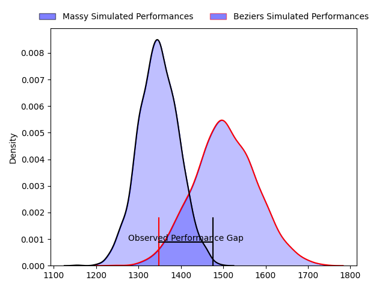
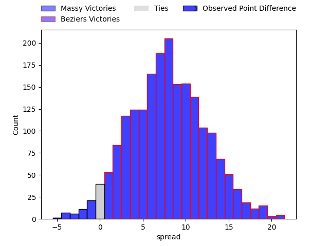
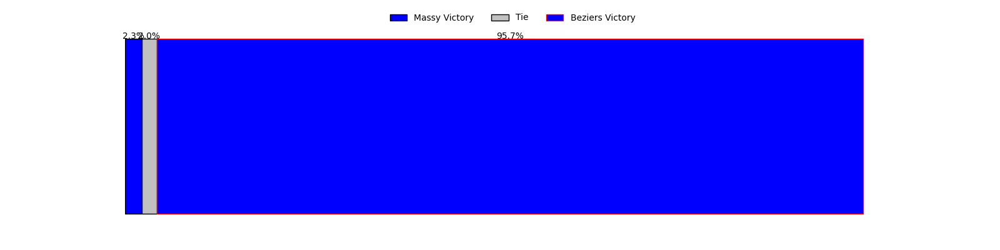

---  
layout: page  
title: Massy at Beziers; 24-19  
date: 2023-04-14 19:30:00 18:00:00 -0500  
categories: match review  
---
# Massy at Beziers; 24-19

# Club Level Predictions

The first set of predictions treats a club as the smallest object, as the club develops its members, organizes a gameplan, and deploys its players as needed for each match. This club model has a prediction of 0.711, which translates to predicting Beziers to win by 7.9.

Each club has a rating and a rating deviation (simiar to a Glicko system), and expected performances can be generated. This allows for simulated matches and spreads like the ones below.
## Projected Performances

## Projected Spreads

## Projected Results

# Player Level Predictions

Treating teams instead as an entity made up of the currently active players, I have ratings for each player in an altogether different system. These can be combined to form team ratings once teamsheets are announced, weighting starters a bit higher than the reserves. After the match is played, players can be weighted by their minutes on the field, allowing for an accurate measure of the team's composition. With these compiled team ratings, we can make predictions, measure inaccuracy, and update the individual player ratings.
## Prediction with Player Minutes: Beziers by 13.7

Beziers by 9.7 on a neutral field

There were 16 large changes in win probability in this match
## Prediction without Player Minutes: Beziers by 12.0

Beziers by 8.0 on a neutral pitch

|   Away Minutes | Away Player              |   Away elo |   Away Percentile |   Number |   Home Percentile |   Home elo | Home Player         |   Home Minutes |
|---------------:|:-------------------------|-----------:|------------------:|---------:|------------------:|-----------:|:--------------------|---------------:|
|             50 | Ushangi Tcheishvili      |      98.18 |               nan |        1 |                72 |     103.81 | Giorgi Akhaladze    |             50 |
|             50 | Pierre Trassoudaine      |     133.33 |                98 |        2 |                69 |     101.05 | Yvann Lalevee       |             50 |
|             50 | Nicolas Ferrer           |     107.22 |                78 |        3 |                37 |      91.91 | Yannick Arroyo      |             59 |
|             80 | Andrew Chauveau          |      59.6  |                 2 |        4 |                40 |      92.32 | Yassine Maamry      |             80 |
|             40 | Marco Fuser              |      88.16 |                19 |        5 |                16 |      82.57 | John Madigan        |             45 |
|             80 | Jean Maurice Decubber    |      94.64 |                46 |        6 |                26 |      93.82 | Sias Koen           |             45 |
|             80 | Mehdi Tlili              |      91.45 |                30 |        7 |                27 |      88.47 | Éloi Massot         |             80 |
|             42 | Yohann Gbizie            |      96.4  |                48 |        8 |                29 |      89.49 | Maxence Lemardelet  |             80 |
|             56 | Gaëtan Pichon            |      85.92 |                20 |        9 |                50 |      95.47 | Mitchell Short      |             50 |
|             61 | Massimo Ortolan          |      78.86 |                10 |       10 |                31 |      89.78 | Victor Dreuille     |             80 |
|             80 | Thomas Rozière           |      82.36 |                15 |       11 |               nan |      95    | Maxime Mazzella     |             50 |
|             56 | Victorien Jacomme        |      75.68 |                 8 |       12 |                73 |     108.36 | Paul Recor          |             80 |
|             80 | Tom Cusson               |     100.94 |                56 |       13 |                99 |     137.56 | Maxime Espeut       |             80 |
|             80 | Alex Preira              |     102.54 |                68 |       14 |                77 |     106.41 | Paul Reau           |             80 |
|             80 | Romain Clouté            |      89.57 |                33 |       15 |                65 |     101.88 | Mathias Duchaux     |             59 |
|             40 | Abongile Nonkontwana     |      80.81 |                11 |       16 |                15 |      86.21 | Thomas Hoarau       |             35 |
|             38 | Samuel Nollet            |      85.22 |                19 |       17 |                14 |      82.63 | Marco Pinto Ferrer  |             30 |
|             30 | Tijde Visser             |      92.69 |                40 |       18 |                 8 |      78.57 | Francisco Fernandes |             30 |
|             30 | Fernandez Correa         |      83.26 |                13 |       19 |                19 |      85.47 | Jean Victor Goillot |             30 |
|             30 | Pierre-Alexandre Duclieu |      89.17 |                29 |       20 |                24 |      87.07 | Watisoni Votu       |             30 |
|             24 | Arthur Seigneuret        |      98.02 |                61 |       21 |               nan |      97.14 | Julien Rasamoelina  |             21 |
|             24 | Kilian Marion            |      95.38 |               nan |       22 |                50 |      99.35 | Romain Uruty        |             21 |
|             19 | Tom Deleuze              |      92.96 |                40 |       23 |                55 |      97    | Pierre Gayraud      |             35 |

