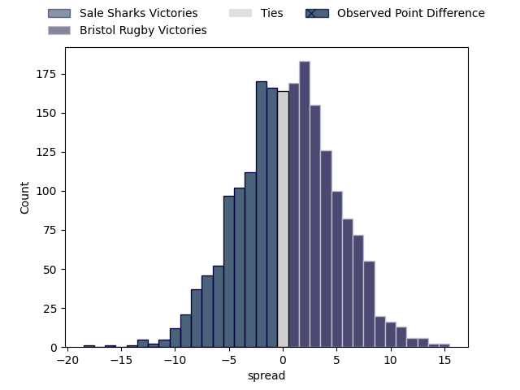

---  
layout: page  
title: Sale Sharks at Bristol Rugby; 36.0-20.0  
date: 2023-04-14 14:45:00 18:00:00 -0500  
categories: match review  
---
# Sale Sharks at Bristol Rugby; 36.0-20.0

# Club Level Predictions

The first set of predictions treats a club as the smallest object, as the club develops its members, organizes a gameplan, and deploys its players as needed for each match. This club model has a prediction of 0.515, which translates to predicting Bristol Rugby to win by 0.5.

Each club has a rating and a rating deviation (simiar to a Glicko system), and expected performances can be generated. This allows for simulated matches and spreads like the ones below.
## Projected Performances

## Projected Spreads

## Projected Results

# Player Level Predictions

Treating teams instead as an entity made up of the currently active players, I have ratings for each player in an altogether different system. These can be combined to form team ratings once teamsheets are announced, weighting starters a bit higher than the reserves. After the match is played, players can be weighted by their minutes on the field, allowing for an accurate measure of the team's composition. With these compiled team ratings, we can make predictions, measure inaccuracy, and update the individual player ratings.
## Prediction with Player Minutes: Bristol Rugby by 7.0

Bristol Rugby by 3.0 on a neutral field

There were 6 large changes in win probability in this match
## Prediction without Player Minutes: Bristol Rugby by 5.0

Bristol Rugby by 1.0 on a neutral pitch

|   Away Minutes | Away Player         |   Away elo |   Away Percentile |   Number |   Home Percentile |   Home elo | Home Player     |   Home Minutes |
|---------------:|:--------------------|-----------:|------------------:|---------:|------------------:|-----------:|:----------------|---------------:|
|             49 | Simon McIntyre      |     102.89 |                86 |        1 |                45 |      93.79 | Ellis Genge     |             66 |
|             66 | Akker van der Merwe |     124.74 |                97 |        2 |                12 |      80.87 | Harry Thacker   |             70 |
|             58 | Nic Schonert        |      88.35 |                24 |        3 |                38 |      92.15 | Max Lahiff      |             49 |
|             80 | Jean-Luc du Preez   |     109.93 |                84 |        4 |                94 |     123.13 | Joe Batley      |             80 |
|             80 | Jonny Hill          |      97.59 |                57 |        5 |                81 |     108.32 | Chris Vui       |             80 |
|             80 | Tom Curry           |      88.54 |                27 |        6 |                96 |     130.81 | Steven Luatua   |             66 |
|             61 | Ben Curry           |      87.43 |                23 |        7 |                46 |      95.72 | Fitz Harding    |             80 |
|             68 | Jono Ross           |     102.66 |                68 |        8 |                30 |      89.31 | Magnus Bradbury |             55 |
|             70 | Gus Warr            |      82.39 |                14 |        9 |                81 |     108.43 | Harry Randall   |             70 |
|             80 | George Ford         |     115.88 |                86 |       10 |                76 |     106.61 | AJ MacGinty     |             80 |
|             75 | Tom O'Flaherty      |      85.04 |                20 |       11 |                53 |      96.93 | Gabriel Ibitoye |             80 |
|             80 | Manu Tuilagi        |     136.14 |                98 |       12 |                37 |      91.33 | James Williams  |             55 |
|             60 | Robert du Preez     |     108.28 |                79 |       13 |               nan |      95    | Joe Jenkins     |             80 |
|             80 | Tom Roebuck         |     101.58 |                66 |       14 |                46 |      94.54 | Ratu Naulago    |             61 |
|             80 | Joe Carpenter       |      60.62 |                 2 |       15 |                90 |     117.33 | Charles Piutau  |             80 |
|             14 | Ewan Ashman         |      91.78 |                33 |       16 |                 7 |      78.88 | Will Capon      |             10 |
|             31 | Bevan Rodd          |     112.13 |                90 |       17 |                25 |      86.18 | Yann Thomas     |             19 |
|             22 | Coenie Oosthuizen   |     120.49 |                95 |       18 |                88 |     109.91 | Kyle Sinckler   |             31 |
|             19 | Josh Beaumont       |     112.75 |                87 |       19 |                97 |     132.61 | Sam Jeffries    |             25 |
|             12 | Sam Dugdale         |      88.36 |                31 |       20 |                88 |     106.99 | Daniel Thomas   |             14 |
|             10 | Raffi Quirke        |     102.31 |                70 |       21 |                 9 |      77.67 | Andy Uren       |             10 |
|             20 | Sam James           |     119.23 |                92 |       22 |                86 |     119.2  | Sam Bedlow      |             25 |
|              5 | Arron Reed          |     111.17 |                84 |       23 |                 8 |      71    | Ioan Lloyd      |             14 |

