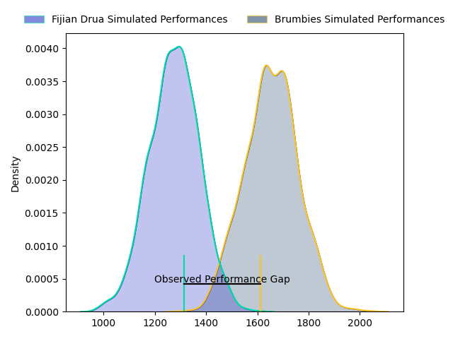
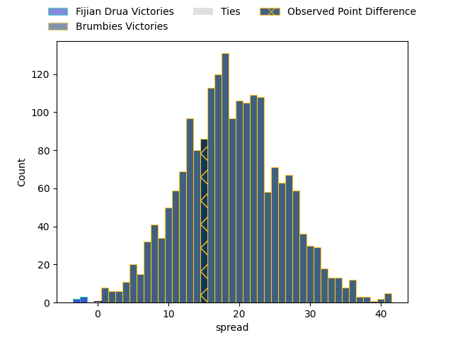

---  
layout: page  
title: Fijian Drua at Brumbies; 28.0-43.0  
date: 2023-04-14 05:35:00 18:00:00 -0500  
categories: match review  
---
# Fijian Drua at Brumbies; 28.0-43.0

# Club Level Predictions

The first set of predictions treats a club as the smallest object, as the club develops its members, organizes a gameplan, and deploys its players as needed for each match. This club model has a prediction of 0.892, which translates to predicting Brumbies to win by 19.2.

Each club has a rating and a rating deviation (simiar to a Glicko system), and expected performances can be generated. This allows for simulated matches and spreads like the ones below.
## Projected Performances

## Projected Spreads

## Projected Results

# Player Level Predictions

Treating teams instead as an entity made up of the currently active players, I have ratings for each player in an altogether different system. These can be combined to form team ratings once teamsheets are announced, weighting starters a bit higher than the reserves. After the match is played, players can be weighted by their minutes on the field, allowing for an accurate measure of the team's composition. With these compiled team ratings, we can make predictions, measure inaccuracy, and update the individual player ratings.
## Prediction with Player Minutes: Brumbies by 6.1

Brumbies by 2.1 on a neutral field

There were 6 large changes in win probability in this match
## Prediction without Player Minutes: Brumbies by 6.9

Brumbies by 2.9 on a neutral pitch

|   Away Minutes | Away Player             |   Away elo |   Away Percentile |   Number |   Home Percentile |   Home elo | Home Player      |   Home Minutes |
|---------------:|:------------------------|-----------:|------------------:|---------:|------------------:|-----------:|:-----------------|---------------:|
|             53 | Livai Natave            |      93.45 |               nan |        1 |                97 |     126.18 | James Slipper    |             68 |
|             47 | Zuriel Togiatama        |      91.48 |                39 |        2 |                12 |      81.17 | Lachlan Lonergan |             53 |
|             60 | Samuela Tawake          |      91.32 |                34 |        3 |                99 |     137.51 | Allan Alaalatoa  |             53 |
|             80 | Isoa Nasilasila         |     128.4  |                96 |        4 |                43 |      95.7  | Darcy Swain      |             68 |
|             61 | Te Ahiwaru Cirikidaveta |     119.81 |                92 |        5 |               nan |      74.72 | Sam Thomson      |             80 |
|             80 | Joseva Tamani           |      84.23 |                15 |        6 |                91 |     119.34 | Rob Valetini     |             80 |
|             71 | Kitione Salawa          |      76.9  |                 7 |        7 |                52 |      96.9  | Rory Scott       |             80 |
|             80 | Elia Canakaivata        |     100.6  |                57 |        8 |                51 |      97.36 | Pete Samu        |             61 |
|             75 | Peni Matawalu           |     102.78 |                70 |        9 |                96 |     127.14 | Ryan Lonergan    |             60 |
|             80 | Teti Tela               |     106.8  |                76 |       10 |                58 |      99.73 | Noah Lolesio     |             60 |
|             80 | Tuidraki Samusamuvodre  |     110.3  |                83 |       11 |                15 |      85.16 | Ben O'Donnell    |             80 |
|             76 | Kalaveti Ravouvou       |     146.8  |                99 |       12 |                54 |      97.6  | Ollie Sapsford   |             80 |
|             80 | Iosefo Masi             |     101.41 |                64 |       13 |                88 |     115.46 | Len Ikitau       |             80 |
|             80 | Eroni Sau               |      97.12 |                53 |       14 |                95 |     127.55 | Andy Muirhead    |             76 |
|             55 | Kitione Taliga          |      98.79 |                57 |       15 |                83 |     110.58 | Tom Wright       |             80 |
|             33 | Mesulame Dolokoto       |      95.96 |               nan |       16 |               nan |      97.32 | Billy Pollard    |             27 |
|             27 | Haereiti Hetet          |     102.39 |                74 |       17 |                38 |      95.01 | Blake Schoupp    |             12 |
|             20 | Jone Koroiduadua        |      97.99 |                60 |       18 |                81 |     108.09 | Rhys Van Nek     |             27 |
|             19 | Ratu Rotuisolia         |      91.64 |                38 |       19 |                21 |      85.35 | Nick Frost       |             12 |
|              9 | Rusiate Nasove          |     141.14 |                99 |       20 |                82 |     111.4  | Luke Reimer      |             19 |
|              5 | Phillip Baselala        |      95.91 |               nan |       21 |                93 |     118.82 | Nic White        |             20 |
|              4 | Michael Naitokani       |      96.05 |               nan |       22 |                30 |      88.11 | Jack Debreczeni  |             20 |
|             25 | Ilaisa Droasese         |     108.17 |                78 |       23 |               nan |      92.66 | Declan Meredith  |              4 |

