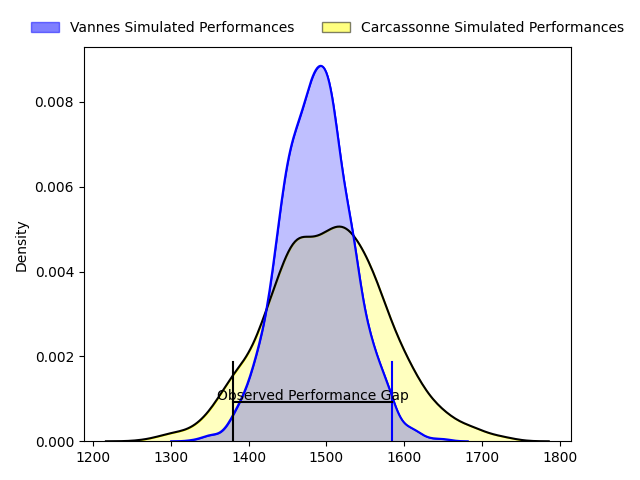
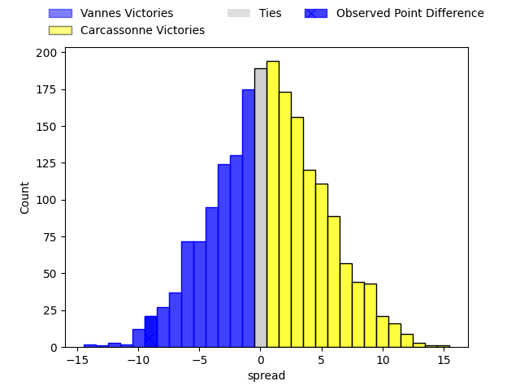
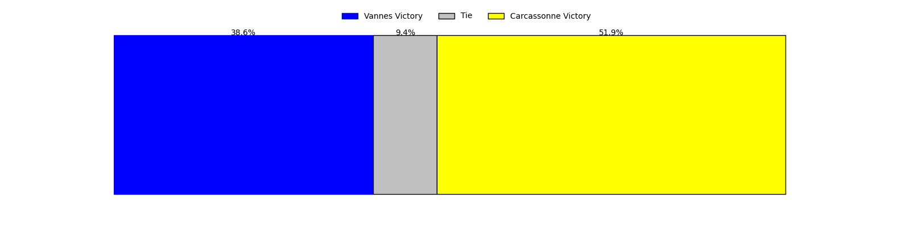

---  
layout: page  
title: Vannes at Carcassonne; 31-22  
date: 2023-04-14 19:30:00 18:00:00 -0500  
categories: match review  
---
# Vannes at Carcassonne; 31-22

# Club Level Predictions

The first set of predictions treats a club as the smallest object, as the club develops its members, organizes a gameplan, and deploys its players as needed for each match. This club model has a prediction of 0.516, which translates to predicting Carcassonne to win by 0.6.

Each club has a rating and a rating deviation (simiar to a Glicko system), and expected performances can be generated. This allows for simulated matches and spreads like the ones below.
## Projected Performances

## Projected Spreads

## Projected Results

# Player Level Predictions

Treating teams instead as an entity made up of the currently active players, I have ratings for each player in an altogether different system. These can be combined to form team ratings once teamsheets are announced, weighting starters a bit higher than the reserves. After the match is played, players can be weighted by their minutes on the field, allowing for an accurate measure of the team's composition. With these compiled team ratings, we can make predictions, measure inaccuracy, and update the individual player ratings.
## Prediction with Player Minutes: Vannes by 13.3

Vannes by 17.3 on a neutral field

There were 8 large changes in win probability in this match
## Prediction without Player Minutes: Vannes by 9.5

Vannes by 13.5 on a neutral pitch

|   Away Minutes | Away Player             |   Away elo |   Away Percentile |   Number |   Home Percentile |   Home elo | Home Player              |   Home Minutes |
|---------------:|:------------------------|-----------:|------------------:|---------:|------------------:|-----------:|:-------------------------|---------------:|
|             48 | Andy Bordelai           |     132.28 |                98 |        1 |                60 |      98.01 | Sami Mavinga             |             66 |
|             48 | Pat Leafa               |     105.77 |                82 |        2 |                78 |     104.48 | Raphaël Carbou           |             66 |
|             48 | Paga Tafili             |     138.47 |                99 |        3 |                85 |     107.71 | Soso Bekoshvili          |             23 |
|             72 | Éric Marks              |     102.28 |                70 |        4 |                 9 |      76.94 | Romain Manchia           |             80 |
|             80 | Ewan Thomas Johnson     |     117.28 |                92 |        5 |                62 |      99.45 | Rynard Ligtoring Landman |             52 |
|             40 | Juan Bautista Pedemonte |      91.24 |                35 |        6 |                53 |      97.21 | Robert Harley            |             80 |
|             80 | Francisco Gorrisen      |     109.85 |                81 |        7 |                77 |     104.78 | Étienne Herjean          |             80 |
|             80 | Léon Boulier            |     128.77 |                97 |        8 |                73 |     105.16 | Pierre Reynaud           |             59 |
|             77 | Michael Ruru            |     110.28 |                84 |        9 |                75 |     104.75 | Samuel Marques           |             18 |
|             80 | Maxime Lafage           |     104.35 |                72 |       10 |                79 |     108.72 | Dorian Jones             |             78 |
|             72 | Romaric Camou           |     103.06 |                70 |       11 |                57 |      98.23 | Clément Clavières        |             80 |
|             80 | Sacha Valleau           |     100.18 |                61 |       12 |                70 |     103.93 | Jordan Puletua           |             80 |
|             80 | Nathanael Hulleu        |     110.4  |                83 |       13 |                38 |      91.41 | Pierre Aguillon          |             72 |
|             80 | Théo Bastardie          |     106.49 |                77 |       14 |                62 |      99.95 | Léo Darrelatour          |             80 |
|             80 | Gwenaël Duplenne        |     110.99 |                83 |       15 |                46 |      94.04 | Baptiste Mouchous        |             80 |
|             40 | Joe Edwards             |     101.67 |                64 |       16 |                19 |      87.21 | Damien Añon              |             62 |
|             32 | Phil Kite               |      99.12 |                63 |       17 |                58 |      94.89 | Vakhtangi Akhobadze      |             57 |
|             32 | Charles-Henri Berguet   |      93.29 |                43 |       18 |                78 |     107.57 | Aaron Carroll            |             28 |
|             32 | Cyril Blanchard         |     105.32 |                80 |       19 |                71 |     102.24 | Simon Meka               |             21 |
|              8 | Myles Edwards           |      58.69 |                 2 |       20 |                22 |      86.14 | Connor Sa                |             14 |
|              8 | Nicolas Freitas         |      87.26 |                21 |       21 |                 3 |      68.04 | Jules Martinez           |             14 |
|              3 | Erwan Nicolas           |     116.08 |                90 |       22 |                63 |      99.76 | Brieuc Plessis Couillaud |              8 |
|            nan | nan                     |     nan    |               nan |       23 |                55 |      98.76 | Christopher Hilsenbeck   |              2 |

