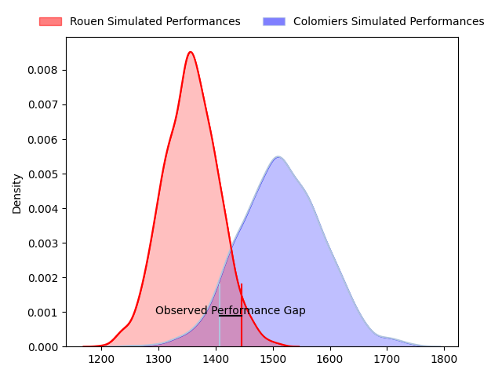
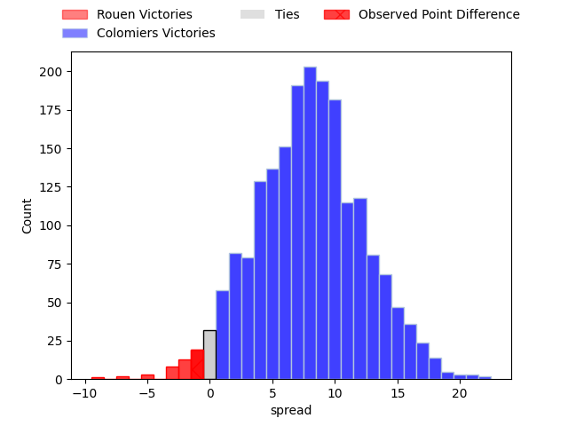
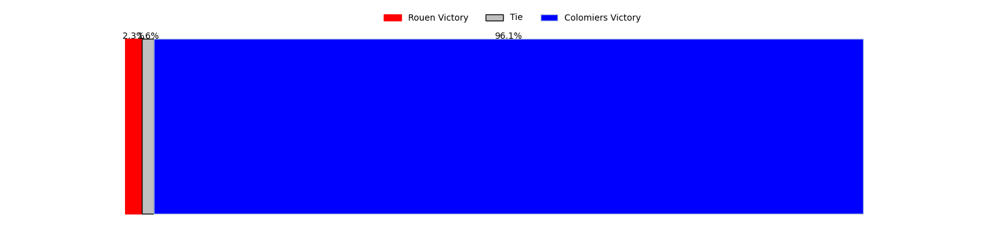

---  
layout: page  
title: Rouen at Colomiers; 18-17  
date: 2023-04-14 19:30:00 18:00:00 -0500  
categories: match review  
---
# Rouen at Colomiers; 18-17

# Club Level Predictions

The first set of predictions treats a club as the smallest object, as the club develops its members, organizes a gameplan, and deploys its players as needed for each match. This club model has a prediction of 0.713, which translates to predicting Colomiers to win by 8.0.

Each club has a rating and a rating deviation (simiar to a Glicko system), and expected performances can be generated. This allows for simulated matches and spreads like the ones below.
## Projected Performances

## Projected Spreads

## Projected Results

# Player Level Predictions

Treating teams instead as an entity made up of the currently active players, I have ratings for each player in an altogether different system. These can be combined to form team ratings once teamsheets are announced, weighting starters a bit higher than the reserves. After the match is played, players can be weighted by their minutes on the field, allowing for an accurate measure of the team's composition. With these compiled team ratings, we can make predictions, measure inaccuracy, and update the individual player ratings.
## Prediction with Player Minutes: Colomiers by 5.7

Colomiers by 1.7 on a neutral field

There were 4 large changes in win probability in this match
## Prediction without Player Minutes: Colomiers by 7.6

Colomiers by 3.6 on a neutral pitch

|   Away Minutes | Away Player           |   Away elo |   Away Percentile |   Number |   Home Percentile |   Home elo | Home Player           |   Home Minutes |
|---------------:|:----------------------|-----------:|------------------:|---------:|------------------:|-----------:|:----------------------|---------------:|
|             48 | Antoine Fournier      |      73.7  |                 5 |        1 |                90 |     109.45 | Guillaume Tartas      |             51 |
|             61 | Efitusi Ma'afu        |      91.26 |                37 |        2 |                41 |      89.2  | Andrew Ready          |             55 |
|             61 | Hugo Ndiaye           |      87.57 |                24 |        3 |                 7 |      74.88 | Hugo Pirlet           |             48 |
|              4 | Jean Leleu            |      84.45 |                19 |        4 |                61 |      99.07 | Jean Thomas           |             55 |
|             80 | Jimi Maximin          |      94.07 |                60 |        5 |                13 |      76.87 | Jack Whetton          |             80 |
|             80 | Samuel Maximin        |      89.07 |                29 |        6 |                12 |      81.44 | Waël Ponpon           |             48 |
|             59 | Fabien Vincent        |      97.01 |                52 |        7 |                82 |     110.59 | Aldric Lescure        |             80 |
|             80 | Valentino Mapapalangi |      87.94 |                26 |        8 |               nan |     121.1  | Romain Bezian         |             80 |
|             69 | Théo Nanette          |      85.68 |                20 |        9 |                19 |      85.51 | Ugo Seguela           |             51 |
|             80 | Franck Pourteau       |      87.5  |                24 |       10 |                64 |     100.2  | Maxime Javaux         |             80 |
|             80 | Benito Masilevu       |      86.72 |                23 |       11 |                33 |      90.04 | Valentin Saurs        |             64 |
|             80 | Taylor Gontineac      |      98.73 |                57 |       12 |                64 |     100.09 | Fabien Perrin         |             80 |
|             65 | Opetera Peleseuma     |      87.06 |                25 |       13 |                70 |     102.46 | Grégoire Maurino      |             51 |
|             45 | Malcolm Bertschy      |      97.56 |                53 |       14 |                 0 |      47.84 | Victor Moro           |             80 |
|             80 | Paul Surano           |      84.74 |                19 |       15 |                48 |      95.13 | Max Auriac            |             80 |
|             76 | Raphaël Vieilledent   |      90.9  |                39 |       16 |                14 |      83.79 | Marco Fepulea'i       |             32 |
|             35 | Peter Lydon           |     122.77 |                94 |       17 |                 6 |      75.53 | Pierre-Samuel Pacheco |             32 |
|             32 | Dylan Jacquot         |      94.86 |               nan |       18 |                25 |      87.63 | Alexis Palisson       |             29 |
|             21 | Willy N'Diaye         |     105.05 |                77 |       19 |                14 |      77.95 | Hugo Djehi            |             29 |
|             19 | Cody Thomas           |      93.02 |                42 |       20 |                46 |      93.91 | Edoardo Gori          |             29 |
|             19 | Ru-Hann Greyling      |      90.74 |                36 |       21 |                80 |     107.1  | Maxime Granouillet    |             25 |
|             15 | John Thomas Jackson   |      77.73 |                 9 |       22 |                31 |      90.07 | Hikawera Elliot       |             25 |
|             11 | Florent Campeggia     |      72.42 |                 5 |       23 |                44 |      94.71 | Thomas Girard         |             16 |

