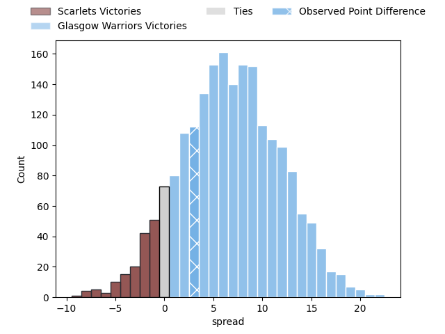

---  
layout: page  
title: Scarlets at Glasgow Warriors; 9-12  
date: 2023-04-14 20:35:00 18:00:00 -0500  
categories: match review  
---
# Scarlets at Glasgow Warriors; 9-12

# Club Level Predictions

The first set of predictions treats a club as the smallest object, as the club develops its members, organizes a gameplan, and deploys its players as needed for each match. This club model has a prediction of 0.686, which translates to predicting Glasgow Warriors to win by 6.9.

Each club has a rating and a rating deviation (simiar to a Glicko system), and expected performances can be generated. This allows for simulated matches and spreads like the ones below.
## Projected Performances

## Projected Spreads

## Projected Results

# Player Level Predictions

Treating teams instead as an entity made up of the currently active players, I have ratings for each player in an altogether different system. These can be combined to form team ratings once teamsheets are announced, weighting starters a bit higher than the reserves. After the match is played, players can be weighted by their minutes on the field, allowing for an accurate measure of the team's composition. With these compiled team ratings, we can make predictions, measure inaccuracy, and update the individual player ratings.
## Prediction with Player Minutes: Glasgow Warriors by 11.5

Glasgow Warriors by 7.5 on a neutral field

There were 10 large changes in win probability in this match
## Prediction without Player Minutes: Glasgow Warriors by 9.9

Glasgow Warriors by 5.9 on a neutral pitch

|   Away Minutes | Away Player      |   Away elo |   Away Percentile |   Number |   Home Percentile |   Home elo | Home Player          |   Home Minutes |
|---------------:|:-----------------|-----------:|------------------:|---------:|------------------:|-----------:|:---------------------|---------------:|
|             47 | Wyn Jones        |     136.28 |                99 |        1 |                84 |     106.63 | Jamie Bhatti         |             60 |
|             47 | Shaun Evans      |     106.79 |                86 |        2 |                79 |     105.69 | Johnny Matthews      |             47 |
|             47 | Sam Wainwright   |      89.97 |                30 |        3 |                88 |     110.4  | Zander Fagerson      |             61 |
|             80 | Morgan Jones     |     102.99 |                67 |        4 |                70 |     106.44 | Lewis Bean           |             47 |
|             80 | Vaea Fifita      |     105.14 |                76 |        5 |                84 |     111.21 | Jean-Pierre du Preez |             80 |
|             49 | Iwan Shenton     |      93.28 |               nan |        6 |               nan |      98.03 | Ryan Wilson          |             45 |
|             80 | Joshua McLeod    |      95.05 |                48 |        7 |                62 |     100.05 | Matt Fagerson        |             72 |
|             80 | Carwyn Tuipulotu |     100.99 |                55 |        8 |                84 |     111.89 | Sione Vailanu        |             80 |
|             72 | Kieran Hardy     |      97.44 |               nan |        9 |                77 |     105.69 | Ali Price            |             60 |
|             49 | Dan Jones        |      98.56 |               nan |       10 |                25 |      89.23 | Tom Jordan           |             80 |
|             80 | Ryan Conbeer     |      91.2  |                37 |       11 |                88 |     116.55 | Cole Forbes          |             80 |
|             64 | Eddie James      |      97.56 |               nan |       12 |                83 |     111.29 | Sam Johnson          |             80 |
|             80 | Ioan Nicholas    |     105.23 |                74 |       13 |                83 |     111.29 | Stafford McDowall    |             80 |
|             80 | Steffan Evans    |     106.2  |                77 |       14 |                75 |     105.64 | Kyle Steyn           |             80 |
|             80 | Tom Rogers       |      93.15 |                43 |       15 |                 7 |      74.96 | Huw Jones            |             80 |
|             33 | Javan Sebastian  |     100.56 |                69 |       16 |                84 |     110.21 | Scott Cummings       |             35 |
|             33 | Steff Thomas     |      99.11 |               nan |       17 |                84 |     108.49 | Fraser Brown         |             33 |
|             33 | Dafydd Hughes    |      91.45 |                38 |       18 |                94 |     122.09 | Richie Gray          |             33 |
|             31 | Aaron Shingler   |      93.76 |                44 |       19 |                80 |     108.06 | Jamie Dobie          |             20 |
|             31 | Rhys Patchell    |      90.23 |               nan |       20 |                67 |     103.21 | Nathan McBeth        |             20 |
|             16 | Joe Roberts      |     108.55 |                79 |       21 |                68 |     103.4  | Simon Berghan        |             19 |
|              8 | Dan Blacker      |      98.86 |                59 |       22 |                81 |     109.37 | Rory Darge           |              8 |

