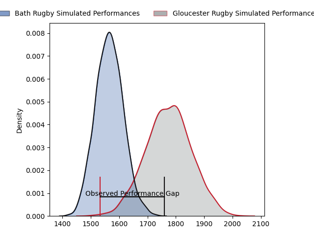
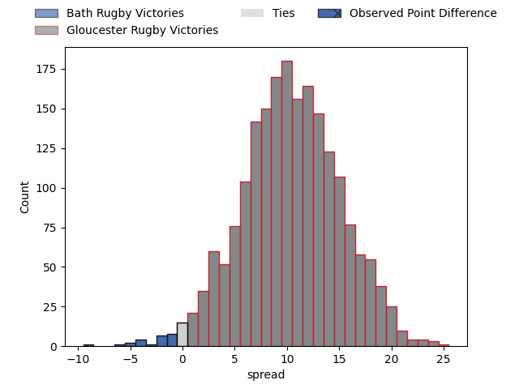

---  
layout: page  
title: Bath Rugby at Gloucester Rugby; 33.0-24.0  
date: 2023-04-14 14:45:00 18:00:00 -0500  
categories: match review  
---
# Bath Rugby at Gloucester Rugby; 33.0-24.0

# Club Level Predictions

The first set of predictions treats a club as the smallest object, as the club develops its members, organizes a gameplan, and deploys its players as needed for each match. This club model has a prediction of 0.763, which translates to predicting Gloucester Rugby to win by 10.3.

Each club has a rating and a rating deviation (simiar to a Glicko system), and expected performances can be generated. This allows for simulated matches and spreads like the ones below.
## Projected Performances

## Projected Spreads

## Projected Results

# Player Level Predictions

Treating teams instead as an entity made up of the currently active players, I have ratings for each player in an altogether different system. These can be combined to form team ratings once teamsheets are announced, weighting starters a bit higher than the reserves. After the match is played, players can be weighted by their minutes on the field, allowing for an accurate measure of the team's composition. With these compiled team ratings, we can make predictions, measure inaccuracy, and update the individual player ratings.
## Prediction with Player Minutes: Gloucester Rugby by 9.6

Gloucester Rugby by 5.6 on a neutral field

There were 14 large changes in win probability in this match
## Prediction without Player Minutes: Gloucester Rugby by 8.4

Gloucester Rugby by 4.4 on a neutral pitch

|   Away Minutes | Away Player         |   Away elo |   Away Percentile |   Number |   Home Percentile |   Home elo | Home Player         |   Home Minutes |
|---------------:|:--------------------|-----------:|------------------:|---------:|------------------:|-----------:|:--------------------|---------------:|
|             68 | Beno Obano          |     109.01 |                87 |        1 |                59 |      97.73 | Mayco Vivas         |             65 |
|             73 | Tom Dunn            |     123.64 |                96 |        2 |                 5 |      73.18 | Sebastian Blake     |             59 |
|             71 | Will Stuart         |      80.47 |                10 |        3 |               nan |      94.68 | Jamal Ford-Robinson |             65 |
|             80 | Josh McNally        |     112.18 |                87 |        4 |                65 |     100.33 | Freddie Clarke      |             80 |
|             68 | GJ van Velze        |      96.45 |                53 |        5 |                76 |     105.25 | Matias Alemanno     |             68 |
|             80 | Ted Hill            |      97.83 |                55 |        6 |                69 |     103.51 | Jack Clement        |             80 |
|             58 | Chris Cloete        |     122.26 |                93 |        7 |                56 |      98.27 | Lewis Ludlow        |             72 |
|             80 | Miles Reid          |     115.72 |                88 |        8 |                95 |     124.97 | Ben Morgan          |             80 |
|             80 | Ben Spencer         |     115.44 |                91 |        9 |                 8 |      75.52 | Stephen Varney      |             59 |
|             68 | Orlando Bailey      |      69.78 |                 4 |       10 |                96 |     135.18 | Billy Twelvetrees   |             80 |
|             80 | Matt Gallagher      |     122.83 |                94 |       11 |                89 |     117.18 | Ollie Thorley       |             59 |
|             75 | Max Ojomoh          |      78.1  |                10 |       12 |                 1 |      55.25 | Sebastien Atkinson  |             80 |
|             80 | Ollie Lawrence      |      84.53 |                18 |       13 |                83 |     111.7  | Chris Harris        |             80 |
|             80 | Joe Cokanasiga      |      97.71 |                55 |       14 |                64 |     101.08 | Louis Rees-Zammit   |             80 |
|             75 | Tom de Glanville    |      71.8  |                 6 |       15 |                98 |     140.34 | Santiago Carreras   |             80 |
|              7 | Niall Annett        |     102.5  |                73 |       16 |                91 |     112.63 | Henry Walker        |             21 |
|             12 | Valery Morozov      |      79.07 |                 9 |       17 |                45 |      95.21 | Harry Elrington     |             15 |
|              9 | D'Arcy Rae          |      40.9  |                 0 |       18 |               nan |      95    | Ciaran Knight       |             15 |
|             12 | Fergus Lee-Warner   |      70.12 |                 3 |       19 |                32 |      83.42 | Cameron Jordan      |             12 |
|             22 | Sam Underhill       |      95.45 |                49 |       20 |               nan |      95.7  | Freddie Thomas      |              8 |
|              5 | Max Green           |      98.2  |                60 |       21 |                77 |      96.32 | Charlie Chapman     |             21 |
|             12 | Piers Francis       |     124.5  |                92 |       22 |               nan |      95    | George Barton       |              0 |
|              5 | Ruaridh McConnochie |     117.43 |                89 |       23 |                80 |     107.88 | Jonny May           |             21 |

