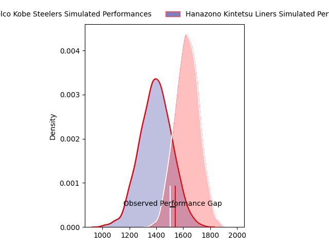
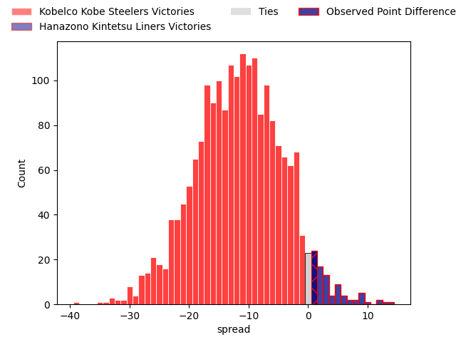
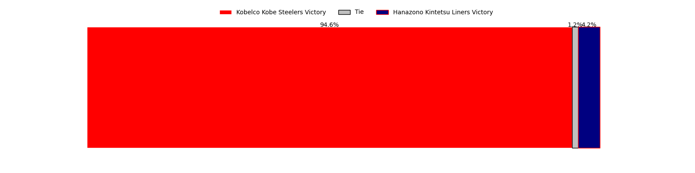

---  
layout: page  
title: Kobelco Kobe Steelers at Hanazono Kintetsu Liners; 33-34  
date: 2023-04-14 12:00:00 18:00:00 -0500  
categories: match review  
---
# Kobelco Kobe Steelers at Hanazono Kintetsu Liners; 33-34

# Club Level Predictions

The first set of predictions treats a club as the smallest object, as the club develops its members, organizes a gameplan, and deploys its players as needed for each match. This club model has a prediction of 0.209, which translates to predicting Kobelco Kobe Steelers to win by 12.0.

Each club has a rating and a rating deviation (simiar to a Glicko system), and expected performances can be generated. This allows for simulated matches and spreads like the ones below.
## Projected Performances

## Projected Spreads

## Projected Results

# Player Level Predictions

Treating teams instead as an entity made up of the currently active players, I have ratings for each player in an altogether different system. These can be combined to form team ratings once teamsheets are announced, weighting starters a bit higher than the reserves. After the match is played, players can be weighted by their minutes on the field, allowing for an accurate measure of the team's composition. With these compiled team ratings, we can make predictions, measure inaccuracy, and update the individual player ratings.
## Prediction with Player Minutes: Kobelco Kobe Steelers by 21.7

Kobelco Kobe Steelers by 25.7 on a neutral field

There were 11 large changes in win probability in this match
## Prediction without Player Minutes: Kobelco Kobe Steelers by 25.3

Kobelco Kobe Steelers by 29.3 on a neutral pitch

|   Away Minutes | Away Player              |   Away elo |   Away Percentile |   Number |   Home Percentile |   Home elo | Home Player           |   Home Minutes |
|---------------:|:-------------------------|-----------:|------------------:|---------:|------------------:|-----------:|:----------------------|---------------:|
|             53 | Isileli Nakajima Vakauta |     112.25 |                90 |        1 |                10 |      80.97 | Kenta Tanaka          |             79 |
|             80 | Kenta Matsuoka           |      97.99 |                60 |        2 |                77 |     104.15 | Atsushi Kashimoto     |             80 |
|             68 | Sho Maeda                |      96.43 |                69 |        3 |                 7 |      77.24 | Kota Mitake           |             68 |
|             80 | Gerard Cowley-Tuioti     |      93.69 |                44 |        4 |                63 |     100.56 | Tsuyoshi Murata       |             80 |
|             70 | John Dave Schickerling   |      90.14 |                33 |        5 |                66 |     100.89 | Sanaila Junior Waqa   |             63 |
|             59 | Takara Imamura           |     104.65 |                72 |        6 |                32 |      89.89 | Hayato Yokoi          |             76 |
|             80 | Hikaru Hashimoto         |     137.02 |                98 |        7 |                69 |     102.91 | Shohei Nonaka         |             80 |
|             80 | Amanaki Saumaki          |      83.15 |                17 |        8 |                14 |      81.62 | Waimana Kapa          |             80 |
|             68 | Daiki Nakajima           |     111.88 |                87 |        9 |                 0 |      54.82 | William Genia         |             80 |
|             77 | Beaudein Waaka           |      90.7  |               nan |       10 |                 2 |      60.82 | Jackson Garden-Bachop |             80 |
|             80 | Rakuhei Yamashita        |     140.23 |                99 |       11 |                68 |     102.41 | Tatsuma Nanto         |             80 |
|             80 | Lee Seung Sin            |      87.06 |                23 |       12 |                50 |      95.89 | Haruki Kanazawa       |             80 |
|             80 | Junta Hamano             |      97.56 |                54 |       13 |                 0 |      41.91 | Sioasia Fifita        |             80 |
|             77 | Kosuke Naka              |      92.02 |                40 |       14 |                22 |      85.92 | Vincent Sefo          |             63 |
|             80 | Ryohei Yamanaka          |      87.05 |                25 |       15 |                18 |      82.28 | Yoshizumi Takeda      |             80 |
|             27 | Koki Yamamoto            |      92.63 |               nan |       16 |                37 |      90.96 | Ren Takano            |             17 |
|             21 | Rinpei Sasaki            |      98.51 |               nan |       17 |                 5 |      69.48 | Ben Toolis            |             17 |
|             12 | Shigure Takao            |      99.95 |                76 |       18 |                 4 |      71.83 | Lata Tangimana        |             12 |
|             12 | Kenta Tokuda             |      99.47 |                58 |       19 |               nan |      93.29 | Tevita Tupou          |              4 |
|             10 | Naohiro Kotaki           |      85.49 |                29 |       20 |                28 |      89.65 | Yushi Inoue           |              1 |
|              3 | Gentaro Ikenaga          |      95    |               nan |       21 |               nan |     nan    | nan                   |            nan |
|              3 | Shinsuke Iseki           |     125.09 |                94 |       22 |               nan |     nan    | nan                   |            nan |

