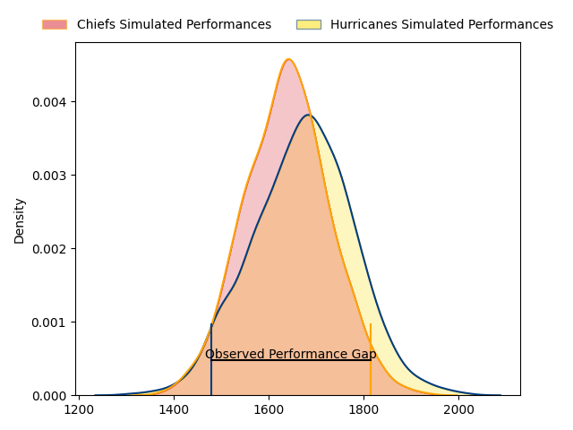
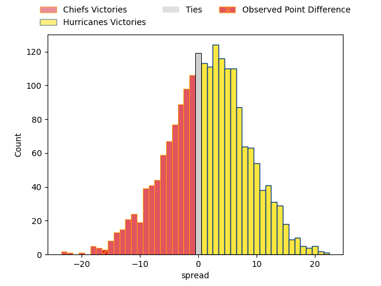

---  
layout: page  
title: Chiefs at Hurricanes; 33.0-17.0  
date: 2023-04-14 22:35:00 18:00:00 -0500  
categories: match review  
---
# Chiefs at Hurricanes; 33.0-17.0

# Club Level Predictions

The first set of predictions treats a club as the smallest object, as the club develops its members, organizes a gameplan, and deploys its players as needed for each match. This club model has a prediction of 0.545, which translates to predicting Hurricanes to win by 1.6.

Each club has a rating and a rating deviation (simiar to a Glicko system), and expected performances can be generated. This allows for simulated matches and spreads like the ones below.
## Projected Performances

## Projected Spreads

## Projected Results

# Player Level Predictions

Treating teams instead as an entity made up of the currently active players, I have ratings for each player in an altogether different system. These can be combined to form team ratings once teamsheets are announced, weighting starters a bit higher than the reserves. After the match is played, players can be weighted by their minutes on the field, allowing for an accurate measure of the team's composition. With these compiled team ratings, we can make predictions, measure inaccuracy, and update the individual player ratings.
## Prediction with Player Minutes: Hurricanes by 5.0

Hurricanes by 1.0 on a neutral field

There were 7 large changes in win probability in this match
## Prediction without Player Minutes: Hurricanes by 5.7

Hurricanes by 1.7 on a neutral pitch

|   Away Minutes | Away Player         |   Away elo |   Away Percentile |   Number |   Home Percentile |   Home elo | Home Player        |   Home Minutes |
|---------------:|:--------------------|-----------:|------------------:|---------:|------------------:|-----------:|:-------------------|---------------:|
|             55 | Aidan Ross          |     107.41 |                85 |        1 |                97 |     124.09 | Xavier Numia       |             52 |
|             73 | Samisoni Taukei'aho |     115.35 |                92 |        2 |                96 |     123.98 | Asafo Aumua        |             52 |
|             63 | George Dyer         |      95.22 |                36 |        3 |                99 |     143.28 | Tyrel Lomax        |             65 |
|             81 | Brodie Retallick    |     120.75 |                93 |        4 |                55 |      97.03 | James Blackwell    |             81 |
|             63 | Tupou Vaa'i         |      95.13 |                48 |        5 |                94 |     123.04 | Dominic Bird       |             60 |
|             63 | Pita Gus Sowakula   |     102.89 |                67 |        6 |                62 |      99.86 | Devan Flanders     |             73 |
|             73 | Sam Cane            |     140.72 |                98 |        7 |                90 |     117.5  | Du'Plessis Kirifi  |             60 |
|             81 | Luke Jacobson       |     138.9  |                98 |        8 |                95 |     125.09 | Ardie Savea        |             81 |
|             57 | Brad Weber          |     138.7  |                99 |        9 |                54 |      97.04 | Cam Roigard        |             63 |
|             81 | Damian McKenzie     |      96.57 |                49 |       10 |                77 |     107.44 | Aidan Morgan       |             81 |
|             77 | Etene Nanai-Seturo  |     103.19 |                70 |       11 |                51 |      96.42 | Salesi Rayasi      |             81 |
|             81 | Rameka Poihipi      |      95    |                48 |       12 |                98 |     131.82 | Jordie Barrett     |             81 |
|             81 | Daniel Rona         |      98.79 |                57 |       13 |                49 |      95.9  | Peter Umaga-Jensen |             68 |
|             61 | Emoni Narawa        |     110.77 |                84 |       14 |                98 |     137.78 | Julian Savea       |             81 |
|             81 | Shaun Stevenson     |     105.44 |                71 |       15 |                48 |      95.03 | Joshua Moorby      |             81 |
|              8 | Bradley Slater      |     116.32 |                92 |       16 |                98 |     129.18 | Dane Coles         |             29 |
|             26 | Ollie Norris        |      93.64 |                44 |       17 |                82 |     104.68 | Tevita Mafileo     |             29 |
|             18 | John Ryan           |     106.71 |                84 |       18 |               nan |      95.69 | Pasilio Tosi       |             16 |
|             18 | Naitoa Ah Kuoi      |     125.36 |                94 |       19 |                25 |      90.38 | TK Howden          |             21 |
|             26 | Samipeni Finau      |     111.74 |                84 |       20 |                 1 |      56.5  | Brayden Iose       |             21 |
|             24 | Cortez Ratima       |     113.71 |                87 |       21 |                74 |     103.76 | Peter Lakai        |              8 |
|             20 | Bryn Gatland        |      98.55 |                55 |       22 |                 2 |      65.44 | Jamie Booth        |             18 |
|              4 | Peniasi Malimali    |      75.95 |                 7 |       23 |                17 |      81.44 | Harry Godfrey      |             13 |

