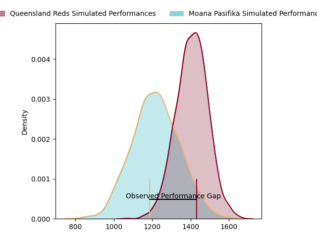

---  
layout: page  
title: Queensland Reds at Moana Pasifika; 40.0-28.0  
date: 2023-04-14 00:05:00 18:00:00 -0500  
categories: match review  
---
# Queensland Reds at Moana Pasifika; 40.0-28.0

# Club Level Predictions

The first set of predictions treats a club as the smallest object, as the club develops its members, organizes a gameplan, and deploys its players as needed for each match. This club model has a prediction of 0.26, which translates to predicting Queensland Reds to win by 9.4.

Each club has a rating and a rating deviation (simiar to a Glicko system), and expected performances can be generated. This allows for simulated matches and spreads like the ones below.
## Projected Performances

## Projected Spreads

## Projected Results

# Player Level Predictions

Treating teams instead as an entity made up of the currently active players, I have ratings for each player in an altogether different system. These can be combined to form team ratings once teamsheets are announced, weighting starters a bit higher than the reserves. After the match is played, players can be weighted by their minutes on the field, allowing for an accurate measure of the team's composition. With these compiled team ratings, we can make predictions, measure inaccuracy, and update the individual player ratings.
## Prediction with Player Minutes: Moana Pasifika by 6.9

Moana Pasifika by 2.9 on a neutral field

There were 4 large changes in win probability in this match
## Prediction without Player Minutes: Moana Pasifika by 5.7

Moana Pasifika by 1.7 on a neutral pitch

|   Away Minutes | Away Player          |   Away elo |   Away Percentile |   Number |   Home Percentile |   Home elo | Home Player          |   Home Minutes |
|---------------:|:---------------------|-----------:|------------------:|---------:|------------------:|-----------:|:---------------------|---------------:|
|             47 | Sef Fa'agase         |      87.86 |               nan |        1 |                 5 |      74.04 | Ezekiel Lindenmuth   |             59 |
|             56 | Matt Faessler        |      90.06 |                31 |        2 |                 8 |      77.78 | Samiuela Moli        |             59 |
|             56 | Zane Nonggorr        |      88.59 |                35 |        3 |               nan |      73.63 | Isileli Tu'ungafasi  |             47 |
|             73 | Connor Vest          |      87.72 |                34 |        4 |                87 |     112.42 | Michael Curry        |             80 |
|             80 | Ryan Smith           |      86.67 |                30 |        5 |                 8 |      75.89 | Mike McKee           |             41 |
|             63 | Jake Upfield         |      95.78 |               nan |        6 |                49 |      95.48 | Miracle Faiilagi     |             80 |
|             80 | Fraser McReight      |     107.43 |                78 |        7 |               nan |      95    | Niko Jones           |             80 |
|             80 | Harry Wilson         |     103.74 |                69 |        8 |                32 |      90.91 | Solomone Funaki      |             80 |
|             73 | Tate McDermott       |      99.76 |                63 |        9 |                69 |     102.09 | Ere Enari            |             66 |
|             80 | Lawson Creighton     |      93.84 |                43 |       10 |                53 |      98.01 | Lincoln McClutchie   |             80 |
|             76 | Jordan Petaia        |      92.67 |                41 |       11 |                44 |      93.75 | Neria Fomai          |             80 |
|             75 | James O'Connor       |      91    |                35 |       12 |                85 |     113.69 | Danny Toala          |             32 |
|             80 | Josh Flook           |      79.98 |                11 |       13 |                91 |     118.86 | Levi Aumua           |             80 |
|             80 | Suliasi Vunivalu     |      95.97 |                50 |       14 |                31 |      89.45 | Timoci Tavatavanawai |             63 |
|             80 | Jock Campbell        |      98.08 |                54 |       15 |                93 |     121.09 | William Havili       |             80 |
|             24 | Richie Asiata        |     113.01 |                89 |       16 |                66 |     102.64 | Luteru Tolai         |             21 |
|             33 | Peni Ravai           |      89.48 |                27 |       17 |                70 |     100.92 | Abraham Pole         |             21 |
|             24 | Phransis Sula-Siaosi |      90.78 |                32 |       18 |                 6 |      75.04 | Suetena Asomua       |             33 |
|              7 | Lopeti Faifua        |      90.73 |                35 |       19 |                10 |      76.37 | Potu Leavasa         |             21 |
|             17 | Connor Anderson      |      96.97 |               nan |       20 |                26 |      88.38 | Sione Tu'ipulotu     |             18 |
|              7 | Kalani Thomas        |      92.68 |                50 |       21 |                41 |      92.51 | Manu Paea            |             14 |
|              5 | Tom Lynagh           |      98.27 |                57 |       22 |                59 |     100.85 | D'Angelo Leuila      |             48 |
|              4 | Mac Grealy           |      91.04 |               nan |       23 |                 7 |      73.82 | Fine Inisi           |             17 |

