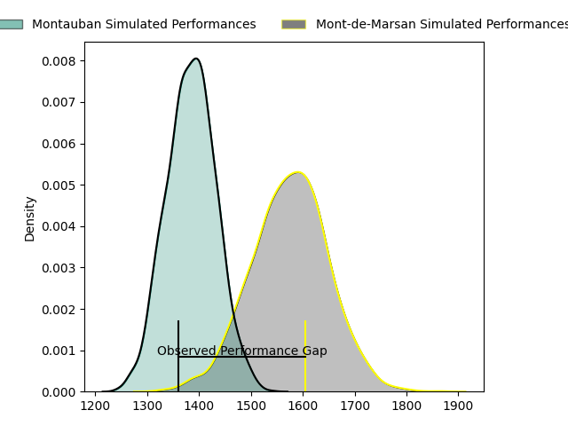
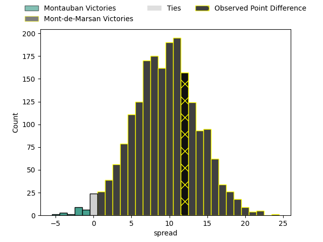
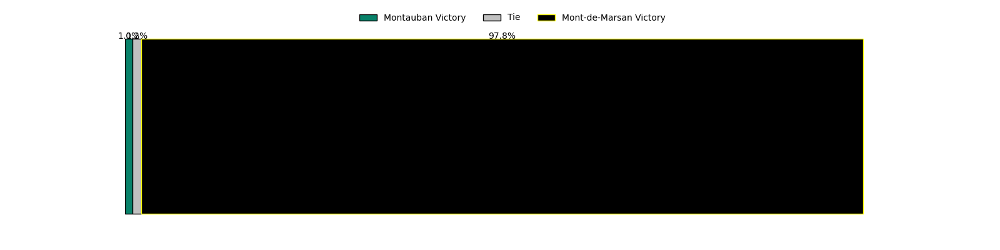

---  
layout: page  
title: Montauban at Mont-de-Marsan; 13-25  
date: 2023-04-14 19:30:00 18:00:00 -0500  
categories: match review  
---
# Montauban at Mont-de-Marsan; 13-25

# Club Level Predictions

The first set of predictions treats a club as the smallest object, as the club develops its members, organizes a gameplan, and deploys its players as needed for each match. This club model has a prediction of 0.743, which translates to predicting Mont-de-Marsan to win by 9.3.

Each club has a rating and a rating deviation (simiar to a Glicko system), and expected performances can be generated. This allows for simulated matches and spreads like the ones below.
## Projected Performances

## Projected Spreads

## Projected Results

# Player Level Predictions

Treating teams instead as an entity made up of the currently active players, I have ratings for each player in an altogether different system. These can be combined to form team ratings once teamsheets are announced, weighting starters a bit higher than the reserves. After the match is played, players can be weighted by their minutes on the field, allowing for an accurate measure of the team's composition. With these compiled team ratings, we can make predictions, measure inaccuracy, and update the individual player ratings.
## Prediction with Player Minutes: Montauban by 0.7

Montauban by 4.7 on a neutral field

There were 10 large changes in win probability in this match
## Prediction without Player Minutes: Mont-de-Marsan by 6.8

Mont-de-Marsan by 2.8 on a neutral pitch

|   Away Minutes | Away Player        |   Away elo |   Away Percentile |   Number |   Home Percentile |   Home elo | Home Player           |   Home Minutes |
|---------------:|:-------------------|-----------:|------------------:|---------:|------------------:|-----------:|:----------------------|---------------:|
|             55 | Lucas Seyrolle     |      93.11 |                42 |        1 |                90 |     112.33 | Thomas Bultel         |             53 |
|             55 | Cyril Deligny      |     103.24 |                75 |        2 |                95 |     120.7  | Jose Luis Gonzalez    |             56 |
|             48 | Victor Laval       |      92.05 |                40 |        3 |                85 |     107.62 | Gheorge Gajion        |             51 |
|             80 | Kevin Gimeno       |     100.76 |                66 |        4 |                88 |     113.64 | Romain Durand         |             80 |
|             48 | Alexandre Manukula |      92.67 |                41 |        5 |                49 |      95.26 | Andrei Ostrikov       |             80 |
|             80 | Tomas Lezana       |      97.98 |               nan |        6 |                22 |      87.07 | Yann Brethous         |             80 |
|             80 | Tjiuee Uanivi      |     103.01 |                71 |        7 |                25 |      88.24 | Léo Banos             |             64 |
|             48 | Dan Malafosse      |      90.89 |                29 |        8 |                42 |      94.2  | Michael Faleafa       |             56 |
|             80 | Alexis Bernadet    |     111.17 |                86 |        9 |                30 |      89.53 | Christophe Loustalot  |             71 |
|             53 | Tedo Abzhandadze   |     107.25 |                76 |       10 |                63 |     100.91 | Willie du Plessis     |             80 |
|             80 | Bastien Guillemin  |     103.53 |                71 |       11 |                41 |      92.51 | Kaminieli Rasaku      |             80 |
|             80 | Sevenaia Galala    |     115.07 |                87 |       12 |                31 |      89.66 | Jules Even            |             80 |
|             80 | Maxime Mathy       |     107.5  |                69 |       13 |                93 |     121.24 | Nacani Wakaya         |             62 |
|             80 | Segundo Tuculet    |     114.18 |                87 |       14 |                62 |     100.29 | Ambrose Curtis        |             65 |
|             80 | Jérôme Bosviel     |     119.4  |                89 |       15 |                94 |     124.79 | Yoann Laousse Azpiazu |             80 |
|             32 | Tietie Tuimauga    |     101.24 |                71 |       16 |                20 |      86.57 | Anthony Alves         |             29 |
|             32 | Maselino Paulino   |      97.28 |               nan |       17 |                 2 |      58.89 | Jean-Luc Innocente    |             27 |
|             32 | Quentin Witt       |     100.72 |                61 |       18 |               nan |      93.64 | Leandro Luis Cedaro   |             24 |
|             25 | Arnaud Feltrin     |      81.29 |                10 |       19 |                29 |      83.8  | Romain Laterrade      |             24 |
|             27 | Semesa Rokoduguni  |      98.65 |                58 |       20 |                72 |     105.77 | Simon Renda           |             18 |
|             25 | Malino Vanai       |      95.45 |                44 |       21 |                88 |     115.33 | Aurélien Lisena       |             16 |
|            nan | nan                |     nan    |               nan |       22 |                74 |     106.52 | Alexandre de Nardi    |             15 |
|            nan | nan                |     nan    |               nan |       23 |               nan |      95    | Clément Darbo         |              9 |

