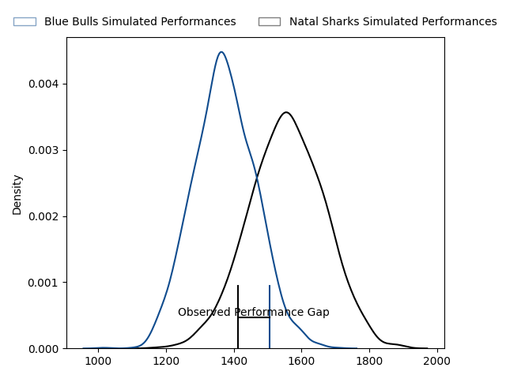
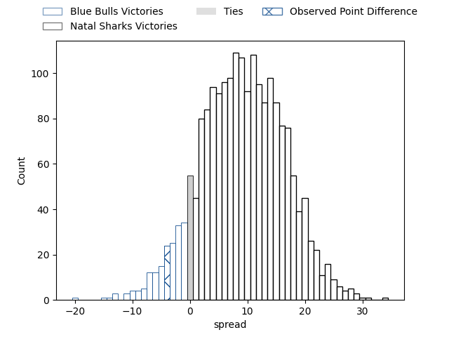
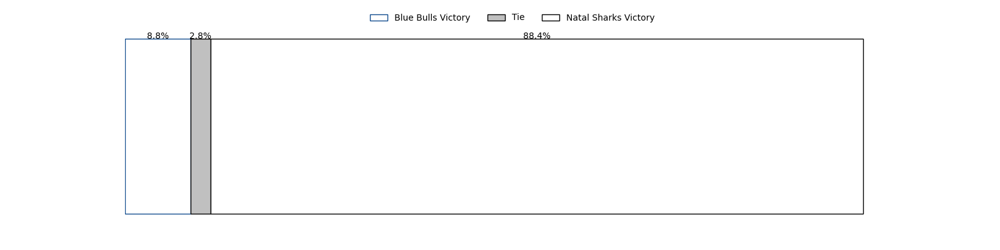

---  
layout: page  
title: Blue Bulls at Natal Sharks; 24-20  
date: 2023-04-14 15:30:00 18:00:00 -0500  
categories: match review  
---
# Blue Bulls at Natal Sharks; 24-20

# Club Level Predictions

The first set of predictions treats a club as the smallest object, as the club develops its members, organizes a gameplan, and deploys its players as needed for each match. This club model has a prediction of 0.726, which translates to predicting Natal Sharks to win by 8.8.

Each club has a rating and a rating deviation (simiar to a Glicko system), and expected performances can be generated. This allows for simulated matches and spreads like the ones below.
## Projected Performances

## Projected Spreads

## Projected Results

# Player Level Predictions

Treating teams instead as an entity made up of the currently active players, I have ratings for each player in an altogether different system. These can be combined to form team ratings once teamsheets are announced, weighting starters a bit higher than the reserves. After the match is played, players can be weighted by their minutes on the field, allowing for an accurate measure of the team's composition. With these compiled team ratings, we can make predictions, measure inaccuracy, and update the individual player ratings.
## Prediction with Player Minutes: Natal Sharks by 20.5

Natal Sharks by 16.5 on a neutral field

There were 13 large changes in win probability in this match
## Prediction without Player Minutes: Natal Sharks by 23.0

Natal Sharks by 19.0 on a neutral pitch

|   Away Minutes | Away Player                       |   Away elo |   Away Percentile |   Number |   Home Percentile |   Home elo | Home Player                      |   Home Minutes |
|---------------:|:----------------------------------|-----------:|------------------:|---------:|------------------:|-----------:|:---------------------------------|---------------:|
|             66 | Simphiwe Matanzima                |      92.5  |               nan |        1 |                64 |      99.1  | Dian Bleuler                     |             39 |
|             80 | Jan Hendrik Wessels               |      70.76 |                 4 |        2 |                42 |      89.91 | Daniel Viljoen Jooste            |             39 |
|             49 | Sebastian Lombard                 |      93.79 |               nan |        3 |                38 |      92.02 | Hanro Jacobs                     |             39 |
|             80 | Willem Hendrik Jacques du Plessis |      78.44 |                11 |        4 |                67 |     102.09 | Corne Rahl                       |             80 |
|             80 | Janko Swanepoel                   |      96.16 |               nan |        5 |                69 |     101.7  | Daniel Pieter (Reniel) Hugo      |             80 |
|             66 | Cameron Hanekom                   |      87.45 |                23 |        6 |                69 |     106.44 | Tinotenda Blithe Mavesere        |             63 |
|             80 | Reinhardt Ludwig                  |      85.69 |                21 |        7 |                54 |      96.76 | Ockie Barnard                    |             47 |
|             53 | Nizaam Carr                       |      92.26 |                27 |        8 |                48 |      96.12 | James Venter                     |             80 |
|             80 | Izak Jacobus Burger               |     100.2  |                64 |        9 |                60 |      99.12 | Bradley Davids                   |             49 |
|             80 | Morne Steyn                       |      83.05 |                16 |       10 |                58 |      99.72 | Frederik Johannes Zeilinga       |             59 |
|             80 | Wandisile Simelane                |      78.46 |                10 |       11 |                54 |      97.45 | Yaw Osei Penxe                   |             80 |
|             80 | Chris Smit                        |     100.63 |                68 |       12 |                75 |     106    | Murray Koster                    |             80 |
|             80 | Lionel Granton Mapoe              |      89.1  |                29 |       13 |               nan |      97.53 | Josh Jonas                       |             66 |
|             63 | Sibongile Vukile Novuka           |      89    |                30 |       14 |                70 |     103.44 | Phiko Sobahle                    |             80 |
|             47 | Franco Knoetze                    |      91.38 |                39 |       15 |                54 |      97.56 | Nevaldo Fleurs                   |             80 |
|             33 | Cornal Hendricks                  |      91.84 |                35 |       16 |                48 |      96.81 | Khwezi Jongamazizi Mona          |             41 |
|             31 | Robert Hunt                       |      90.62 |                31 |       17 |                92 |     115.64 | Fezokuhle Mbatha                 |             41 |
|             27 | WJ Steenkamp                      |      99.45 |                55 |       18 |                79 |     103.23 | Khuthuzani Kingdom Mchunu        |             41 |
|             17 | Bernard van der Linde             |      97.1  |                56 |       19 |                52 |      98.03 | Celimpilo Gumede                 |             33 |
|             14 | Phumzile Maqondwana               |      85.82 |                19 |       20 |                69 |     101.83 | Tiaan Fourie                     |             31 |
|             14 | Jacques van Rooyen                |      95.49 |               nan |       21 |                59 |      95.96 | Lionel Cronje                    |             21 |
|            nan | nan                               |     nan    |               nan |       22 |                 9 |      75.43 | Athenkosi Ernest (Dave) Khethani |             17 |
|            nan | nan                               |     nan    |               nan |       23 |                61 |     102.39 | Zee Mkhabela                     |             14 |

