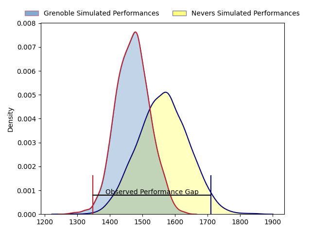
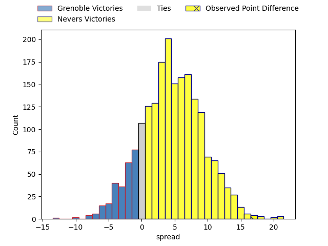
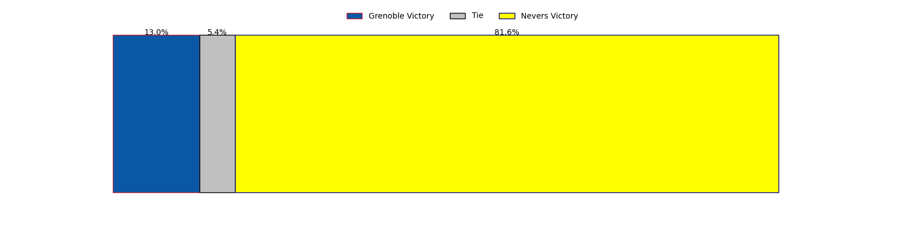

---  
layout: page  
title: Grenoble at Nevers; 14-31  
date: 2023-04-14 21:00:00 18:00:00 -0500  
categories: match review  
---
# Grenoble at Nevers; 14-31

# Club Level Predictions

The first set of predictions treats a club as the smallest object, as the club develops its members, organizes a gameplan, and deploys its players as needed for each match. This club model has a prediction of 0.632, which translates to predicting Nevers to win by 4.7.

Each club has a rating and a rating deviation (simiar to a Glicko system), and expected performances can be generated. This allows for simulated matches and spreads like the ones below.
## Projected Performances

## Projected Spreads

## Projected Results

# Player Level Predictions

Treating teams instead as an entity made up of the currently active players, I have ratings for each player in an altogether different system. These can be combined to form team ratings once teamsheets are announced, weighting starters a bit higher than the reserves. After the match is played, players can be weighted by their minutes on the field, allowing for an accurate measure of the team's composition. With these compiled team ratings, we can make predictions, measure inaccuracy, and update the individual player ratings.
## Prediction with Player Minutes: Nevers by 7.6

Nevers by 3.6 on a neutral field

There were 9 large changes in win probability in this match
## Prediction without Player Minutes: Nevers by 6.2

Nevers by 2.2 on a neutral pitch

|   Away Minutes | Away Player         |   Away elo |   Away Percentile |   Number |   Home Percentile |   Home elo | Home Player         |   Home Minutes |
|---------------:|:--------------------|-----------:|------------------:|---------:|------------------:|-----------:|:--------------------|---------------:|
|             49 | Zack Gauthier       |     120.56 |                93 |        1 |                80 |     104.74 | Kamaliele Tufele    |             55 |
|             55 | Jean-Charles Orioli |     103.29 |                76 |        2 |                67 |     100.09 | Issam Hamel         |             55 |
|             50 | Sam Nixon           |      96.72 |               nan |        3 |                77 |     103.59 | Ilia Kaikatsishvili |             67 |
|             55 | José Duarte Madeira |     107.05 |                78 |        4 |                93 |     120.74 | Maxence Barjaud     |             62 |
|             80 | Tanginoa Halaifonua |     116.22 |                90 |        5 |                80 |     107.45 | Senio Toleafoa      |             52 |
|             80 | Thibaut Martel      |     108.14 |                80 |        6 |                14 |      82.54 | Luka Plataret       |             62 |
|             80 | Marnus Schoeman     |      96.87 |                47 |        7 |                99 |     141.63 | Hugues Bastide      |             80 |
|             61 | Talalelei Gray      |      93.23 |                34 |        8 |                69 |     103.97 | Jason-Collin Fraser |             80 |
|             45 | Felipe Ezcurra      |      93.99 |                30 |        9 |                65 |     100.43 | Yoan Cottin         |             62 |
|             42 | Romain Barthélémy   |     118.07 |                91 |       10 |                60 |     100.06 | Yohan Le Bourhis    |             16 |
|             80 | Karim Qadiri        |     104.11 |                72 |       11 |                63 |     100.4  | Lucas Blanc         |             80 |
|             80 | Romain Trouilloud   |      94.87 |                48 |       12 |                36 |      91.28 | Rudy Derrieux       |             80 |
|             80 | Terence Hepetema    |     102.26 |                62 |       13 |                33 |      90.31 | Alifereti Loaloa    |             80 |
|             80 | Romain Fusier       |      91.67 |                38 |       14 |                68 |     102.26 | Christian Ambadiang |             80 |
|             80 | Hugo Trouilloud     |      83.4  |                12 |       15 |                81 |     109.42 | Kylian Jaminet      |             80 |
|             38 | Corentin Glenat     |      89.19 |                28 |       16 |                79 |     109.75 | Leonard Paris       |             64 |
|             35 | Éric Escande        |     116.2  |                91 |       17 |                44 |      93.81 | Maka Polutele       |             28 |
|             11 | Eli Eglaine         |      88.33 |                39 |       18 |               nan |      94.2  | Jordan Seneca       |             25 |
|             30 | Regis Montagne      |     102.62 |                69 |       19 |                67 |     103.11 | Elia Elia           |             25 |
|             25 | Lilian Rossi        |      97.96 |               nan |       20 |                37 |      91.45 | Lasha Jaiani        |             18 |
|             25 | Thomas Lainault     |     113.78 |                88 |       21 |                46 |      97.27 | Julien Kazubek      |             18 |
|             20 | Marko Gazzotti      |     102.8  |                67 |       22 |                84 |     110.96 | Arthurs Barbier     |             18 |
|             19 | Clément Ancely      |      98.19 |                50 |       23 |               nan |      95    | Lasha Pkhakadze     |             13 |

