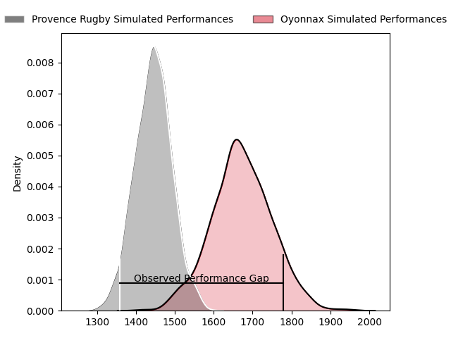
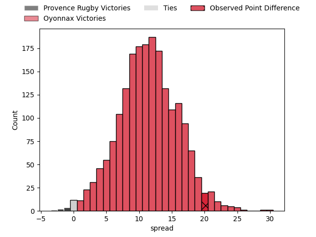

---  
layout: page  
title: Provence Rugby at Oyonnax; 7-27  
date: 2023-04-14 19:30:00 18:00:00 -0500  
categories: match review  
---
# Provence Rugby at Oyonnax; 7-27

# Club Level Predictions

The first set of predictions treats a club as the smallest object, as the club develops its members, organizes a gameplan, and deploys its players as needed for each match. This club model has a prediction of 0.786, which translates to predicting Oyonnax to win by 11.4.

Each club has a rating and a rating deviation (simiar to a Glicko system), and expected performances can be generated. This allows for simulated matches and spreads like the ones below.
## Projected Performances

## Projected Spreads

## Projected Results

# Player Level Predictions

Treating teams instead as an entity made up of the currently active players, I have ratings for each player in an altogether different system. These can be combined to form team ratings once teamsheets are announced, weighting starters a bit higher than the reserves. After the match is played, players can be weighted by their minutes on the field, allowing for an accurate measure of the team's composition. With these compiled team ratings, we can make predictions, measure inaccuracy, and update the individual player ratings.
## Prediction with Player Minutes: Oyonnax by 8.7

Oyonnax by 4.7 on a neutral field

There were 3 large changes in win probability in this match
## Prediction without Player Minutes: Oyonnax by 8.4

Oyonnax by 4.4 on a neutral pitch

|   Away Minutes | Away Player         |   Away elo |   Away Percentile |   Number |   Home Percentile |   Home elo | Home Player         |   Home Minutes |
|---------------:|:--------------------|-----------:|------------------:|---------:|------------------:|-----------:|:--------------------|---------------:|
|             52 | Federico Wegrzyn    |      95.47 |                51 |        1 |                47 |      94.39 | Tommy Raynaud       |             69 |
|             52 | Loïck Jammes        |      86.69 |                22 |        2 |                32 |      90.38 | Teddy Durand        |             56 |
|             52 | David Lolohea       |      73.84 |                 5 |        3 |                33 |      91.16 | Thomas Laclayat     |             64 |
|             52 | Jérôme Dufour       |     104.35 |                75 |        4 |                63 |      99.9  | Phoenix Battye      |             80 |
|             80 | Alexandre Flanquart |      98.65 |                60 |        5 |                62 |      97.28 | Steve Mafi          |             60 |
|             80 | Jessy Jegerlhener   |      97.01 |                53 |        6 |                97 |     133.96 | Kevin Lebreton      |             80 |
|             50 | Bilel Taieb         |      95    |               nan |        7 |                43 |      93.6  | Loïc Credoz         |             69 |
|             80 | Carl Axtens         |     101.51 |                63 |        8 |                28 |      88.71 | Rory Grice          |             80 |
|             65 | Joris Cazenave      |      74.52 |                 7 |        9 |                18 |      84.55 | Charlie Cassang     |             75 |
|             65 | Enzo Selponi        |      87.38 |                24 |       10 |                35 |      91.18 | Tony Ensor          |             80 |
|             80 | Léo Drouet          |     103.25 |                70 |       11 |                54 |      97.65 | Enzo Reybier        |             75 |
|             58 | Louis Marrou        |      90.55 |                44 |       12 |                31 |      89.67 | Théo Millet         |             64 |
|             80 | Kaveinga Finau      |      89.21 |                30 |       13 |                21 |      85.79 | Chris Farrell       |             80 |
|             80 | Kevin Bly           |     107.9  |                80 |       14 |                56 |      98.01 | Gavin Stark         |             80 |
|             80 | Nadir Bouhedjeur    |      85.1  |                20 |       15 |                82 |     109.91 | Aurelien Callandret |             80 |
|             30 | Charles Malet       |      77.77 |                13 |       16 |                49 |      94.33 | Benjamin Geledan    |             24 |
|             28 | German Kessler      |     101.24 |                70 |       17 |                47 |      94.83 | Hugo Hermet         |             20 |
|             28 | Hans Nkinsi         |      83.98 |                24 |       18 |               nan |      97.54 | Victor Delmas       |             16 |
|             28 | Thomas Vernet       |      90.3  |                50 |       19 |                38 |      91.49 | Florian Vialelle    |             16 |
|             28 | Nicolas Toth        |      90.61 |               nan |       20 |                10 |      79.44 | Antoine Abraham     |             11 |
|             22 | Adrian Sanday       |     117.95 |                84 |       21 |                83 |     110.78 | Wandrille Picault   |             11 |
|             15 | Dorian Lavernhe     |     108.47 |                79 |       22 |                17 |      84.52 | Ilan El Khattabi    |              5 |
|             15 | Jeremie Martin      |      97.4  |                55 |       23 |               nan |      94.55 | Alexis Pisani       |              5 |

