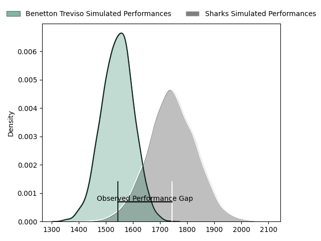
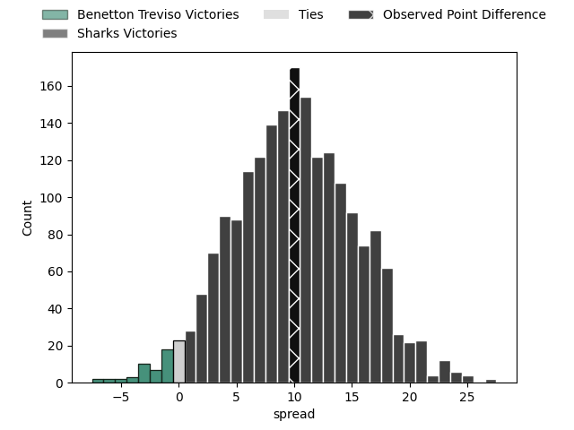

---  
layout: page  
title: Benetton Treviso at Sharks; 33-43  
date: 2023-04-14 18:30:00 18:00:00 -0500  
categories: match review  
---
# Benetton Treviso at Sharks; 33-43

# Club Level Predictions

The first set of predictions treats a club as the smallest object, as the club develops its members, organizes a gameplan, and deploys its players as needed for each match. This club model has a prediction of 0.752, which translates to predicting Sharks to win by 9.8.

Each club has a rating and a rating deviation (simiar to a Glicko system), and expected performances can be generated. This allows for simulated matches and spreads like the ones below.
## Projected Performances

## Projected Spreads

## Projected Results

# Player Level Predictions

Treating teams instead as an entity made up of the currently active players, I have ratings for each player in an altogether different system. These can be combined to form team ratings once teamsheets are announced, weighting starters a bit higher than the reserves. After the match is played, players can be weighted by their minutes on the field, allowing for an accurate measure of the team's composition. With these compiled team ratings, we can make predictions, measure inaccuracy, and update the individual player ratings.
## Prediction with Player Minutes: Sharks by 6.6

Sharks by 2.6 on a neutral field

There were 11 large changes in win probability in this match
## Prediction without Player Minutes: Sharks by 4.7

Sharks by 0.7 on a neutral pitch

|   Away Minutes | Away Player                     |   Away elo |   Away Percentile |   Number |   Home Percentile |   Home elo | Home Player               |   Home Minutes |
|---------------:|:--------------------------------|-----------:|------------------:|---------:|------------------:|-----------:|:--------------------------|---------------:|
|             43 | Francisco Nahuel Tetaz Chaparro |      98.46 |                62 |        1 |                54 |      96.33 | Retshegofaditswe Nche     |             52 |
|             43 | Giacomo Nicotera                |     120.17 |                95 |        2 |                41 |      92.51 | Mbongeni Mbonambi         |             59 |
|             30 | Tiziano Pasquali                |      94.12 |                46 |        3 |                53 |      95.89 | Thomas Joubert du Toit    |             52 |
|             80 | Niccolo Cannone                 |      55.5  |                 1 |        4 |                12 |      80.06 | Hyron Diego Andrews       |             43 |
|             59 | Federico Ruzza                  |     103.38 |                73 |        5 |                41 |      92.59 | Douw Gerbrandt Grobler    |             80 |
|             53 | Sebastian Negri                 |      86.39 |                20 |        6 |                66 |     101.36 | Siya Kolisi               |             64 |
|             80 | Michele Lamaro                  |     111.7  |                84 |        7 |                64 |     100.44 | Vincent Tshikaya Tshituka |             80 |
|             80 | Lorenzo Cannone                 |      94.71 |                44 |        8 |                78 |     106.62 | Sikhumbuzo Notshe         |             80 |
|             47 | Dewald Otto Duvenage            |      97.71 |                56 |        9 |                77 |     105.76 | Grant Williams            |             68 |
|             80 | Tomas Albornoz                  |      84.34 |                16 |       10 |                54 |      98.38 | Curwin Dominique Bosch    |             80 |
|             80 | Marcus Watson                   |     107.93 |                80 |       11 |                44 |      93.51 | Makazole Mapimpi          |             80 |
|             64 | Joaquin Riera                   |     102.61 |                67 |       12 |                36 |      91.23 | Ben Tapuai                |             68 |
|             80 | Juan Ignacio Brex               |      99.94 |                60 |       13 |                64 |     101.36 | Lukhanyo Am               |             80 |
|             80 | Edoardo Padovani                |     107.12 |                78 |       14 |                71 |     103.78 | Werner Kok                |             80 |
|             56 | Rhyno Christo Smith             |      89.46 |                33 |       15 |                48 |      95.15 | Boeta Chamberlain         |             64 |
|             50 | Filipo Alongi                   |      94.99 |               nan |       16 |                43 |      92.81 | Jeandre Labuschagne       |             37 |
|             37 | Thomas Gallo                    |      93.3  |               nan |       17 |                50 |      97.6  | Ntuthuko Mchunu           |             28 |
|             37 | Siua Maile                      |      91.4  |                34 |       18 |                84 |     106.76 | Carlu Johann Sadie        |             28 |
|             33 | Alessandro Garbisi              |      94.12 |                36 |       19 |                45 |      96.8  | Kerron van Vuuren         |             21 |
|             27 | Manuel Zuliani                  |      93.46 |                39 |       20 |                30 |      88.63 | Thaakir Abrahams          |             16 |
|             24 | Jacob Umaga                     |     104.15 |                71 |       21 |                57 |     100.35 | Phendulani Buthelezi      |             16 |
|             21 | Riccardo Favretto               |      96.13 |                48 |       22 |                14 |      82.08 | Cameron Robin Wright      |             12 |
|             16 | Marco Zanon                     |      85.13 |                15 |       23 |                85 |     113.61 | Marnus Potgieter          |             12 |

